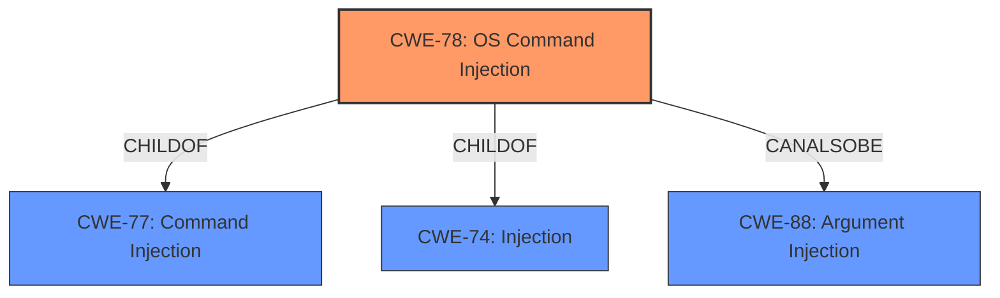

# Raw Analyzer Response for CVE-2021-23399

# Summary
| CWE ID  | CWE Name  | Confidence | CWE Abstraction Level | CWE Vulnerability Mapping Label | CWE-Vulnerability Mapping Notes |
| ----------- | ----------- | ----------- | ----------- | ----------- | ----------- |
| CWE-78 | Improper Neutralization of Special Elements used in an OS Command ('OS Command Injection') | 1.0 | Base | Allowed | Primary CWE |

## Evidence and Confidence

*   **Confidence Score:** 1.0
*   **Evidence Strength:** HIGH

## Relationship Analysis
The primary relationship that influenced my decision was the hierarchical one, where CWE-78 is a base-level weakness. Other relationships considered were those of the other candidate CWEs such as `CWE-74`, `CWE-94`, and `CWE-116`.

## Vulnerability Chain
The vulnerability chain involves the following steps:
1.  Attacker provides malicious input to the `getCredential` function.
2.  The `getCredential` function uses `child_process.exec` without proper sanitization.
3.  The system executes arbitrary commands due to the **improper neutralization** of special elements.

## Summary of Analysis
The initial analysis pointed towards `CWE-78` due to the **lack of input sanitization** when using the `child_process.exec` function, which allows an attacker to execute arbitrary commands.

The vulnerability description states, "If attacker-controlled user input is given to the getCredential function, it is possible for an attacker to **execute arbitrary commands**. This is due to use of the child_process exec function without **input sanitization**." The CVE Reference Links Content Summary confirms this: "The vulnerability is due to the use of the `child_process.exec` function without proper input sanitization in the `getCredential` function of the `wincred` package."

`CWE-78` (Improper Neutralization of Special Elements used in an OS Command ('OS Command Injection')) is a Base level CWE that accurately describes this vulnerability. The description of `CWE-78` states: "The product constructs all or part of an OS command using externally-influenced input from an upstream component, but it does not neutralize or incorrectly neutralizes special elements that could modify the intended OS command when it is sent to a downstream component." This perfectly aligns with the vulnerability where the `child_process.exec` function constructs an OS command with attacker-controlled input without proper sanitization.

The other considered CWEs were not as specific:
*   `CWE-74` (Improper Neutralization of Special Elements in Output Used by a Downstream Component ('Injection')) is a more general class of injection vulnerabilities.
*   `CWE-94` (Improper Control of Generation of Code ('Code Injection')) is more suitable when the application constructs a code segment. In this case, the application is constructing an OS command.
*   `CWE-116` (Improper Encoding or Escaping of Output) is a class that describes issues with encoding or escaping, which is related to neutralization but not as specific as `CWE-78`.

Therefore, `CWE-78` is the most appropriate and specific CWE for this vulnerability.