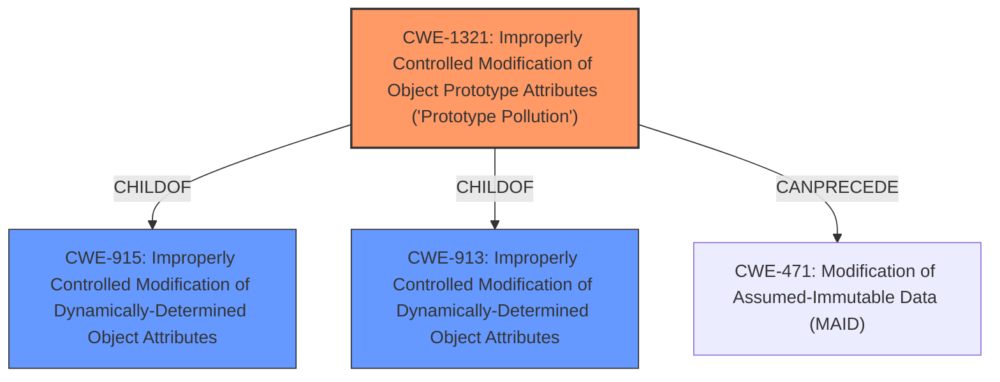

# Raw Analyzer Response for CVE-2021-23417

# Summary
| CWE ID | CWE Name | Confidence | CWE Abstraction Level | CWE Vulnerability Mapping Label | CWE-Vulnerability Mapping Notes |
|---|---|---|---|---|---|
| CWE-1321 | Improperly Controlled Modification of Object Prototype Attributes ('Prototype Pollution') | 1.0 | Variant | Allowed | Primary CWE |
| CWE-915 | Improperly Controlled Modification of Dynamically-Determined Object Attributes | 0.6 | Base | Allowed | Secondary Candidate CWE |

## Evidence and Confidence

*   **Confidence Score:** 1.0
*   **Evidence Strength:** HIGH

## Relationship Analysis
The primary CWE, CWE-1321, is a Variant of CWE-915 and CWE-913. The vulnerability description clearly indicates a **Prototype Pollution** issue, making CWE-1321 the most specific and appropriate choice.

## Vulnerability Chain
The vulnerability chain starts with the **improper handling of input** in the `deepMerge` function, leading to the **modification of the object prototype**, ultimately resulting in potential denial of service, remote code execution, or privilege escalation.

## Summary of Analysis
The analysis is primarily based on the provided evidence, which includes the vulnerability description and the CVE reference links content summary. The vulnerability description explicitly mentions "**Prototype Pollution**" as the **weakness**. The CVE reference links content summary confirms that the `deepMerge` function is vulnerable to prototype pollution due to unsafe recursive merging and lack of input sanitization, allowing injection of properties into the `Object.prototype` using a `__proto__` property.

The relationship analysis highlights that CWE-1321 is a Variant of CWE-915, making it a more specific and accurate representation of the vulnerability.

Therefore, the selection of CWE-1321 is justified based on the evidence and relationship analysis, and it is at the optimal level of specificity.

Relevant CWE Information:

# Enhanced Context (25 CWEs)

## CWE-915: Improperly Controlled Modification of Dynamically-Determined Object Attributes
**Abstraction Level**: Base
**Similarity Score**: 0.76

**Description**:
The product receives input from an upstream component that specifies multiple attributes, properties, or fields that are to be initialized or updated in an object, but it does not properly control which attributes can be modified.

**Mapping Guidance**:
- Usage: Allowed
- Rationale: This CWE entry is at the Base level of abstraction, which is a preferred level of abstraction for mapping to the root causes of vulnerabilities.

**Why this CWE was considered:** This CWE describes the general case of modifying object attributes without proper control. The vulnerability involves a `deepMerge` function that allows modification of object attributes, which aligns with this CWE's description.
**Why this CWE was not selected as primary:** While relevant, this CWE is less specific than CWE-1321, which explicitly addresses **Prototype Pollution**.

## CWE-74: Improper Neutralization of Special Elements in Output Used by a Downstream Component ('Injection')
**Abstraction Level**: Class
**Similarity Score**: 0.76

**Description**:
The product constructs all or part of a command, data structure, or record using externally-influenced input from an upstream component, but it does not neutralize or incorrectly neutralizes special elements that could modify how it is parsed or interpreted when it is sent to a downstream component.

**Mapping Guidance**:
- Usage: Discouraged
- Rationale: CWE-74 is high-level and often misused when lower-level weaknesses are more appropriate.

**Why this CWE was not selected:** While **Prototype Pollution** can be seen as a form of injection, CWE-74 is too broad and there are more specific CWEs available. The mapping guidance discourages its use when lower-level weaknesses are more appropriate.

## CWE-184: Incomplete List of Disallowed Inputs
**Abstraction Level**: Base
**Similarity Score**: 0.74

**Description**:
The product implements a protection mechanism that relies on a list of inputs (or properties of inputs) that are not allowed by policy or otherwise require other action to neutralize before additional processing takes place, but the list is incomplete.

**Mapping Guidance**:
- Usage: Allowed
- Rationale: This CWE entry is at the Base level of abstraction, which is a preferred level of abstraction for mapping to the root causes of vulnerabilities.

**Why this CWE was not selected:** The vulnerability is not due to an incomplete list of disallowed inputs, but rather the **improper handling** of the `__proto__` property during the merging process.

## CWE-99: Improper Control of Resource Identifiers ('Resource Injection')
**Abstraction Level**: Class
**Similarity Score**: 0.74

**Description**:
The product receives input from an upstream component, but it does not restrict or incorrectly restricts the input before it is used as an identifier for a resource that may be outside the intended sphere of control.

**Mapping Guidance**:
- Usage: Allowed-with-Review
- Rationale: This CWE entry is a Class and might have Base-level children that would be more appropriate

**Why this CWE was not selected:** While the `__proto__` property can be considered a resource identifier, this CWE is not as specific as CWE-1321, which directly addresses **Prototype Pollution**.

## CWE-138: Improper Neutralization of Special Elements
**Abstraction Level**: Class
**Similarity Score**: 0.74

**Description**:
The product receives input from an upstream component, but it does not neutralize or incorrectly neutralizes special elements that could be interpreted as control elements or syntactic markers when they are sent to a downstream component.

**Mapping Guidance**:
- Usage: Discouraged
- Rationale: This CWE entry is a level-1 Class (i.e., a child of a Pillar). It might have lower-level children that would be more appropriate

**Why this CWE was not selected:** Similar to CWE-74, this CWE is too broad and less specific than CWE-1321.

## CWE-1289: Improper Validation of Unsafe Equivalence in Input
**Abstraction Level**: Base
**Similarity Score**: 0.74

**Description**:
The product receives an input value that is used as a resource identifier or other type of reference, but it does not validate or incorrectly validates that the input is equivalent to a potentially-unsafe value.

**Mapping Guidance**:
- Usage: Allowed
- Rationale: This CWE entry is at the Base level of abstraction, which is a preferred level of abstraction for mapping to the root causes of vulnerabilities.

**Why this CWE was not selected:** The vulnerability is not primarily about validating equivalence, but about **improperly controlling the modification** of the object prototype.

## CWE-917: Improper Neutralization of Special Elements used in an Expression Language Statement ('Expression Language Injection')
**Abstraction Level**: Base
**Similarity Score**: 0.74

**Description**:
The product constructs all or part of an expression language (EL) statement in a framework such as a Java Server Page (JSP) using externally-influenced input from an upstream component, but it does not neutralize or incorrectly neutralizes special elements that could modify the intended EL statement before it is executed.

**Mapping Guidance**:
- Usage: Allowed
- Rationale: This CWE entry is at the Base level of abstraction, which is a preferred level of abstraction for mapping to the root causes of vulnerabilities.

**Why this CWE was not selected:** This CWE is specific to expression language injection, which is not the case in this vulnerability.

## CWE-470: Use of Externally-Controlled Input to Select Classes or Code ('Unsafe Reflection')
**Abstraction Level**: Base
**Similarity Score**: 0.74

**Description**:
The product uses external input with reflection to select which classes or code to use, but it does not sufficiently prevent the input from selecting improper classes or code.

**Mapping Guidance**:
- Usage: Allowed
- Rationale: This CWE entry is at the Base level of abstraction, which is a preferred level of abstraction for mapping to the root causes of vulnerabilities.

**Why this CWE was not selected:** The vulnerability does not involve the use of reflection.

## CWE-799: Improper Control of Interaction Frequency
**Abstraction Level**: Class
**Similarity Score**: 0.73

**Description**:
The product does not properly limit the number or frequency of interactions that it