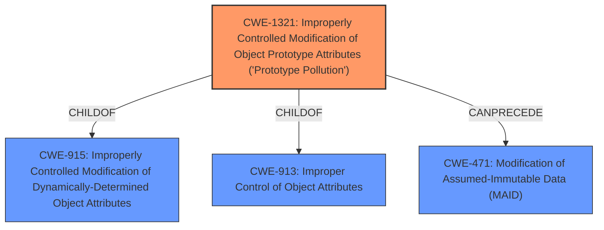

# Analysis Report for CVE-2021-23421

# Vulnerability Analysis Report: CVE-2021-23421

## Description


## Analysis (with Relationship Data)

# Summary
| CWE ID | CWE Name | Confidence | CWE Abstraction Level | CWE Vulnerability Mapping Label | CWE-Vulnerability Mapping Notes |
|---|---|---|---|---|---|
| CWE-1321 | Improperly Controlled Modification of Object Prototype Attributes ('Prototype Pollution') | 1.0 | Variant | Allowed | Primary CWE |
| CWE-915 | Improperly Controlled Modification of Dynamically-Determined Object Attributes | 0.7 | Base | Allowed | Secondary Candidate |

## Evidence and Confidence

*   **Confidence Score:** 0.9
*   **Evidence Strength:** HIGH

## Relationship Analysis
The primary CWE, CWE-1321, is a Variant of CWE-915 and CWE-913, providing a more specific classification for prototype pollution vulnerabilities. The relationship to CWE-471 via `CanPrecede` suggests that modification of the prototype can lead to further data modification issues. Using the Variant CWE-1321 provides a more precise characterization of the vulnerability than its parents.



## Vulnerability Chain
The vulnerability chain starts with the **improper control of object attributes**, specifically the object prototype, leading to **prototype pollution**. This can then lead to denial of service, remote code execution, or property injection.

## Summary of Analysis
The primary weakness is **Prototype Pollution**, which occurs due to the **improper control of modifications to object prototype attributes**. The vulnerability description and the CVE reference links content summary both strongly support this. The `utils.set` function allows unsafe recursive merging and property definition by path, enabling attackers to inject properties into the `Object.prototype`. This aligns perfectly with the description of CWE-1321.

The choice of CWE-1321 is based on the following evidence:
*   The vulnerability description explicitly states "**Prototype Pollution** via the utils.set function."
*   The CVE reference links content summary describes the root cause as "unsafe recursive merge function and allows property definition by path, which an attacker can exploit by injecting properties into the `Object.prototype`."
*   The `utils.set` function enables property definition via path, which matches the CWE-1321 description.

CWE-915 was considered as a parent, but CWE-1321 is a more specific variant that directly addresses prototype pollution.

Relevant CWE Information:

# Enhanced Context (25 CWEs)
The following CWEs were identified as potentially relevant to this vulnerability:

## CWE-915: Improperly Controlled Modification of Dynamically-Determined Object Attributes
**Abstraction Level**: Base
**Similarity Score**: 0.77
**Source**: dense

**Description**:
The product receives input from an upstream component that specifies multiple attributes, properties, or fields that are to be initialized or updated in an object, but it does not properly control which attributes can be modified.

**Mapping Guidance**:
- Usage: Allowed
- Rationale: This CWE entry is at the Base level of abstraction, which is a preferred level of abstraction for mapping to the root causes of vulnerabilities.

## CWE-1321: Improperly Controlled Modification of Object Prototype Attributes ('Prototype Pollution')
**Abstraction Level**: Variant
**Similarity Score**: 7201.41
**Source**: sparse

**Description**:
The product receives input from an upstream component that specifies attributes that are to be initialized or updated in an object, but it does not properly control modifications of attributes of the object prototype.

**Mapping Guidance**:
- Usage: Allowed
- Rationale: This CWE entry is at the Variant level of abstraction, which is a preferred level of abstraction for mapping to the root causes of vulnerabilities.


## CWE Relationship Analysis

Current CWEs represent these abstraction levels: .


### Vulnerability Chain Analysis

**Chain starting from CWE-471:**
- 471 (Modification of Assumed-Immutable Data (MAID)) - ROOT


**Chain starting from CWE-1321:**
- 1321 (Improperly Controlled Modification of Object Prototype Attributes ('Prototype Pollution')) - ROOT


### CWE Relationship Diagram

```mermaid
graph TD
    classDef primary fill:#f96,stroke:#333,stroke-width:2px
    classDef secondary fill:#69f,stroke:#333
    classDef tertiary fill:#9e9,stroke:#333
```


*Report generated on 2025-04-02 11:28:58*
