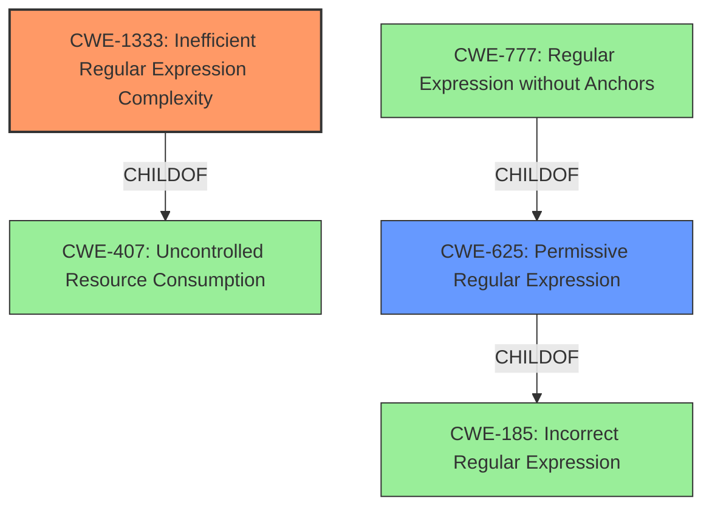

# Analysis for CVE-2021-23425

# Summary
| CWE ID    | CWE Name                                          | Confidence | CWE Abstraction Level | CWE Vulnerability Mapping Label | CWE-Vulnerability Mapping Notes |
| :-------- | :------------------------------------------------ | :--------- | :-------------------- | :------------------------------ | :------------------------------ |
| CWE-1333  | Inefficient Regular Expression Complexity         | 1          | Base                  | Allowed                         |                                 |
| CWE-625   | Permissive Regular Expression                     | 0.7        | Base                  | Allowed                         |                                 |

## Evidence and Confidence

*   **Confidence Score:** 0.9
*   **Evidence Strength:** HIGH

## Relationship Analysis
The primary relationship that influenced my decision was the direct match of **ReDoS** to **CWE-1333 (Inefficient Regular Expression Complexity)**. The description clearly states that the vulnerability stems from an inefficient regular expression that leads to catastrophic backtracking. Secondary is CWE-625 which is a parent to CWE-777 and peer to CWE-184, CWE-183, and CWE-187, providing alternative classifications based on the specifics of the regular expression's deficiencies. The evidence directly supports the selection of CWE-1333 as the most specific and relevant classification.

## Vulnerability Chain
The vulnerability chain starts with a **weakness** in the regular expression used in the `trim-off-newlines` package. This **weakness** leads to catastrophic backtracking, which results in excessive CPU consumption and ultimately a denial of service.

## Summary of Analysis
The initial assessment identified **CWE-1333 (Inefficient Regular Expression Complexity)** as the primary candidate due to the vulnerability description explicitly mentioning **regular expression denial of service** and catastrophic backtracking.

The "CVE Reference Links Content Summary" confirms this by stating: "The vulnerability is a Regular Expression Denial of Service (ReDoS) stemming from inefficient regular expression processing within the `trim-off-newlines` package. The regex used to remove newlines is susceptible to catastrophic backtracking when processing specific crafted strings."

**CWE-1333 (Inefficient Regular Expression Complexity)** is at the Base level of abstraction, which aligns with the goal of identifying the root cause of the vulnerability. The retriever results also list **CWE-1333 (Inefficient Regular Expression Complexity)** as the top candidate with a score of 1.000.

I am also adding **CWE-625 (Permissive Regular Expression)** as a secondary CWE, as the description mentions that the regular expression does not sufficiently restrict the set of allowed values.

Other CWEs Considered but Not Used:

*   CWE-617 (Reachable Assertion): While a denial of service can be caused by a reachable assertion, the root cause here is the inefficient regular expression, not an assertion.
*   CWE-777 (Regular Expression without Anchors): This is more specific to cases where the lack of anchors in a regex leads to vulnerabilities. While potentially related, the primary issue here is the inefficiency of the regex itself.
*   CWE-185 (Incorrect Regular Expression): This is a more general category, and **CWE-1333 (Inefficient Regular Expression Complexity)** is a more specific and appropriate fit.

The final selection of **CWE-1333 (Inefficient Regular Expression Complexity)** is based on the direct evidence of **ReDoS** and catastrophic backtracking, making it the most accurate and specific classification for this vulnerability.

Relevant CWE Information:

# Enhanced Context (25 CWEs)
The following CWEs were identified as potentially relevant to this vulnerability:

## CWE-158: Improper Neutralization of Null Byte or NUL Character
**Abstraction Level**: Variant
**Similarity Score**: 0.77
**Source**: dense

**Description**:
The product receives input from an upstream component, but it does not neutralize or incorrectly neutralizes NUL characters or null bytes when they are sent to a downstream component.

**Mapping Guidance**:
- Usage: Allowed
- Rationale: This CWE entry is at the Variant level of abstraction, which is a preferred level of abstraction for mapping to the root causes of vulnerabilities.

## CWE-170: Improper Null Termination
**Abstraction Level**: Base
**Similarity Score**: 0.76
**Source**: dense

**Description**:
The product does not terminate or incorrectly terminates a string or array with a null character or equivalent terminator.

**Mapping Guidance**:
- Usage: Allowed
- Rationale: This CWE entry is at the Base level of abstraction, which is a preferred level of abstraction for mapping to the root causes of vulnerabilities.

## CWE-1289: Improper Validation of Unsafe Equivalence in Input
**Abstraction Level**: Base
**Similarity Score**: 0.76
**Source**: dense

**Description**:
The product receives an input value that is used as a resource identifier or other type of reference, but it does not validate or incorrectly validates that the input is equivalent to a potentially-unsafe value.

**Mapping Guidance**:
- Usage: Allowed
- Rationale: This CWE entry is at the Base level of abstraction, which is a preferred level of abstraction for mapping to the root causes of vulnerabilities.

## CWE-41: Improper Resolution of Path Equivalence
**Abstraction Level**: Base
**Similarity Score**: 0.75
**Source**: dense

**Description**:
The product is vulnerable to file system contents disclosure through path equivalence. Path equivalence involves the use of special characters in file and directory names. The associated manipulations are intended to generate multiple names for the same object.

**Mapping Guidance**:
- Usage: Allowed
- Rationale: This CWE entry is at the Base level of abstraction, which is a preferred level of abstraction for mapping to the root causes of vulnerabilities.

## CWE-138: Improper Neutralization of Special Elements
**Abstraction Level**: Class
**Similarity Score**: 0.75
**Source**: dense

**Description**:
The product receives input from an upstream component, but it does not neutralize or incorrectly neutralizes special elements that could be interpreted as control elements or syntactic markers when they are sent to a downstream component.

**Mapping Guidance**:
- Usage: Discouraged
- Rationale: This CWE entry is a level-1 Class (i.e., a child of a Pillar). It might have lower-level children that would be more appropriate

## CWE-625: Permissive Regular Expression
**Abstraction Level**: Base
**Similarity Score**: 0.75
**Source**: dense

**Description**:
The product uses a regular expression that does not sufficiently restrict the set of allowed values.

**Mapping Guidance**:
- Usage: Allowed
- Rationale: This CWE entry is at the Base level of abstraction, which is a preferred level of abstraction for mapping to the root causes of vulnerabilities.

## CWE-184: Incomplete List of Disallowed Inputs
**Abstraction Level**: Base
**Similarity Score**: 0.75
**Source**: dense

**Description**:
The product implements a protection mechanism that relies on a list of inputs (or properties of inputs) that are not allowed by policy or otherwise require other action to neutralize before additional processing takes place, but the list is incomplete.

**Mapping Guidance**:
- Usage: Allowed
- Rationale: This CWE entry is at the Base level of abstraction, which is a preferred level of abstraction for mapping to the root causes of vulnerabilities.

## CWE-754: Improper Check for Unusual or Exceptional Conditions
**Abstraction Level**: Class
**Similarity Score**: 0.74
**Source**: dense

**Description**:
The product does not check or incorrectly checks for unusual or exceptional conditions that are not expected to occur frequently during day to day operation of the product.

**Mapping Guidance**:
- Usage: Allowed-with-Review
- Rationale: This CWE entry is a Class and might have Base-level children that would be more appropriate

## CWE-74: Improper Neutralization of Special Elements in Output Used by a Downstream Component ('Injection')
**Abstraction Level**: Class
**Similarity Score**: 0.74
**Source**: dense

**Description**:
The product constructs all or part of a command, data structure, or record using externally-influenced input from an upstream component, but it does not neutralize or incorrectly neutralizes special elements that could modify