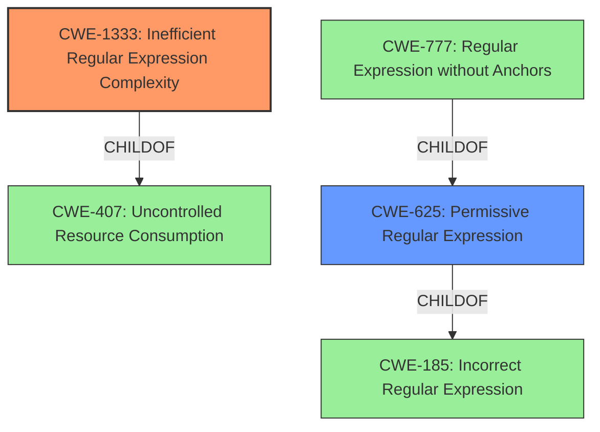

# Analysis for CVE-2021-23425

# Summary
| CWE ID    | CWE Name                                          | Confidence | CWE Abstraction Level | CWE Vulnerability Mapping Label | CWE-Vulnerability Mapping Notes |
| :-------- | :------------------------------------------------ | :--------- | :-------------------- | :------------------------------ | :------------------------------ |
| CWE-1333  | Inefficient Regular Expression Complexity         | 1          | Base                  | Allowed                         |                                 |
| CWE-625   | Permissive Regular Expression                     | 0.7        | Base                  | Allowed                         |                                 |

## Evidence and Confidence

*   **Confidence Score:** 0.9
*   **Evidence Strength:** HIGH

## Relationship Analysis
The primary relationship that influenced my decision was the direct match of **ReDoS** to **CWE-1333 (Inefficient Regular Expression Complexity)**. The description clearly states that the vulnerability stems from an inefficient regular expression that leads to catastrophic backtracking. Secondary is CWE-625 which is a parent to CWE-777 and peer to CWE-184, CWE-183, and CWE-187, providing alternative classifications based on the specifics of the regular expression's deficiencies. The evidence directly supports the selection of CWE-1333 as the most specific and relevant classification.

## Vulnerability Chain
The vulnerability chain starts with a **weakness** in the regular expression used in the `trim-off-newlines` package. This **weakness** leads to catastrophic backtracking, which results in excessive CPU consumption and ultimately a denial of service.

## Summary of Analysis
The initial assessment identified **CWE-1333 (Inefficient Regular Expression Complexity)** as the primary candidate due to the vulnerability description explicitly mentioning **regular expression denial of service** and catastrophic backtracking.

The "CVE Reference Links Content Summary" confirms this by stating: "The vulnerability is a Regular Expression Denial of Service (ReDoS) stemming from inefficient regular expression processing within the `trim-off-newlines` package. The regex used to remove newlines is susceptible to catastrophic backtracking when processing specific crafted strings."

**CWE-1333 (Inefficient Regular Expression Complexity)** is at the Base level of abstraction, which aligns with the goal of identifying the root cause of the vulnerability. The retriever results also list **CWE-1333 (Inefficient Regular Expression Complexity)** as the top candidate with a score of 1.000.

I am also adding **CWE-625 (Permissive Regular Expression)** as a secondary CWE, as the description mentions that the regular expression does not sufficiently restrict the set of allowed values.

Other CWEs Considered but Not Used:

*   CWE-617 (Reachable Assertion): While a denial of service can be caused by a reachable assertion, the root cause here is the inefficient regular expression, not an assertion.
*   CWE-777 (Regular Expression without Anchors): This is more specific to cases where the lack of anchors in a regex leads to vulnerabilities. While potentially related, the primary issue here is the inefficiency of the regex itself.
*   CWE-185 (Incorrect Regular Expression): This is a more general category, and **CWE-1333 (Inefficient Regular Expression Complexity)** is a more specific and appropriate fit.

The final selection of **CWE-1333 (Inefficient Regular Expression Complexity)** is based on the direct evidence of **ReDoS** and catastrophic backtracking, making it the most accurate and specific classification for this vulnerability.

Relevant CWE Information:

# Enhanced Context (25 CWEs)
The following CWEs were identified as potentially relevant to this vulnerability:

## CWE-158: Improper Neutralization of Null Byte or NUL Character
**Abstraction Level**: Variant
**Similarity Score**: 0.77
**Source**: dense

**Description**:
The product receives input from an upstream component, but it does not neutralize or incorrectly neutralizes NUL characters or null bytes when they are sent to a downstream component.

**Mapping Guidance**:
- Usage: Allowed
- Rationale: This CWE entry is at the Variant level of abstraction, which is a preferred level of abstraction for mapping to the root causes of vulnerabilities.

## CWE-170: Improper Null Termination
**Abstraction Level**: Base
**Similarity Score**: 0.76
**Source**: dense

**Description**:
The product does not terminate or incorrectly terminates a string or array with a null character or equivalent terminator.

**Mapping Guidance**:
- Usage: Allowed
- Rationale: This CWE entry is at the Base level of abstraction, which is a preferred level of abstraction for mapping to the root causes of vulnerabilities.

## CWE-1289: Improper Validation of Unsafe Equivalence in Input
**Abstraction Level**: Base
**Similarity Score**: 0.76
**Source**: dense

**Description**:
The product receives an input value that is used as a resource identifier or other type of reference, but it does not validate or incorrectly validates that the input is equivalent to a potentially-unsafe value.

**Mapping Guidance**:
- Usage: Allowed
- Rationale: This CWE entry is at the Base level of abstraction, which is a preferred level of abstraction for mapping to the root causes of vulnerabilities.

## CWE-41: Improper Resolution of Path Equivalence
**Abstraction Level**: Base
**Similarity Score**: 0.75
**Source**: dense

**Description**:
The product is vulnerable to file system contents disclosure through path equivalence. Path equivalence involves the use of special characters in file and directory names. The associated manipulations are intended to generate multiple names for the same object.

**Mapping Guidance**:
- Usage: Allowed
- Rationale: This CWE entry is at the Base level of abstraction, which is a preferred level of abstraction for mapping to the root causes of vulnerabilities.

## CWE-138: Improper Neutralization of Special Elements
**Abstraction Level**: Class
**Similarity Score**: 0.75
**Source**: dense

**Description**:
The product receives input from an upstream component, but it does not neutralize or incorrectly neutralizes special elements that could be interpreted as control elements or syntactic markers when they are sent to a downstream component.

**Mapping Guidance**:
- Usage: Discouraged
- Rationale: This CWE entry is a level-1 Class (i.e., a child of a Pillar). It might have lower-level children that would be more appropriate

## CWE-625: Permissive Regular Expression
**Abstraction Level**: Base
**Similarity Score**: 0.75
**Source**: dense

**Description**:
The product uses a regular expression that does not sufficiently restrict the set of allowed values.

**Mapping Guidance**:
- Usage: Allowed
- Rationale: This CWE entry is at the Base level of abstraction, which is a preferred level of abstraction for mapping to the root causes of vulnerabilities.

## CWE-184: Incomplete List of Disallowed Inputs
**Abstraction Level**: Base
**Similarity Score**: 0.75
**Source**: dense

**Description**:
The product implements a protection mechanism that relies on a list of inputs (or properties of inputs) that are not allowed by policy or otherwise require other action to neutralize before additional processing takes place, but the list is incomplete.

**Mapping Guidance**:
- Usage: Allowed
- Rationale: This CWE entry is at the Base level of abstraction, which is a preferred level of abstraction for mapping to the root causes of vulnerabilities.

## CWE-754: Improper Check for Unusual or Exceptional Conditions
**Abstraction Level**: Class
**Similarity Score**: 0.74
**Source**: dense

**Description**:
The product does not check or incorrectly checks for unusual or exceptional conditions that are not expected to occur frequently during day to day operation of the product.

**Mapping Guidance**:
- Usage: Allowed-with-Review
- Rationale: This CWE entry is a Class and might have Base-level children that would be more appropriate

## CWE-74: Improper Neutralization of Special Elements in Output Used by a Downstream Component ('Injection')
**Abstraction Level**: Class
**Similarity Score**: 0.74
**Source**: dense

**Description**:
The product constructs all or part of a command, data structure, or record using externally-influenced input from an upstream component, but it does not neutralize or incorrectly neutralizes special elements that could modify

# Enhanced Query for CVE-2021-23425

## Vulnerability Description
All versions of package trim-off-newlines are vulnerable to Regular Expression Denial of Service (ReDoS) via string processing.

### Vulnerability Description Key Phrases
- **weakness:** **regular expression denial of service**
- **product:** trim-off-newlines
- **version:** all versions

## CVE Reference Links Content Summary
Based on the provided information, here's an analysis of CVE-2021-23425:

**Root Cause of Vulnerability:**

The vulnerability is a Regular Expression Denial of Service (ReDoS) stemming from inefficient regular expression processing within the `trim-off-newlines` package. The regex used to remove newlines is susceptible to catastrophic backtracking when processing specific crafted strings.

**Weaknesses/Vulnerabilities Present:**

*   **ReDoS:** The core vulnerability is the use of a poorly designed regular expression that can lead to catastrophic backtracking. This occurs when the regex engine tries multiple combinations of patterns in a string that does not match the expected format, exponentially increasing processing time.
*   **Inefficient Regex:** The regex used in the `trim-off-newlines` package is not optimized for handling strings with repeating newline characters, causing it to become extremely slow or get stuck when presented with such input.

**Impact of Exploitation:**

*   **Denial of Service (DoS):** By sending specially crafted strings to the vulnerable function, an attacker can cause the application to consume excessive CPU resources, leading to a denial of service. The application may become unresponsive or crash due to the prolonged processing time caused by the regex engine's backtracking.

**Attack Vectors:**

*   **Network:** The attack vector is network-based, meaning that an attacker can send malicious input via network requests, potentially remotely. The vulnerability is triggered when the application processes user-controlled input using the vulnerable function.

**Required Attacker Capabilities/Position:**

*   **No Privileges Required:** The attacker doesn't need any prior access to the system or application.
*   **No User Interaction Required:** The attack can be carried out without requiring any actions from users of the vulnerable system.
*   **Ability to send crafted input:** The attacker must be able to send crafted input strings to the vulnerable function within the application.

**Additional Information:**
*   The vulnerability is present in `trim-off-newlines` versions prior to 1.0.3.
*   The vulnerable code is located in the `index.js` file of the package.
*   The vulnerability is also present in the `org.webjars.npm:trim-off-newlines` package.
*   The vulnerability has been assigned a CVSS score of 5.3 (Medium).
*   The attack complexity is low, meaning it's relatively easy to exploit.
*   A proof-of-concept (PoC) is available, demonstrating how to exploit the vulnerability.
*   The provided PoC demonstrates how the processing time increases exponentially with the repetition of the `\r\n` character sequence in the input string.

## Retriever Results

### Top Combined Results

| Rank | CWE ID | Name | Abstraction | Usage  | Retrievers | Individual Scores |
|------|--------|------|-------------|-------|------------|-------------------|
| 1 | 1333 | Inefficient Regular Expression Complexity | Base | Allowed | alternate_terms | 1.000 |
| 2 | 617 | Reachable Assertion | Base | Allowed | sparse | 0.153 |
| 3 | 625 | Permissive Regular Expression | Base | Allowed | sparse | 0.143 |
| 4 | 626 | Null Byte Interaction Error (Poison Null Byte) | Variant | Allowed | sparse | 0.132 |
| 5 | 777 | Regular Expression without Anchors | Variant | Allowed | sparse | 0.129 |
| 6 | 185 | Incorrect Regular Expression | Class | Allowed-with-Review | dense | 0.541 |
| 7 | 187 | Partial String Comparison | Variant | Allowed | graph | 0.003 |
| 8 | 674 | Uncontrolled Recursion | Class | Allowed-with-Review | sparse | 0.128 |
| 9 | 193 | Off-by-one Error | Base | Allowed | sparse | 0.125 |
| 10 | 158 | Improper Neutralization of Null Byte or NUL Character | Variant | Allowed | sparse | 0.122 |

# Complete CWE Specifications

## CWE-1333: Inefficient Regular Expression Complexity
**Abstraction:** Base
**Status:** Draft

### Description
The product uses a regular expression with an inefficient, possibly exponential worst-case computational complexity that consumes excessive CPU cycles.

### Extended Description
Some regular expression engines have a feature called "backtracking". If the token cannot match, the engine "backtracks" to a position that may result in a different token that can match.
 Backtracking becomes a weakness if all of these conditions are met:

  - The number of possible backtracking attempts are exponential relative to the length of the input.

  - The input can fail to match the regular expression.

  - The input can be long enough.

 Attackers can create crafted inputs that intentionally cause the regular expression to use excessive backtracking in a way that causes the CPU consumption to spike. 

### Alternative Terms
ReDoS: ReDoS is an abbreviation of "Regular expression Denial of Service".
Regular Expression Denial of Service: While this term is attack-focused, this is commonly used to describe the weakness.
Catastrophic backtracking: This term is used to describe the behavior of the regular expression as a negative technical impact.

### Relationships
ChildOf -> CWE-407
ChildOf -> CWE-407

### Mapping Guidance
**Usage:** Allowed
**Rationale:** This CWE entry is at the Base level of abstraction, which is a preferred level of abstraction for mapping to the root causes of vulnerabilities.
**Comments:** Carefully read both the name and description to ensure that this mapping is an appropriate fit. Do not try to 'force' a mapping to a lower-level Base/Variant simply to comply with this preferred level of abstraction.
**Reasons:**
- Acceptable-Use

### Observed Examples
- **CVE-2020-5243:** server allows ReDOS with crafted User-Agent strings, due to overlapping capture groups that cause excessive backtracking.
- **CVE-2021-21317:** npm package for user-agent parser prone to ReDoS due to overlapping capture groups
- **CVE-2019-16215:** Markdown parser uses inefficient regex when processing a message, allowing users to cause CPU consumption and delay preventing processing of other messages.

## CWE-617: Reachable Assertion
**Abstraction:** Base
**Status:** Draft

### Description
The product contains an assert() or similar statement that can be triggered by an attacker, which leads to an application exit or other behavior that is more severe than necessary.

### Extended Description

While assertion is good for catching logic errors and reducing the chances of reaching more serious vulnerability conditions, it can still lead to a denial of service.

For example, if a server handles multiple simultaneous connections, and an assert() occurs in one single connection that causes all other connections to be dropped, this is a reachable assertion that leads to a denial of service.

### Alternative Terms
assertion failure

### Relationships
ChildOf -> CWE-670
ChildOf -> CWE-670

### Mapping Guidance
**Usage:** Allowed
**Rationale:** This CWE entry is at the Base level of abstraction, which is a preferred level of abstraction for mapping to the root causes of vulnerabilities.
**Comments:** Carefully read both the name and description to ensure that this mapping is an appropriate fit. Do not try to 'force' a mapping to a lower-level Base/Variant simply to comply with this preferred level of abstraction.
**Reasons:**
- Acceptable-Use

### Observed Examples
- **CVE-2023-49286:** Chain: function in web caching proxy does not correctly check a return value (CWE-253) leading to a reachable assertion (CWE-617)
- **CVE-2006-6767:** FTP server allows remote attackers to cause a denial of service (daemon abort) via crafted commands which trigger an assertion failure.
- **CVE-2006-6811:** Chat client allows remote attackers to cause a denial of service (crash) via a long message string when connecting to a server, which causes an assertion failure.

## CWE-625: Permissive Regular Expression
**Abstraction:** Base
**Status:** Draft

### Description
The product uses a regular expression that does not sufficiently restrict the set of allowed values.

### Extended Description

This effectively causes the regexp to accept substrings that match the pattern, which produces a partial comparison to the target. In some cases, this can lead to other weaknesses. Common errors include:

  - not identifying the beginning and end of the target string

  - using wildcards instead of acceptable character ranges

  - others

### Alternative Terms
None

### Relationships
ChildOf -> CWE-185
PeerOf -> CWE-187
PeerOf -> CWE-184
PeerOf -> CWE-183

### Mapping Guidance
**Usage:** Allowed
**Rationale:** This CWE entry is at the Base level of abstraction, which is a preferred level of abstraction for mapping to the root causes of vulnerabilities.
**Comments:** Carefully read both the name and description to ensure that this mapping is an appropriate fit. Do not try to 'force' a mapping to a lower-level Base/Variant simply to comply with this preferred level of abstraction.
**Reasons:**
- Acceptable-Use

### Observed Examples
- **CVE-2021-22204:** Chain: regex in EXIF processor code does not correctly determine where a string ends (CWE-625), enabling eval injection (CWE-95), as exploited in the wild per CISA KEV.
- **CVE-2006-1895:** ".*" regexp leads to static code injection
- **CVE-2002-2175:** insertion of username into regexp results in partial comparison, causing wrong database entry to be updated when one username is a substring of another.

## CWE-626: Null Byte Interaction Error (Poison Null Byte)
**Abstraction:** Variant
**Status:** Draft

### Description
The product does not properly handle null bytes or NUL characters when passing data between different representations or components.

### Extended Description

A null byte (NUL character) can have different meanings across representations or languages. For example, it is a string terminator in standard C libraries, but Perl and PHP strings do not treat it as a terminator. When two representations are crossed - such as when Perl or PHP invokes underlying C functionality - this can produce an interaction error with unexpected results. Similar issues have been reported for ASP. Other interpreters written in C might also be affected.

The poison null byte is frequently useful in path traversal attacks by terminating hard-coded extensions that are added to a filename. It can play a role in regular expression processing in PHP.

### Alternative Terms
None

### Relationships
ChildOf -> CWE-147
ChildOf -> CWE-436

### Mapping Guidance
**Usage:** Allowed
**Rationale:** This CWE entry is at the Variant level of abstraction, which is a preferred level of abstraction for mapping to the root causes of vulnerabilities.
**Comments:** Carefully read both the name and description to ensure that this mapping is an appropriate fit. Do not try to 'force' a mapping to a lower-level Base/Variant simply to comply with this preferred level of abstraction.
**Reasons:**
- Acceptable-Use

### Additional Notes
**[Terminology]** Current usage of "poison null byte" is typically related to this C/Perl/PHP interaction error, but the original term in 1998 was applied to an off-by-one buffer overflow involving a null byte.

**[Research Gap]** There are not many CVE examples, because the poison NULL byte is a design limitation, which typically is not included in CVE by itself. It is typically used as a facilitator manipulation to widen the scope of potential attacks against other vulnerabilities.

### Observed Examples
- **CVE-2005-4155:** NUL byte bypasses PHP regular expression check
- **CVE-2005-3153:** inserting SQL after a NUL byte bypasses allowlist regexp, enabling SQL injection

## CWE-777: Regular Expression without Anchors
**Abstraction:** Variant
**Status:** Incomplete

### Description
The product uses a regular expression to perform neutralization, but the regular expression is not anchored and may allow malicious or malformed data to slip through.

### Extended Description
When performing tasks such as validating against a set of allowed inputs (allowlist), data is examined and possibly modified to ensure that it is well-formed and adheres to a list of safe values. If the regular expression is not anchored, malicious or malformed data may be included before or after any string matching the regular expression. The type of malicious data that is allowed will depend on the context of the application and which anchors are omitted from the regular expression.

### Alternative Terms
None

### Relationships
ChildOf -> CWE-625

### Mapping Guidance
**Usage:** Allowed
**Rationale:** This CWE entry is at the Variant level of abstraction, which is a preferred level of abstraction for mapping to the root causes of vulnerabilities.
**Comments:** Carefully read both the name and description to ensure that this mapping is an appropriate fit. Do not try to 'force' a mapping to a lower-level Base/Variant simply to comply with this preferred level of abstraction.
**Reasons:**
- Acceptable-Use

### Observed Examples
- **CVE-2022-30034:** Chain: Web UI for a Python RPC framework does not use regex anchors to validate user login emails (CWE-777), potentially allowing bypass of OAuth (CWE-1390).

## CWE-185: Incorrect Regular Expression
**Abstraction:** Class
**Status:** Draft

### Description
The product specifies a regular expression in a way that causes data to be improperly matched or compared.

### Extended Description
When the regular expression is used in protection mechanisms such as filtering or validation, this may allow an attacker to bypass the intended restrictions on the incoming data.

### Alternative Terms
None

### Relationships
ChildOf -> CWE-697
CanPrecede -> CWE-187
CanPrecede -> CWE-182

### Mapping Guidance
**Usage:** Allowed-with-Review
**Rationale:** This CWE entry is a Class and might have Base-level children that would be more appropriate
**Comments:** Examine children of this entry to see if there is a better fit
**Reasons:**
- Abstraction

### Additional Notes
**[Relationship]** While there is some overlap with allowlist/denylist problems, this entry is intended to deal with incorrectly written regular expressions, regardless of their intended use. Not every regular expression is intended for use as an allowlist or denylist. In addition, allowlists and denylists can be implemented using other mechanisms besides regular expressions.

**[Research Gap]** Regexp errors are likely a primary factor in many MFVs, especially those that require multiple manipulations to exploit. However, they are rarely diagnosed at this level of detail.

### Observed Examples
- **CVE-2002-2109:** Regexp isn't "anchored" to the beginning or end, which allows spoofed values that have trusted values as substrings.
- **CVE-2005-1949:** Regexp for IP address isn't anchored at the end, allowing appending of shell metacharacters.
- **CVE-2001-1072:** Bypass access restrictions via multiple leading slash, which causes a regular expression to fail.

## CWE-187: Partial String Comparison
**Abstraction:** Variant
**Status:** Incomplete

### Description
The product performs a comparison that only examines a portion of a factor before determining whether there is a match, such as a substring, leading to resultant weaknesses.

### Extended Description
For example, an attacker might succeed in authentication by providing a small password that matches the associated portion of the larger, correct password.

### Alternative Terms
None

### Relationships
ChildOf -> CWE-1023

### Mapping Guidance
**Usage:** Allowed
**Rationale:** This CWE entry is at the Variant level of abstraction, which is a preferred level of abstraction for mapping to the root causes of vulnerabilities.
**Comments:** Carefully read both the name and description to ensure that this mapping is an appropriate fit. Do not try to 'force' a mapping to a lower-level Base/Variant simply to comply with this preferred level of abstraction.
**Reasons:**
- Acceptable-Use

### Additional Notes
**[Relationship]** This is conceptually similar to other weaknesses, such as insufficient verification and regular expression errors. It is primary to some weaknesses.

### Observed Examples
- **CVE-2014-6394:** Product does not prevent access to restricted directories due to partial string comparison with a public directory
- **CVE-2004-1012:** Argument parser of an IMAP server treats a partial command "body[p" as if it is "body.peek", leading to index error and out-of-bounds corruption.
- **CVE-2004-0765:** Web browser only checks the hostname portion of a certificate when the hostname portion of the URI is not a fully qualified domain name (FQDN), which allows remote attackers to spoof trusted certificates.

## CWE-674: Uncontrolled Recursion
**Abstraction:** Class
**Status:** Draft

### Description
The product does not properly control the amount of recursion that takes place,  consuming excessive resources, such as allocated memory or the program stack.

### Extended Description
Not provided

### Alternative Terms
Stack Exhaustion

### Relationships
ChildOf -> CWE-834

### Mapping Guidance
**Usage:** Allowed-with-Review
**Rationale:** This CWE entry is a Class and might have Base-level children that would be more appropriate
**Comments:** Examine children of this entry to see if there is a better fit
**Reasons:**
- Abstraction

### Observed Examples
- **CVE-2007-1285:** Deeply nested arrays trigger stack exhaustion.
- **CVE-2007-3409:** Self-referencing pointers create infinite loop and resultant stack exhaustion.
- **CVE-2016-10707:** Javascript application accidentally changes input in a way that prevents a recursive call from detecting an exit condition.

## CWE-193: Off-by-one Error
**Abstraction:** Base
**Status:** Draft

### Description
A product calculates or uses an incorrect maximum or minimum value that is 1 more, or 1 less, than the correct value.

### Extended Description
Not provided

### Alternative Terms
off-by-five: An "off-by-five" error was reported for sudo in 2002 (CVE-2002-0184), but that is more like a "length calculation" error.

### Relationships
ChildOf -> CWE-682
ChildOf -> CWE-682
CanPrecede -> CWE-617
CanPrecede -> CWE-170
CanPrecede -> CWE-119

### Mapping Guidance
**Usage:** Allowed
**Rationale:** This CWE entry is at the Base level of abstraction, which is a preferred level of abstraction for mapping to the root causes of vulnerabilities.
**Comments:** Carefully read both the name and description to ensure that this mapping is an appropriate fit. Do not try to 'force' a mapping to a lower-level Base/Variant simply to comply with this preferred level of abstraction.
**Reasons:**
- Acceptable-Use

### Additional Notes
**[Relationship]** This is not always a buffer overflow. For example, an off-by-one error could be a factor in a partial comparison, a read from the wrong memory location, an incorrect conditional, etc.

### Observed Examples
- **CVE-2003-0252:** Off-by-one error allows remote attackers to cause a denial of service and possibly execute arbitrary code via requests that do not contain newlines.
- **CVE-2001-1391:** Off-by-one vulnerability in driver allows users to modify kernel memory.
- **CVE-2002-0083:** Off-by-one error allows local users or remote malicious servers to gain privileges.

## CWE-158: Improper Neutralization of Null Byte or NUL Character
**Abstraction:** Variant
**Status:** Incomplete

### Description
The product receives input from an upstream component, but it does not neutralize or incorrectly neutralizes NUL characters or null bytes when they are sent to a downstream component.

### Extended Description
As data is parsed, an injected NUL character or null byte may cause the product to believe the input is terminated earlier than it actually is, or otherwise cause the input to be misinterpreted. This could then be used to inject potentially dangerous input that occurs after the null byte or otherwise bypass validation routines and other protection mechanisms.

### Alternative Terms
None

### Relationships
ChildOf -> CWE-138

### Mapping Guidance
**Usage:** Allowed
**Rationale:** This CWE entry is at the Variant level of abstraction, which is a preferred level of abstraction for mapping to the root causes of vulnerabilities.
**Comments:** Carefully read both the name and description to ensure that this mapping is an appropriate fit. Do not try to 'force' a mapping to a lower-level Base/Variant simply to comply with this preferred level of abstraction.
**Reasons:**
- Acceptable-Use

### Additional Notes
**[Relationship]** This can be a factor in multiple interpretation errors, other interaction errors, filename equivalence, etc.

### Observed Examples
- **CVE-2008-1284:** NUL byte in theme name causes directory traversal impact to be worse
- **CVE-2005-2008:** Source code disclosure using trailing null.
- **CVE-2005-3293:** Source code disclosure using trailing null.

