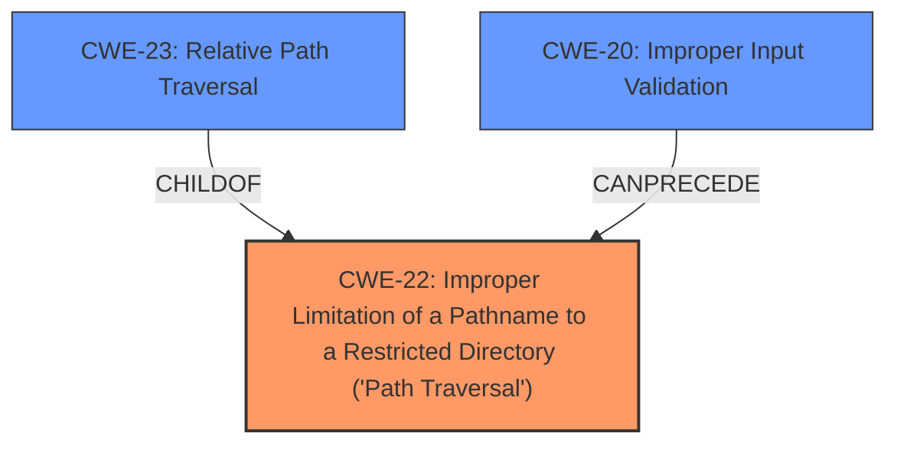

# Analysis Report for CVE-2021-23427

# Vulnerability Analysis Report: CVE-2021-23427

## Description


## Analysis (with Relationship Data)

# Summary
| CWE ID | CWE Name | Confidence | CWE Abstraction Level | CWE Vulnerability Mapping Label | CWE-Vulnerability Mapping Notes |
|---|---|---|---|---|---|
| CWE-22 | Improper Limitation of a Pathname to a Restricted Directory ('Path Traversal') | 1.0 | Base | Allowed | Primary CWE |
| CWE-23 | Relative Path Traversal | 0.9 | Base | Allowed | Secondary Candidate |
| CWE-20 | Improper Input Validation | 0.6 | Class | Discouraged | Secondary Candidate |

## Evidence and Confidence

*   **Confidence Score:** 0.9
*   **Evidence Strength:** HIGH

## Relationship Analysis
The primary CWE is CWE-22, which represents the **improper limitation of a pathname to a restricted directory**. This is a base-level CWE. CWE-23 is a child of CWE-22, representing a specific type of path traversal using relative paths. CWE-20, Improper Input Validation, is a class-level CWE that can precede CWE-22. The relationships highlight the path traversal nature of the vulnerability and the potential for input validation issues as a contributing factor. Choosing CWE-22 offers a balance between specificity and broad applicability.



## Vulnerability Chain
The vulnerability chain starts with **insufficient validation** in the `ExtractAsync` function, leading to the possibility of a malicious ZIP archive containing path traversal sequences. This allows writing files to arbitrary locations due to **improper limitation of a pathname to a restricted directory ('Path Traversal')**, which can further lead to arbitrary code execution.

## Summary of Analysis
The initial analysis indicated that the `ExtractAsync` function within the FileSystem is vulnerable to arbitrary extraction due to **insufficient validation**. The retriever results pointed to CWE-22, CWE-23, and CWE-20 as potential candidates.

Based on the provided evidence:
*   "The `ExtractAsync` function in `FileSystemDriver.cs` within the `elFinder.NetCore` library lacks **sufficient validation** when extracting files from a ZIP archive."
*   "The vulnerability is a classic 'Zip Slip' issue where a specially crafted ZIP archive contains filenames with path traversal sequences (e.g., `../../file.exe`)."
*   "The extraction process does not properly validate or sanitize the file paths within the archive before extracting them."
*   "An attacker can write files to arbitrary locations on the server's filesystem, outside of the intended target directory for extraction."

I am choosing CWE-22 as the primary CWE because it directly addresses the core issue of **improperly limiting a pathname to a restricted directory**, which is the core of the "Zip Slip" vulnerability. CWE-23 is a more specific variant, but CWE-22 better captures the general issue. CWE-20 is a broader class and is discouraged for cases where more specific CWEs apply.

Relevant CWE Information:

# Enhanced Context (25 CWEs)
The following CWEs were identified as potentially relevant to this vulnerability:

## CWE-23: Relative Path Traversal
**Technical Explanation:** The vulnerability description highlights that the malicious ZIP archive contains filenames with path traversal sequences such as `../../file.exe`. This directly aligns with the description of CWE-23, which involves using external input to construct a pathname that is intended to be within a restricted directory, but it fails to properly neutralize sequences such as ".." that can resolve to a location outside of that directory.
**Rationale:** CWE-23 is a `ChildOf` CWE-22 and is a valid option since the exploit uses "../" but CWE-22 is more general. This is a secondary candidate, with a confidence of 0.9.
**Security Implications:** By exploiting this vulnerability, an attacker can write files to arbitrary locations on the server's filesystem, outside of the intended target directory for extraction.

## CWE-20: Improper Input Validation
**Technical Explanation:** The vulnerability arises from the **insufficient validation** within the `ExtractAsync` function. While this could fall under the broader category of CWE-20, the specific issue is the **lack of validation** of file paths within the ZIP archive, which leads to path traversal.
**Rationale:** CWE-20 is a broad class, and the guidance discourages its use when more specific CWEs are available. While **insufficient validation** is the root cause, the resulting vulnerability is better described by CWE-22. Confidence is low at 0.6.
**Security Implications:** **Improper Input Validation** can lead to path traversal, arbitrary file write, and potential arbitrary code execution.

## CWE-59: Improper Link Resolution Before File Access ('Link Following')
**Explanation:** This CWE addresses vulnerabilities related to symbolic links. While the vulnerability description does not explicitly mention symbolic links, it is possible that an attacker could use symbolic links within the ZIP archive to achieve similar results as path traversal. However, the evidence is not sufficient to support this mapping.

## CWE-73: External Control of File Name or Path
**Explanation:** This CWE addresses vulnerabilities where user input controls file names or paths. While the filenames within the ZIP archive are a form of external input, the primary issue is the **lack of validation** of those filenames, rather than the direct control of the file path. Therefore, this CWE is less relevant than CWE-22.

## CWE-61: UNIX Symbolic Link (Symlink) Following
**Explanation:** This is similar to CWE-59 but more specific to symlinks. Given the lack of explicit mention of symlinks, this CWE is not a good fit.

## CWE-770: Allocation of Resources Without Limits or Throttling
**Explanation:** This CWE deals with resource exhaustion. Although extracting large or many files could lead to resource exhaustion, the primary vulnerability is related to path traversal, not resource management.

## CWE-138: Improper Neutralization of Special Elements
**Explanation:** This is a class-level CWE that is too general. The special element here is the ".." sequence, but this is better addressed by CWE-22.

## CWE-116: Improper Encoding or Escaping of Output
**Explanation:** Encoding or escaping is not the primary issue here. The problem is the **lack of validation** of the file paths before extraction.

## CWE-1333: Inefficient Regular Expression Complexity
**Explanation:** This is not relevant as there's no mention or implication of inefficient regular expressions in the provided vulnerability description.

## CWE-1286: Improper Validation of Syntactic Correctness of Input
**Explanation:** While related to validation, this is too specific and doesn't directly address the path traversal issue.

## CWE-41: Improper Resolution of Path Equivalence
**Explanation:** This CWE is about file system contents disclosure through path equivalence, which is not the primary issue here.

## CWE-1289: Improper Validation of Unsafe Equivalence in Input
**Explanation:** This CWE is too general and doesn't directly address the path traversal issue.

## CWE-184: Incomplete List of Disallowed Inputs
**Explanation:** This could be related, but the description focuses on the missing validation rather than an incomplete list of disallowed inputs.

## CWE-668: Exposure of Resource to Wrong Sphere
**Explanation:** This is a high-level class and is not specific enough.

## CWE-24: Path Traversal: '../filedir'
**Explanation:** This is a variant of CWE-22, but CWE-22 is sufficient.

## CWE-789: Memory Allocation with Excessive Size Value
**Explanation:** This is not relevant as there's no mention or implication of memory allocation issues in the provided vulnerability description.

## CWE-621: Variable Extraction Error
**Explanation:** This is not relevant to the described vulnerability.

## CWE-471: Modification of Assumed-Immutable Data (MAID)
**Explanation:** This is not relevant to the described vulnerability.

## CWE-386: Symbolic Name not Mapping to Correct Object
**Explanation:** This is not relevant to the described vulnerability.

I have chosen the CWEs at the optimal level of specificity. CWE-22 directly describes the path traversal issue, while CWE-23 is a more specific variant. CWE-20 is a broader class that is discouraged when more specific CWEs are available.


## CWE Relationship Analysis

Current CWEs represent these abstraction levels: .


### Vulnerability Chain Analysis

**Chain starting from CWE-116:**
- 116 (Improper Encoding or Escaping of Output) - ROOT


**Chain starting from CWE-24:**
- 24 (Path Traversal: '../filedir') - ROOT


### CWE Relationship Diagram

```mermaid
graph TD
    classDef primary fill:#f96,stroke:#333,stroke-width:2px
    classDef secondary fill:#69f,stroke:#333
    classDef tertiary fill:#9e9,stroke:#333
```


*Report generated on 2025-04-02 15:53:25*
