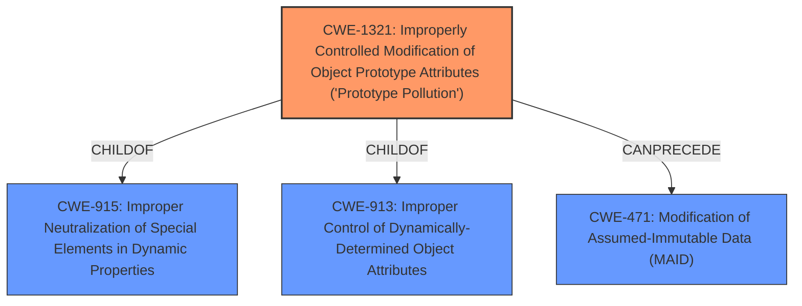

# Analysis for CVE-2021-23448

# Summary
| CWE ID | CWE Name | Confidence | CWE Abstraction Level | CWE Vulnerability Mapping Label | CWE-Vulnerability Mapping Notes |
|---|---|---|---|---|---|
| CWE-1321 | Improperly Controlled Modification of Object Prototype Attributes ('Prototype Pollution') | 1.0 | Variant | Allowed | Primary CWE |

## Evidence and Confidence

*   **Confidence Score:** 1.0
*   **Evidence Strength:** HIGH

## Relationship Analysis
The primary relationship influencing the decision is the ChildOf relationship between CWE-1321 and CWE-913 (Improper Control of Dynamically-Determined Object Attributes) and CWE-915 (Improper Neutralization of Special Elements in Dynamic Properties). This indicates that prototype pollution is a specific type of improper control of object attributes. The CanPrecede relationship to CWE-471 (Modification of Assumed-Immutable Data (MAID)) suggests that prototype pollution can lead to the modification of data that should not be modified. The Variant level of CWE-1321 makes it a more specific and appropriate choice than its Class-level parents.

## Vulnerability Chain
The vulnerability chain starts with the **improper handling of configuration files**, leading to **prototype pollution** and potentially resulting in Denial of Service (DoS), Remote Code Execution (RCE), or property injection.

## Summary of Analysis
The analysis is based on the provided vulnerability description and supporting evidence from the CVE reference links content summary. The primary **rootcause** is identified as **prototype pollution**, which is explicitly mentioned in the vulnerability description. The CVE reference links content summary confirms that the `config-handler` package is susceptible to Prototype Pollution due to the ability to inject properties into existing JavaScript language construct prototypes. The vulnerability description key phrases also highlight **prototype pollution** as the **rootcause**.

The decision to select CWE-1321 is based on the following evidence:

*   **Vulnerability Description:** "All versions of package config-handler are vulnerable to Prototype Pollution when loading config files."
*   **CVE Reference Links Content Summary:** "The vulnerability stems from the `config-handler` package's unsafe handling of configuration files, specifically when loading them. The package is susceptible to Prototype Pollution due to the ability to inject properties into existing JavaScript language construct prototypes."
*   **Retriever Results:** CWE-1321 is the top combined result with a similarity score of 0.249.
*   **CWE Specifications:** The description of CWE-1321 aligns perfectly with the vulnerability description: "The product receives input from an upstream component that specifies attributes that are to be initialized or updated in an object, but it does not properly control modifications of attributes of the object prototype."

CWE-1321 is at the Variant level of abstraction, which is the preferred level for mapping root causes. The MITRE mapping guidance for CWE-1321 states that its usage is "Allowed" and the rationale is "This CWE entry is at the Variant level of abstraction, which is a preferred level of abstraction for mapping to the root causes of vulnerabilities."

Other CWEs Considered but Not Used:

*   CWE-1188 (Initialization of a Resource with an Insecure Default): While the vulnerability involves loading configuration files, which could be considered resource initialization, the core issue is the uncontrolled modification of object prototypes, making CWE-1321 a more direct and accurate match.
*   CWE-73 (External Control of File Name or Path): While configuration files are involved, the path to the file itself is not the primary concern. The vulnerability lies in the contents of the file and how they are processed, leading to prototype pollution.
*   CWE-88 (Improper Neutralization of Argument Delimiters in a Command ('Argument Injection')): This CWE is related to command injection, which is not the case here.
*   CWE-843 (Access of Resource Using Incompatible Type ('Type Confusion')): This CWE is about accessing a resource using an incompatible type, which is not directly related to prototype pollution.
*   CWE-1333 (Inefficient Regular Expression Complexity): This CWE is related to regular expression complexity, which is not part of the vulnerability.
*   CWE-94 (Improper Control of Generation of Code ('Code Injection')): This CWE is about code injection, which is not directly happening.
*   CWE-918 (Server-Side Request Forgery (SSRF)): Not related to the vulnerability.
*   CWE-427 (Uncontrolled Search Path Element): Not related to the vulnerability.
*   CWE-790 (Improper Filtering of Special Elements): This CWE is too generic. The vulnerability description states that the config-handler is vulnerable to prototype pollution, not to a generic "improper filtering".