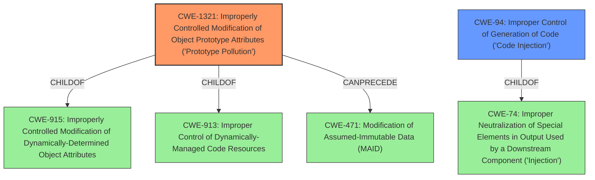

# Enhanced Analysis for CVE-2021-23449

# Summary
| CWE ID | CWE Name | Confidence | CWE Abstraction Level | CWE Vulnerability Mapping Label | CWE-Vulnerability Mapping Notes |
|---|---|---|---|---|---|
| CWE-1321 | Improperly Controlled Modification of Object Prototype Attributes ('Prototype Pollution') | 1.0 | Variant | Allowed | Primary CWE |
| CWE-94 | Improper Control of Generation of Code ('Code Injection') | 0.7 | Base | Allowed-with-Review | Secondary CWE |

## Evidence and Confidence

*   **Confidence Score:** 0.85
*   **Evidence Strength:** HIGH

## Relationship Analysis
The primary weakness is CWE-1321, which is a variant of CWE-915 and CWE-913. CWE-1321 can precede CWE-471. The high-level impact is CWE-94, code injection, which is related to CWE-74. The vulnerability involves prototype pollution leading to arbitrary code execution. The chain starts with the **improper modification of object prototype attributes**, and the exploitation of this weakness enables code injection.



## Vulnerability Chain
The vulnerability chain starts with **prototype pollution** (CWE-1321), which then leads to arbitrary code execution (CWE-94).

## Summary of Analysis
The initial analysis identified CWE-1321 as the most relevant based on the description indicating a **prototype pollution** attack vector. The CVE Reference Links Content Summary confirms this root cause. The impact of arbitrary code execution further supports this classification. The relationship analysis confirms that CWE-1321 is a variant-level weakness, which is the preferred level of abstraction.

CWE-94 was considered as a secondary weakness due to the high-level impact of code execution. However, since the primary root cause is prototype pollution, CWE-1321 is the more specific and accurate classification.

*   **Vulnerability Description Key Phrases**: "**rootcause:** **prototype pollution**", "**impact:** arbitrary code execution"
*   **CVE Reference Links Content Summary**: "The vulnerability is a result of a **Prototype Pollution attack vector**. Specifically, it involves the manipulation of `__proto__` attributes of JavaScript objects to overwrite or pollute an application's object prototype, potentially leading to remote code execution."

The selected CWEs are at the optimal level of specificity, with CWE-1321 accurately representing the root cause of the vulnerability, and CWE-94 capturing the high-level impact.

Relevant CWE Information:

# Enhanced Context (25 CWEs)
The following CWEs were identified as potentially relevant to this vulnerability:

## CWE-1321: Improperly Controlled Modification of Object Prototype Attributes ('Prototype Pollution')
**Abstraction:** Variant
**Similarity Score**: 7182.56
**Source**: sparse

**Description**:
The product receives input from an upstream component that specifies attributes that are to be initialized or updated in an object, but it does not properly control modifications of attributes of the object prototype.

**Mapping Guidance**:
- Usage: Allowed
- Rationale: This CWE entry is at the Variant level of abstraction, which is a preferred level of abstraction for mapping to the root causes of vulnerabilities.

## CWE-94: Improper Control of Generation of Code ('Code Injection')
**Abstraction:** base
**Similarity Score**: 3.89
**Source**: graph

**Description**:
CWE-94: Improper Control of Generation of Code ('Code Injection')

**Mapping Guidance**:
- Usage: Allowed-with-Review
- Rationale: This entry is frequently misused for vulnerabilities with a technical impact of "code execution," which does not by itself indicate a root cause weakness, since dozens of weaknesses can enable code execution.


## CWE Relationship Analysis

Current CWEs represent these abstraction levels: .


### Vulnerability Chain Analysis

**Chain starting from CWE-915:**
- 915 (Improperly Controlled Modification of Dynamically-Determined Object Attributes) - ROOT


**Chain starting from CWE-74:**
- 74 (Improper Neutralization of Special Elements in Output Used by a Downstream Component ('Injection')) - ROOT


### CWE Relationship Diagram

```mermaid
graph TD
    classDef primary fill:#f96,stroke:#333,stroke-width:2px
    classDef secondary fill:#69f,stroke:#333
    classDef tertiary fill:#9e9,stroke:#333
```