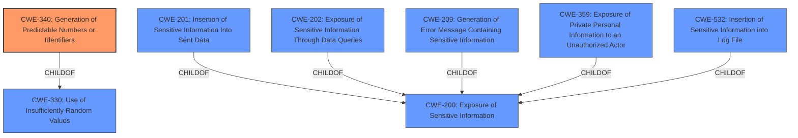

# Analysis for CVE-2021-23566

# Summary
| CWE ID | CWE Name | Confidence | CWE Abstraction Level | CWE Vulnerability Mapping Label | CWE-Vulnerability Mapping Notes |
|---|---|---|---|---|---|
| CWE-340 | Generation of Predictable Numbers or Identifiers | 0.9 | Class | Allowed-with-Review | Primary CWE |
| CWE-200 | Exposure of Sensitive Information | 0.7 | Class | Allowed | Secondary Candidate |

## Evidence and Confidence

*   **Confidence Score:** 0.8
*   **Evidence Strength:** HIGH

## Relationship Analysis
The primary CWE, CWE-340, is a Class-level weakness, which may have more specific Base or Variant level children. The relationship to CWE-330 (Use of Insufficiently Random Values) is important because insufficient randomness often leads to predictable outputs. CWE-200 is a parent of CWE-201(Insertion of Sensitive Information Into Sent Data), CWE-202(Exposure of Sensitive Information Through Data Queries), CWE-209(Generation of Error Message Containing Sensitive Information), CWE-359(Exposure of Private Personal Information to an Unauthorized Actor), and CWE-532(Insertion of Sensitive Information into Log File).

## Vulnerability Chain
The vulnerability chain starts with the **improper handling** of the `valueOf()` function, leading to the re-use of previously generated random bytes. This **weakness** results in the **generation of predictable identifiers**, which in turn leads to **information exposure**.

## Summary of Analysis
The initial assessment focused on identifying the root cause of the vulnerability and the resulting impact. The vulnerability description and CVE reference links clearly indicate that the `valueOf()` function allows the re-use of previously generated random bytes, leading to the generation of duplicate IDs. This directly aligns with CWE-340, which describes the **generation of predictable numbers or identifiers**. The **impact** is **information exposure**, because the last generated id can be reproduced.

The selection of CWE-340 is based on the following evidence:

*   Vulnerability Description Key Phrases: **impact: Information Exposure**
*   CVE Reference Links Content Summary: "**Root Cause:** The vulnerability stems from the `valueOf()` function in the `nanoid` library, which, when manipulated using a proxy number, can cause the library to reuse previously generated random bytes, leading to the generation of duplicate IDs."
*   CVE Reference Links Content Summary: "**Weaknesses/Vulnerabilities:** The primary weakness is the exposure of previously generated random data, leading to predictable ID generation."
*   Retriever Results: CWE-340 is in the retriever results.

The CWE is at the optimal level of specificity because it directly addresses the **root cause** of the vulnerability which is the **generation of predictable identifiers**. While information exposure (CWE-200) is a consequence, the core issue lies in the predictable nature of the generated IDs.

Relevant CWE Information:

# Enhanced Context (25 CWEs)
The following CWEs were identified as potentially relevant to this vulnerability:

## CWE-74: Improper Neutralization of Special Elements in Output Used by a Downstream Component ('Injection')
**Why it was not selected:** CWE-74 is too generic and focuses on injection vulnerabilities, which is not the primary issue here. The vulnerability is about predictable ID generation, not injecting malicious code or data.

## CWE-212: Improper Removal of Sensitive Information Before Storage or Transfer
**Why it was not selected:** This CWE is not relevant because the vulnerability is not about removing sensitive information.

## CWE-538: Insertion of Sensitive Information into Externally-Accessible File or Directory
**Why it was not selected:** This CWE is not relevant because the vulnerability is not about placing sensitive information into files or directories.

## CWE-113: Improper Neutralization of CRLF Sequences in HTTP Headers ('HTTP Request/Response Splitting')
**Why it was not selected:** This CWE is specific to HTTP headers and CRLF sequences, which are not involved in this vulnerability.

## CWE-209: Generation of Error Message Containing Sensitive Information
**Why it was not selected:** This CWE is not relevant because the vulnerability is not about generating error messages with sensitive information.

## CWE-138: Improper Neutralization of Special Elements
**Why it was not selected:** While this CWE is related to improper neutralization, it's a Class-level CWE and less specific than CWE-340, which directly addresses the predictable ID generation issue.

## CWE-668: Exposure of Resource to Wrong Sphere
**Why it was not selected:** This CWE is too high-level and doesn't accurately reflect the specific vulnerability.

## CWE-184: Incomplete List of Disallowed Inputs
**Why it was not selected:** This CWE is not relevant because the vulnerability is not about an incomplete list of disallowed inputs.

## CWE-41: Improper Resolution of Path Equivalence
**Why it was not selected:** This CWE is specific to file system path equivalence, which is not involved in this vulnerability.

## CWE-1289: Improper Validation of Unsafe Equivalence in Input
**Why it was not selected:** This CWE is not relevant because the vulnerability is not about validating unsafe equivalence in input.

## CWE-79: Improper Neutralization of Input During Web Page Generation ('Cross-site Scripting')
**Why it was not selected:** This CWE is specific to cross-site scripting vulnerabilities, which are not involved in this vulnerability.

## CWE-116: Improper Encoding or Escaping of Output
**Why it was not selected:** This CWE is about improper encoding or escaping of output, which is not the primary issue here.

## CWE-639: Authorization Bypass Through User-Controlled Key
**Why it was not selected:** This CWE is about authorization bypass, which is not involved in this vulnerability.

## CWE-209: Generation of Error Message Containing Sensitive Information
**Why it was not selected:** This CWE is not relevant because the vulnerability is not about generating error messages with sensitive information.

## CWE-201: Insertion of Sensitive Information Into Sent Data
**Why it was not selected:** While the vulnerability results in the re-use of random bytes, leading to predictable ID generation, the core issue is not about inserting sensitive information into sent data, but about the predictable nature of the generated IDs.

## CWE-201: Insertion of Sensitive Information Into Sent Data
**Why it was not selected:** While the vulnerability results in the re-use of random bytes, leading to predictable ID generation, the core issue is not about inserting sensitive information into sent data, but about the predictable nature of the generated IDs.

## CWE-79: Improper Neutralization of Input During Web Page Generation ('Cross-site Scripting')
**Why it was not selected:** This CWE is specific to cross-site scripting vulnerabilities, which are not involved in this vulnerability.

## CWE-494: Download of Code Without Integrity Check
**Why it was not selected:** This CWE is not relevant because the vulnerability is not about downloading code without integrity checks.

## CWE-117: Improper Output Neutralization for Logs
**Why it was not selected:** This CWE is specific to improper output neutralization for logs, which is not involved in this vulnerability.

## CWE-804: Guessable CAPTCHA
**Why it was not selected:** This CWE is specific to guessable CAPTCHAs, which are not involved in this vulnerability.

## CWE-22: Improper Limitation of a Pathname to a Restricted Directory ('Path Traversal')
**Why it was not selected:** This CWE is specific to path traversal vulnerabilities, which are not involved in this vulnerability.