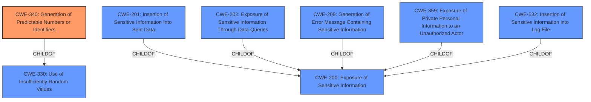

# Analysis for CVE-2021-23566

# Summary
| CWE ID | CWE Name | Confidence | CWE Abstraction Level | CWE Vulnerability Mapping Label | CWE-Vulnerability Mapping Notes |
|---|---|---|---|---|---|
| CWE-340 | Generation of Predictable Numbers or Identifiers | 0.9 | Class | Allowed-with-Review | Primary CWE |
| CWE-200 | Exposure of Sensitive Information | 0.7 | Class | Allowed | Secondary Candidate |

## Evidence and Confidence

*   **Confidence Score:** 0.8
*   **Evidence Strength:** HIGH

## Relationship Analysis
The primary CWE, CWE-340, is a Class-level weakness, which may have more specific Base or Variant level children. The relationship to CWE-330 (Use of Insufficiently Random Values) is important because insufficient randomness often leads to predictable outputs. CWE-200 is a parent of CWE-201(Insertion of Sensitive Information Into Sent Data), CWE-202(Exposure of Sensitive Information Through Data Queries), CWE-209(Generation of Error Message Containing Sensitive Information), CWE-359(Exposure of Private Personal Information to an Unauthorized Actor), and CWE-532(Insertion of Sensitive Information into Log File).

## Vulnerability Chain
The vulnerability chain starts with the **improper handling** of the `valueOf()` function, leading to the re-use of previously generated random bytes. This **weakness** results in the **generation of predictable identifiers**, which in turn leads to **information exposure**.

## Summary of Analysis
The initial assessment focused on identifying the root cause of the vulnerability and the resulting impact. The vulnerability description and CVE reference links clearly indicate that the `valueOf()` function allows the re-use of previously generated random bytes, leading to the generation of duplicate IDs. This directly aligns with CWE-340, which describes the **generation of predictable numbers or identifiers**. The **impact** is **information exposure**, because the last generated id can be reproduced.

The selection of CWE-340 is based on the following evidence:

*   Vulnerability Description Key Phrases: **impact: Information Exposure**
*   CVE Reference Links Content Summary: "**Root Cause:** The vulnerability stems from the `valueOf()` function in the `nanoid` library, which, when manipulated using a proxy number, can cause the library to reuse previously generated random bytes, leading to the generation of duplicate IDs."
*   CVE Reference Links Content Summary: "**Weaknesses/Vulnerabilities:** The primary weakness is the exposure of previously generated random data, leading to predictable ID generation."
*   Retriever Results: CWE-340 is in the retriever results.

The CWE is at the optimal level of specificity because it directly addresses the **root cause** of the vulnerability which is the **generation of predictable identifiers**. While information exposure (CWE-200) is a consequence, the core issue lies in the predictable nature of the generated IDs.

Relevant CWE Information:

# Enhanced Context (25 CWEs)
The following CWEs were identified as potentially relevant to this vulnerability:

## CWE-74: Improper Neutralization of Special Elements in Output Used by a Downstream Component ('Injection')
**Why it was not selected:** CWE-74 is too generic and focuses on injection vulnerabilities, which is not the primary issue here. The vulnerability is about predictable ID generation, not injecting malicious code or data.

## CWE-212: Improper Removal of Sensitive Information Before Storage or Transfer
**Why it was not selected:** This CWE is not relevant because the vulnerability is not about removing sensitive information.

## CWE-538: Insertion of Sensitive Information into Externally-Accessible File or Directory
**Why it was not selected:** This CWE is not relevant because the vulnerability is not about placing sensitive information into files or directories.

## CWE-113: Improper Neutralization of CRLF Sequences in HTTP Headers ('HTTP Request/Response Splitting')
**Why it was not selected:** This CWE is specific to HTTP headers and CRLF sequences, which are not involved in this vulnerability.

## CWE-209: Generation of Error Message Containing Sensitive Information
**Why it was not selected:** This CWE is not relevant because the vulnerability is not about generating error messages with sensitive information.

## CWE-138: Improper Neutralization of Special Elements
**Why it was not selected:** While this CWE is related to improper neutralization, it's a Class-level CWE and less specific than CWE-340, which directly addresses the predictable ID generation issue.

## CWE-668: Exposure of Resource to Wrong Sphere
**Why it was not selected:** This CWE is too high-level and doesn't accurately reflect the specific vulnerability.

## CWE-184: Incomplete List of Disallowed Inputs
**Why it was not selected:** This CWE is not relevant because the vulnerability is not about an incomplete list of disallowed inputs.

## CWE-41: Improper Resolution of Path Equivalence
**Why it was not selected:** This CWE is specific to file system path equivalence, which is not involved in this vulnerability.

## CWE-1289: Improper Validation of Unsafe Equivalence in Input
**Why it was not selected:** This CWE is not relevant because the vulnerability is not about validating unsafe equivalence in input.

## CWE-79: Improper Neutralization of Input During Web Page Generation ('Cross-site Scripting')
**Why it was not selected:** This CWE is specific to cross-site scripting vulnerabilities, which are not involved in this vulnerability.

## CWE-116: Improper Encoding or Escaping of Output
**Why it was not selected:** This CWE is about improper encoding or escaping of output, which is not the primary issue here.

## CWE-639: Authorization Bypass Through User-Controlled Key
**Why it was not selected:** This CWE is about authorization bypass, which is not involved in this vulnerability.

## CWE-209: Generation of Error Message Containing Sensitive Information
**Why it was not selected:** This CWE is not relevant because the vulnerability is not about generating error messages with sensitive information.

## CWE-201: Insertion of Sensitive Information Into Sent Data
**Why it was not selected:** While the vulnerability results in the re-use of random bytes, leading to predictable ID generation, the core issue is not about inserting sensitive information into sent data, but about the predictable nature of the generated IDs.

## CWE-201: Insertion of Sensitive Information Into Sent Data
**Why it was not selected:** While the vulnerability results in the re-use of random bytes, leading to predictable ID generation, the core issue is not about inserting sensitive information into sent data, but about the predictable nature of the generated IDs.

## CWE-79: Improper Neutralization of Input During Web Page Generation ('Cross-site Scripting')
**Why it was not selected:** This CWE is specific to cross-site scripting vulnerabilities, which are not involved in this vulnerability.

## CWE-494: Download of Code Without Integrity Check
**Why it was not selected:** This CWE is not relevant because the vulnerability is not about downloading code without integrity checks.

## CWE-117: Improper Output Neutralization for Logs
**Why it was not selected:** This CWE is specific to improper output neutralization for logs, which is not involved in this vulnerability.

## CWE-804: Guessable CAPTCHA
**Why it was not selected:** This CWE is specific to guessable CAPTCHAs, which are not involved in this vulnerability.

## CWE-22: Improper Limitation of a Pathname to a Restricted Directory ('Path Traversal')
**Why it was not selected:** This CWE is specific to path traversal vulnerabilities, which are not involved in this vulnerability.

# Enhanced Query for CVE-2021-23566

## Vulnerability Description
The package nanoid from 3.0.0 and before 3.1.31 are vulnerable to Information Exposure via the valueOf() function which allows to reproduce the last id generated.

### Vulnerability Description Key Phrases
- **impact:** Information Exposure
- **vector:** valueOf() function
- **product:** nanoid
- **version:** 3.0.0 to 3.1.31

## CVE Reference Links Content Summary
Based on the provided content, here's a breakdown of the vulnerability:

**Root Cause:**

The vulnerability stems from the `valueOf()` function in the `nanoid` library, which, when manipulated using a proxy number, can cause the library to reuse previously generated random bytes, leading to the generation of duplicate IDs.

**Weaknesses/Vulnerabilities:**

*   **Information Exposure:** The primary weakness is the exposure of previously generated random data, leading to predictable ID generation.
*   **Predictable IDs:** The core issue is that by manipulating the input through the `valueOf()` function of a proxy object, an attacker can cause the library to reuse the same random data that was used to create the previous ID.

**Impact of Exploitation:**

*   **ID Collision:** The vulnerability allows the attacker to generate the same ID as previously generated by the library.
*   **Security Implications:** Duplicate IDs can have various security implications depending on the application's use case for them. This could include bypassing access controls, tampering with data, or other unexpected behaviors.

**Attack Vectors:**

*   **Manipulated Input:**  The attack vector is the manipulation of the `size` argument passed to the nanoid function, using a specially crafted object with a `valueOf()` method that influences how the random byte pool is accessed within the library.

**Required Attacker Capabilities/Position:**

*   **Code Execution:** The attacker needs to have the ability to execute code that utilizes the vulnerable version of the `nanoid` library.
*   **Control over Input:** The attacker must be able to control or influence the input to the `nanoid()` function, specifically, they must be able to pass a malicious object that has a `valueOf()` function with specific behavior.

**Technical Details:**

*   The `nanoid` library uses a pool of random bytes to generate IDs. Normally, each call to `nanoid()` will pull new random bytes from this pool to ensure a unique ID.
*   The vulnerability is due to how the library handles the `size` parameter internally. The code uses the `valueOf()` method to convert the size argument to a number.
*  The provided proof of concept shows how a proxy object with a custom `valueOf()` method can manipulate the internal pool offset leading to the library reusing the previously generated bytes.
*   The fix is to explicitly convert the `size` and `bytes` arguments to numbers using `(size -= 0)` before using them to calculate offsets in the pool of random bytes. This prevents the malicious object from being able to influence these calculations.

**Versions Affected:**

*   `org.webjars.npm:nanoid` versions `[3.1.12,3.2.0)`
*   `nanoid` package versions `>=3.0.0 <3.1.31`

**Mitigation:**

*   Upgrade the `nanoid` package to version 3.2.0 or higher for `org.webjars.npm:nanoid`.
* Upgrade the `nanoid` package to version 3.1.31 or higher for `nanoid` package.

## Retriever Results

### Top Combined Results

| Rank | CWE ID | Name | Abstraction | Usage  | Retrievers | Individual Scores |
|------|--------|------|-------------|-------|------------|-------------------|
| 1 | 704 | Incorrect Type Conversion or Cast | Class | Allowed-with-Review | sparse | 0.079 |
| 2 | 201 | Insertion of Sensitive Information Into Sent Data | Base | Allowed | sparse | 0.052 |
| 3 | 359 | Exposure of Private Personal Information to an Unauthorized Actor | Base | Allowed | sparse | 0.051 |
| 4 | 138 | Improper Neutralization of Special Elements | Class | Discouraged | sparse | 0.049 |
| 5 | 532 | Insertion of Sensitive Information into Log File | Base | Allowed | sparse | 0.049 |
| 6 | 340 | Generation of Predictable Numbers or Identifiers | Class | Allowed-with-Review | dense | 0.468 |
| 7 | 804 | Guessable CAPTCHA | Base | Allowed | graph | 0.002 |
| 8 | 79 | Improper Neutralization of Input During Web Page Generation ('Cross-site Scripting') | Base | Allowed | sparse | 0.048 |
| 9 | 93 | Improper Neutralization of CRLF Sequences ('CRLF Injection') | Base | Allowed | sparse | 0.048 |
| 10 | 209 | Generation of Error Message Containing Sensitive Information | Base | Allowed | sparse | 0.048 |

# Complete CWE Specifications

## CWE-704: Incorrect Type Conversion or Cast
**Abstraction:** Class
**Status:** Incomplete

### Description
The product does not correctly convert an object, resource, or structure from one type to a different type.

### Extended Description
Not provided

### Alternative Terms
None

### Relationships
ChildOf -> CWE-664

### Mapping Guidance
**Usage:** Allowed-with-Review
**Rationale:** This CWE entry is a Class and might have Base-level children that would be more appropriate
**Comments:** Examine children of this entry to see if there is a better fit
**Reasons:**
- Abstraction

### Observed Examples
- **CVE-2021-43537:** Chain: in a web browser, an unsigned 64-bit integer is forcibly cast to a 32-bit integer (CWE-681) and potentially leading to an integer overflow (CWE-190). If an integer overflow occurs, this can cause heap memory corruption (CWE-122)
- **CVE-2022-3979:** Chain: data visualization program written in PHP uses the "!=" operator instead of the type-strict "!==" operator (CWE-480) when validating hash values, potentially leading to an incorrect type conversion (CWE-704)

## CWE-201: Insertion of Sensitive Information Into Sent Data
**Abstraction:** Base
**Status:** Draft

### Description
The code transmits data to another actor, but a portion of the data includes sensitive information that should not be accessible to that actor.

### Extended Description
Not provided

### Alternative Terms
None

### Relationships
ChildOf -> CWE-200
CanAlsoBe -> CWE-209
CanAlsoBe -> CWE-202

### Mapping Guidance
**Usage:** Allowed
**Rationale:** This CWE entry is at the Base level of abstraction, which is a preferred level of abstraction for mapping to the root causes of vulnerabilities.
**Comments:** Carefully read both the name and description to ensure that this mapping is an appropriate fit. Do not try to 'force' a mapping to a lower-level Base/Variant simply to comply with this preferred level of abstraction.
**Reasons:**
- Acceptable-Use

### Additional Notes
**[Other]** Sensitive information could include data that is sensitive in and of itself (such as credentials or private messages), or otherwise useful in the further exploitation of the system (such as internal file system structure).

### Observed Examples
- **CVE-2022-0708:** Collaboration platform does not clear team emails in a response, allowing leak of email addresses

## CWE-359: Exposure of Private Personal Information to an Unauthorized Actor
**Abstraction:** Base
**Status:** Incomplete

### Description
The product does not properly prevent a person's private, personal information from being accessed by actors who either (1) are not explicitly authorized to access the information or (2) do not have the implicit consent of the person about whom the information is collected.

### Extended Description
Not provided

### Alternative Terms
Privacy violation
Privacy leak
Privacy leakage

### Relationships
ChildOf -> CWE-200

### Mapping Guidance
**Usage:** Allowed
**Rationale:** This CWE entry is at the Base level of abstraction, which is a preferred level of abstraction for mapping to the root causes of vulnerabilities.
**Comments:** Carefully read both the name and description to ensure that this mapping is an appropriate fit. Do not try to 'force' a mapping to a lower-level Base/Variant simply to comply with this preferred level of abstraction.
**Reasons:**
- Acceptable-Use

### Additional Notes
**[Maintenance]** This entry overlaps many other entries that are not organized around the kind of sensitive information that is exposed. However, because privacy is treated with such importance due to regulations and other factors, and it may be useful for weakness-finding tools to highlight capabilities that detect personal private information instead of system information, it is not clear whether - and how - this entry should be deprecated.

**[Other]** 

There are many types of sensitive information that products must protect from attackers, including system data, communications, configuration, business secrets, intellectual property, and an individual's personal (private) information. Private personal information may include a password, phone number, geographic location, personal messages, credit card number, etc. Private information is important to consider whether the person is a user of the product, or part of a data set that is processed by the product. An exposure of private information does not necessarily prevent the product from working properly, and in fact the exposure might be intended by the developer, e.g. as part of data sharing with other organizations. However, the exposure of personal private information can still be undesirable or explicitly prohibited by law or regulation.

Some types of private information include:

  - Government identifiers, such as Social Security Numbers

  - Contact information, such as home addresses and telephone numbers

  - Geographic location - where the user is (or was)

  - Employment history

  - Financial data - such as credit card numbers, salary, bank accounts, and debts

  - Pictures, video, or audio

  - Behavioral patterns - such as web surfing history, when certain activities are performed, etc.

  - Relationships (and types of relationships) with others - family, friends, contacts, etc.

  - Communications - e-mail addresses, private messages, text messages, chat logs, etc.

  - Health - medical conditions, insurance status, prescription records

  - Account passwords and other credentials

Some of this information may be characterized as PII (Personally Identifiable Information), Protected Health Information (PHI), etc. Categories of private information may overlap or vary based on the intended usage or the policies and practices of a particular industry.

Sometimes data that is not labeled as private can have a privacy implication in a different context. For example, student identification numbers are usually not considered private because there is no explicit and publicly-available mapping to an individual student's personal information. However, if a school generates identification numbers based on student social security numbers, then the identification numbers should be considered private.

## CWE-138: Improper Neutralization of Special Elements
**Abstraction:** Class
**Status:** Draft

### Description
The product receives input from an upstream component, but it does not neutralize or incorrectly neutralizes special elements that could be interpreted as control elements or syntactic markers when they are sent to a downstream component.

### Extended Description
Most languages and protocols have their own special elements such as characters and reserved words. These special elements can carry control implications. If product does not prevent external control or influence over the inclusion of such special elements, the control flow of the program may be altered from what was intended. For example, both Unix and Windows interpret the symbol < ("less than") as meaning "read input from a file".

### Alternative Terms
None

### Relationships
ChildOf -> CWE-707

### Mapping Guidance
**Usage:** Discouraged
**Rationale:** This CWE entry is a level-1 Class (i.e., a child of a Pillar). It might have lower-level children that would be more appropriate
**Comments:** Examine children of this entry to see if there is a better fit
**Reasons:**
- Abstraction

### Additional Notes
**[Relationship]** This weakness can be related to interpretation conflicts or interaction errors in intermediaries (such as proxies or application firewalls) when the intermediary's model of an endpoint does not account for protocol-specific special elements.

**[Relationship]** See this entry's children for different types of special elements that have been observed at one point or another. However, it can be difficult to find suitable CVE examples. In an attempt to be complete, CWE includes some types that do not have any associated observed example.

**[Research Gap]** This weakness is probably under-studied for proprietary or custom formats. It is likely that these issues are fairly common in applications that use their own custom format for configuration files, logs, meta-data, messaging, etc. They would only be found by accident or with a focused effort based on an understanding of the format.

### Observed Examples
- **CVE-2001-0677:** Read arbitrary files from mail client by providing a special MIME header that is internally used to store pathnames for attachments.
- **CVE-2000-0703:** Setuid program does not cleanse special escape sequence before sending data to a mail program, causing the mail program to process those sequences.
- **CVE-2003-0020:** Multi-channel issue. Terminal escape sequences not filtered from log files.

## CWE-532: Insertion of Sensitive Information into Log File
**Abstraction:** Base
**Status:** Incomplete

### Description
The product writes sensitive information to a log file.

### Extended Description
Not provided

### Alternative Terms
None

### Relationships
ChildOf -> CWE-538
ChildOf -> CWE-200

### Mapping Guidance
**Usage:** Allowed
**Rationale:** This CWE entry is at the Base level of abstraction, which is a preferred level of abstraction for mapping to the root causes of vulnerabilities.
**Comments:** Carefully read both the name and description to ensure that this mapping is an appropriate fit. Do not try to 'force' a mapping to a lower-level Base/Variant simply to comply with this preferred level of abstraction.
**Reasons:**
- Acceptable-Use

### Observed Examples
- **CVE-2017-9615:** verbose logging stores admin credentials in a world-readable log file
- **CVE-2018-1999036:** SSH password for private key stored in build log

## CWE-340: Generation of Predictable Numbers or Identifiers
**Abstraction:** Class
**Status:** Incomplete

### Description
The product uses a scheme that generates numbers or identifiers that are more predictable than required.

### Extended Description
Not provided

### Alternative Terms
None

### Relationships
ChildOf -> CWE-330
CanPrecede -> CWE-384

### Mapping Guidance
**Usage:** Allowed-with-Review
**Rationale:** This CWE entry is a Class and might have Base-level children that would be more appropriate
**Comments:** Examine children of this entry to see if there is a better fit
**Reasons:**
- Abstraction

### Additional Notes
**[Maintenance]** As of CWE 4.5, terminology related to randomness, entropy, and predictability can vary widely. Within the developer and other communities, "randomness" is used heavily. However, within cryptography, "entropy" is distinct, typically implied as a measurement. There are no commonly-used definitions, even within standards documents and cryptography papers. Future versions of CWE will attempt to define these terms and, if necessary, distinguish between them in ways that are appropriate for different communities but do not reduce the usability of CWE for mapping, understanding, or other scenarios.

### Observed Examples
- **CVE-2022-29330:** Product for administering PBX systems uses predictable identifiers and timestamps for filenames (CWE-340) which allows attackers to access files via direct request (CWE-425).
- **CVE-2001-1141:** PRNG allows attackers to use the output of small PRNG requests to determine the internal state information, which could be used by attackers to predict future pseudo-random numbers.
- **CVE-1999-0074:** Listening TCP ports are sequentially allocated, allowing spoofing attacks.

## CWE-804: Guessable CAPTCHA
**Abstraction:** Base
**Status:** Incomplete

### Description
The product uses a CAPTCHA challenge, but the challenge can be guessed or automatically recognized by a non-human actor.

### Extended Description

An automated attacker could bypass the intended protection of the CAPTCHA challenge and perform actions at a higher frequency than humanly possible, such as launching spam attacks.

There can be several different causes of a guessable CAPTCHA:

  - An audio or visual image that does not have sufficient distortion from the unobfuscated source image.

  - A question is generated with a format that can be automatically recognized, such as a math question.

  - A question for which the number of possible answers is limited, such as birth years or favorite sports teams.

  - A general-knowledge or trivia question for which the answer can be accessed using a data base, such as country capitals or popular entertainers.

  - Other data associated with the CAPTCHA may provide hints about its contents, such as an image whose filename contains the word that is used in the CAPTCHA.

### Alternative Terms
None

### Relationships
ChildOf -> CWE-863
ChildOf -> CWE-1390

### Mapping Guidance
**Usage:** Allowed
**Rationale:** This CWE entry is at the Base level of abstraction, which is a preferred level of abstraction for mapping to the root causes of vulnerabilities.
**Comments:** Carefully read both the name and description to ensure that this mapping is an appropriate fit. Do not try to 'force' a mapping to a lower-level Base/Variant simply to comply with this preferred level of abstraction.
**Reasons:**
- Acceptable-Use

### Observed Examples
- **CVE-2022-4036:** Chain: appointment booking app uses a weak hash (CWE-328) for generating a CAPTCHA, making it guessable (CWE-804)

## CWE-79: Improper Neutralization of Input During Web Page Generation ('Cross-site Scripting')
**Abstraction:** Base
**Status:** Stable

### Description
The product does not neutralize or incorrectly neutralizes user-controllable input before it is placed in output that is used as a web page that is served to other users.

### Extended Description

Cross-site scripting (XSS) vulnerabilities occur when:

  1. Untrusted data enters a web application, typically from a web request.

  1. The web application dynamically generates a web page that contains this untrusted data.

  1. During page generation, the application does not prevent the data from containing content that is executable by a web browser, such as JavaScript, HTML tags, HTML attributes, mouse events, Flash, ActiveX, etc.

  1. A victim visits the generated web page through a web browser, which contains malicious script that was injected using the untrusted data.

  1. Since the script comes from a web page that was sent by the web server, the victim's web browser executes the malicious script in the context of the web server's domain.

  1. This effectively violates the intention of the web browser's same-origin policy, which states that scripts in one domain should not be able to access resources or run code in a different domain.

There are three main kinds of XSS:

  -  **Type 1: Reflected XSS (or Non-Persistent)**  - The server reads data directly from the HTTP request and reflects it back in the HTTP response. Reflected XSS exploits occur when an attacker causes a victim to supply dangerous content to a vulnerable web application, which is then reflected back to the victim and executed by the web browser. The most common mechanism for delivering malicious content is to include it as a parameter in a URL that is posted publicly or e-mailed directly to the victim. URLs constructed in this manner constitute the core of many phishing schemes, whereby an attacker convinces a victim to visit a URL that refers to a vulnerable site. After the site reflects the attacker's content back to the victim, the content is executed by the victim's browser.

  -  **Type 2: Stored XSS (or Persistent)**  - The application stores dangerous data in a database, message forum, visitor log, or other trusted data store. At a later time, the dangerous data is subsequently read back into the application and included in dynamic content. From an attacker's perspective, the optimal place to inject malicious content is in an area that is displayed to either many users or particularly interesting users. Interesting users typically have elevated privileges in the application or interact with sensitive data that is valuable to the attacker. If one of these users executes malicious content, the attacker may be able to perform privileged operations on behalf of the user or gain access to sensitive data belonging to the user. For example, the attacker might inject XSS into a log message, which might not be handled properly when an administrator views the logs. 

  -  **Type 0: DOM-Based XSS**  - In DOM-based XSS, the client performs the injection of XSS into the page; in the other types, the server performs the injection. DOM-based XSS generally involves server-controlled, trusted script that is sent to the client, such as Javascript that performs sanity checks on a form before the user submits it. If the server-supplied script processes user-supplied data and then injects it back into the web page (such as with dynamic HTML), then DOM-based XSS is possible. 

Once the malicious script is injected, the attacker can perform a variety of malicious activities. The attacker could transfer private information, such as cookies that may include session information, from the victim's machine to the attacker. The attacker could send malicious requests to a web site on behalf of the victim, which could be especially dangerous to the site if the victim has administrator privileges to manage that site. Phishing attacks could be used to emulate trusted web sites and trick the victim into entering a password, allowing the attacker to compromise the victim's account on that web site. Finally, the script could exploit a vulnerability in the web browser itself possibly taking over the victim's machine, sometimes referred to as "drive-by hacking."

In many cases, the attack can be launched without the victim even being aware of it. Even with careful users, attackers frequently use a variety of methods to encode the malicious portion of the attack, such as URL encoding or Unicode, so the request looks less suspicious.

### Alternative Terms
XSS: A common abbreviation for Cross-Site Scripting.
HTML Injection: Used as a synonym of stored (Type 2) XSS.
CSS: In the early years after initial discovery of XSS, "CSS" was a commonly-used acronym. However, this would cause confusion with "Cascading Style Sheets," so usage of this acronym has declined significantly.

### Relationships
ChildOf -> CWE-74
ChildOf -> CWE-74
CanPrecede -> CWE-494
PeerOf -> CWE-352

### Mapping Guidance
**Usage:** Allowed
**Rationale:** This CWE entry is at the Base level of abstraction, which is a preferred level of abstraction for mapping to the root causes of vulnerabilities.
**Comments:** Carefully read both the name and description to ensure that this mapping is an appropriate fit. Do not try to 'force' a mapping to a lower-level Base/Variant simply to comply with this preferred level of abstraction.
**Reasons:**
- Acceptable-Use

### Additional Notes
**[Relationship]** 

There can be a close relationship between XSS and CSRF (CWE-352). An attacker might use CSRF in order to trick the victim into submitting requests to the server in which the requests contain an XSS payload. A well-known example of this was the Samy worm on MySpace [REF-956]. The worm used XSS to insert malicious HTML sequences into a user's profile and add the attacker as a MySpace friend. MySpace friends of that victim would then execute the payload to modify their own profiles, causing the worm to propagate exponentially. Since the victims did not intentionally insert the malicious script themselves, CSRF was a root cause.

**[Applicable Platform]** 

XSS flaws are very common in web applications, since they require a great deal of developer discipline to avoid them.

### Observed Examples
- **CVE-2021-25926:** Python Library Manager did not sufficiently neutralize a user-supplied search term, allowing reflected XSS.
- **CVE-2021-25963:** Python-based e-commerce platform did not escape returned content on error pages, allowing for reflected Cross-Site Scripting attacks.
- **CVE-2021-1879:** Universal XSS in mobile operating system, as exploited in the wild per CISA KEV.

## CWE-93: Improper Neutralization of CRLF Sequences ('CRLF Injection')
**Abstraction:** Base
**Status:** Draft

### Description
The product uses CRLF (carriage return line feeds) as a special element, e.g. to separate lines or records, but it does not neutralize or incorrectly neutralizes CRLF sequences from inputs.

### Extended Description
Not provided

### Alternative Terms
None

### Relationships
ChildOf -> CWE-74
CanPrecede -> CWE-117

### Mapping Guidance
**Usage:** Allowed
**Rationale:** This CWE entry is at the Base level of abstraction, which is a preferred level of abstraction for mapping to the root causes of vulnerabilities.
**Comments:** Carefully read both the name and description to ensure that this mapping is an appropriate fit. Do not try to 'force' a mapping to a lower-level Base/Variant simply to comply with this preferred level of abstraction.
**Reasons:**
- Acceptable-Use

### Observed Examples
- **CVE-2002-1771:** CRLF injection enables spam proxy (add mail headers) using email address or name.
- **CVE-2002-1783:** CRLF injection in API function arguments modify headers for outgoing requests.
- **CVE-2004-1513:** Spoofed entries in web server log file via carriage returns

## CWE-209: Generation of Error Message Containing Sensitive Information
**Abstraction:** Base
**Status:** Draft

### Description
The product generates an error message that includes sensitive information about its environment, users, or associated data.

### Extended Description

The sensitive information may be valuable information on its own (such as a password), or it may be useful for launching other, more serious attacks. The error message may be created in different ways:

  - self-generated: the source code explicitly constructs the error message and delivers it

  - externally-generated: the external environment, such as a language interpreter, handles the error and constructs its own message, whose contents are not under direct control by the programmer

An attacker may use the contents of error messages to help launch another, more focused attack. For example, an attempt to exploit a path traversal weakness (CWE-22) might yield the full pathname of the installed application. In turn, this could be used to select the proper number of ".." sequences to navigate to the targeted file. An attack using SQL injection (CWE-89) might not initially succeed, but an error message could reveal the malformed query, which would expose query logic and possibly even passwords or other sensitive information used within the query.

### Alternative Terms
None

### Relationships
ChildOf -> CWE-200
ChildOf -> CWE-200
ChildOf -> CWE-755

### Mapping Guidance
**Usage:** Allowed
**Rationale:** This CWE entry is at the Base level of abstraction, which is a preferred level of abstraction for mapping to the root causes of vulnerabilities.
**Comments:** Carefully read both the name and description to ensure that this mapping is an appropriate fit. Do not try to 'force' a mapping to a lower-level Base/Variant simply to comply with this preferred level of abstraction.
**Reasons:**
- Acceptable-Use

### Observed Examples
- **CVE-2008-2049:** POP3 server reveals a password in an error message after multiple APOP commands are sent. Might be resultant from another weakness.
- **CVE-2007-5172:** Program reveals password in error message if attacker can trigger certain database errors.
- **CVE-2008-4638:** Composite: application running with high privileges (CWE-250) allows user to specify a restricted file to process, which generates a parsing error that leaks the contents of the file (CWE-209).

