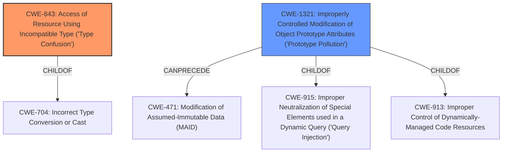

# Enhanced Analysis for CVE-2021-23807

# Summary
| CWE ID | CWE Name | Confidence | CWE Abstraction Level | CWE Vulnerability Mapping Label | CWE-Vulnerability Mapping Notes |
|---|---|---|---|---|---|
| CWE-843 | Access of Resource Using Incompatible Type ('Type Confusion') | 0.9 | Base | Allowed | Primary CWE |
| CWE-1321 | Improperly Controlled Modification of Object Prototype Attributes ('Prototype Pollution') | 0.8 | Variant | Allowed | Secondary Candidate |

## Evidence and Confidence

*   **Confidence Score:** 0.9
*   **Evidence Strength:** HIGH

## Relationship Analysis
The primary relationship that influenced the decision was the close association between **type confusion** (CWE-843) and **prototype pollution** (CWE-1321). While prototype pollution is the end result, the **type confusion** is the underlying cause that allowed the bypass. The hierarchy is such that both are related to improper input validation, and type confusion can often precede memory corruption issues.



## Vulnerability Chain
The vulnerability chain starts with a **type confusion** (**CWE-843**), which then allows for the bypass of a previous fix for prototype pollution, ultimately leading to **improperly controlled modification of object prototype attributes** (**CWE-1321**).

## Summary of Analysis
The initial assessment focused on the **type confusion** as the root cause, as indicated in the "Vulnerability Description Key Phrases": "**rootcause:** **type confusion**".

The CVE Reference Links Content Summary provides further evidence:
*   "It stems from a **type confusion** vulnerability that bypasses a previous fix for Prototype Pollution. The `set` function of the library does not properly validate the path components when they are arrays, allowing attackers to inject properties into the `Object.prototype`."
*   "**Type Confusion:** The vulnerability exists because the code does not strictly enforce path components to be strings or numbers when accessing object properties. It was possible to bypass the existing checks by providing an array as a path component."
*   "**Prototype Pollution:** The core weakness is the ability to modify the `Object.prototype` by manipulating special attributes such as `__proto__`, `constructor`, and `prototype`."

Based on this evidence, CWE-843 (Access of Resource Using Incompatible Type ('Type Confusion')) is chosen as the primary CWE. The vulnerability description clearly indicates that the root cause is the **type confusion** which leads to the bypass of the prototype pollution fix. CWE-1321 (Improperly Controlled Modification of Object Prototype Attributes ('Prototype Pollution')) is a secondary weakness because it is the direct result of the **type confusion**.

The Retriever Results also list CWE-843 with a high similarity score of 0.700, further supporting the choice of this CWE. CWE-1321 is also listed, reinforcing its role as a related weakness.

CWE-129 (Improper Validation of Array Index) was considered because the **type confusion** occurs when array indices are not properly validated. However, CWE-843 is a better fit as it directly addresses the **type confusion** issue, rather than specifically focusing on array index validation.

CWE-427 (Uncontrolled Search Path Element) was considered but deemed not relevant as the vulnerability does not involve uncontrolled search paths.

CWE-125 (Out-of-bounds Read) was considered but deemed not relevant as the vulnerability does not involve reading data past the end of a buffer.

CWE-825 (Expired Pointer Dereference) was considered but is not relevant since the description doesn't mention anything about memory being released or pointers to released memory being accessed.

CWE-822 (Untrusted Pointer Dereference) was considered but is not relevant as there is no mention of converting a value from an untrusted source into a pointer.

CWE-1333 (Inefficient Regular Expression Complexity) was considered but is not relevant as regular expressions are not involved in the vulnerability.

CWE-824 (Access of Uninitialized Pointer) was considered but is not relevant since there is no mention of uninitialized pointers being accessed.

CWE-1284 (Improper Validation of Specified Quantity in Input) was considered but is not relevant as the vulnerability doesn't involve improper validation of input quantities.

The selected CWEs are at the optimal level of specificity, with CWE-843 being a Base-level CWE and CWE-1321 being a Variant-level CWE, both accurately representing the root cause and resulting weakness of the vulnerability.

Relevant CWE Information:
## CWE-843: Access of Resource Using Incompatible Type ('Type Confusion')
**Abstraction:** Base
**Status:** Incomplete

### Description
The product allocates or initializes a resource such as a pointer, object, or variable using one type, but it later accesses that resource using a type that is incompatible with the original type.

### Extended Description
When the product accesses the resource using an incompatible type, this could trigger logical errors because the resource does not have expected properties. In languages without memory safety, such as C and C++, type confusion can lead to out-of-bounds memory access.

## CWE-1321: Improperly Controlled Modification of Object Prototype Attributes ('Prototype Pollution')
**Abstraction:** Variant
**Status:** Incomplete

### Description
The product receives input from an upstream component that specifies attributes that are to be initialized or updated in an object, but it does not properly control modifications of attributes of the object prototype.

### Extended Description
By adding or modifying attributes of an object prototype, it is possible to create attributes that exist on every object, or replace critical attributes with malicious ones. This can be problematic if the product depends on existence or non-existence of certain attributes, or uses pre-defined attributes of object prototype (such as hasOwnProperty, toString or valueOf).


## CWE Relationship Analysis

Current CWEs represent these abstraction levels: .


### Vulnerability Chain Analysis

**Chain starting from CWE-822:**
- 822 (Untrusted Pointer Dereference) - ROOT


**Chain starting from CWE-1284:**
- 1284 (Improper Validation of Specified Quantity in Input) - ROOT


### CWE Relationship Diagram

```mermaid
graph TD
    classDef primary fill:#f96,stroke:#333,stroke-width:2px
    classDef secondary fill:#69f,stroke:#333
    classDef tertiary fill:#9e9,stroke:#333
```