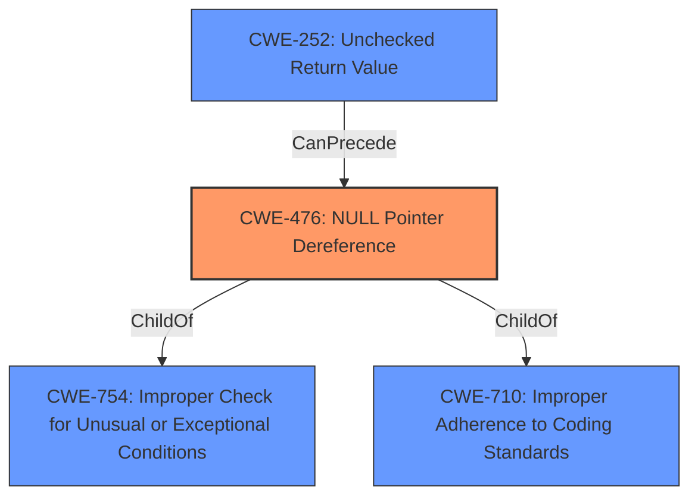

# Analysis for CVE-2021-23841

# Summary
| CWE ID  | CWE Name                                                       | Confidence | CWE Abstraction Level | CWE Vulnerability Mapping Label | CWE-Vulnerability Mapping Notes |
| :-------- | :------------------------------------------------------------- | :--------- | :---------------------- | :------------------------------ | :------------------------------ |
| CWE-476 | **CWE-476: NULL Pointer Dereference**                      | 1.0        | Base                    | Primary                         | Allowed                       |
| CWE-252 | **CWE-252: Unchecked Return Value**                          | 0.7        | Base                    | Secondary                       | Allowed                       |

## Evidence and Confidence

*   **Confidence Score:** 0.85
*   **Evidence Strength:** HIGH

## Relationship Analysis
The primary CWE identified is **CWE-476: NULL Pointer Dereference**, which is a Base level CWE. It is related to **CWE-754: Improper Check for Unusual or Exceptional Conditions** and **CWE-710: Improper Adherence to Coding Standards**. The vulnerability description indicates that the **NULL pointer dereference** occurs because the code **fails to correctly handle any errors** that may occur while parsing the issuer field, suggesting a potential lack of proper error checking which may lead to an unchecked return value.

## Vulnerability Chain
The vulnerability chain starts with the **improper parsing of the issuer field** in an X509 certificate, leading to a **failure in error handling**. This results in a **NULL pointer dereference**, which ultimately causes a **denial of service**.

Improper Input -> Error Handling Failure -> **CWE-476: NULL Pointer Dereference** -> Denial of Service

## Summary of Analysis
The initial analysis correctly identified **CWE-476: NULL Pointer Dereference** as the primary weakness, supported by the explicit mention of "NULL pointer deref" in the vulnerability description and the CVE details. The analysis considered the potential for **improper error handling** as a contributing factor.

The graph relationships highlight the connection between **CWE-476** and related CWEs like **CWE-754** (Improper Check for Unusual or Exceptional Conditions), suggesting that the root cause might involve inadequate checks for exceptional conditions during the parsing process.

The selection of **CWE-476** is at the optimal level of specificity because it directly describes the **technical weakness** that leads to the denial-of-service impact.

The vulnerability description clearly states: "This may subsequently result in a **NULL pointer deref** and a crash leading to a potential denial of service attack."

The CVE reference content summary reinforces this: "The function `X509_issuer_and_serial_hash()` does not properly handle errors when parsing the issuer field of an X509 certificate, which may lead to a **null pointer dereference**."

Additionally, it may be caused by an **unchecked return value** from a function that could return NULL if an error is encountered during the parsing of the issuer field.

CWEs Considered and Rejected:

*   CWE-327: Use of a Broken or Risky Cryptographic Algorithm - While the vulnerability involves OpenSSL, the root cause isn't a broken cryptographic algorithm, but rather a **failure in error handling** that leads to a **NULL pointer dereference**.
*   CWE-125: Out-of-bounds Read - There's no evidence of an out-of-bounds read in the provided description. The issue stems from a **NULL pointer dereference**.
*   CWE-427: Uncontrolled Search Path Element - This CWE is related to using an untrusted search path, which is not relevant to the vulnerability described.
*   CWE-459: Incomplete Cleanup - This CWE is about not properly cleaning up resources, which is not directly related to the **NULL pointer dereference** caused by error handling failure.
*   CWE-295: Improper Certificate Validation - While certificates are involved, the core issue is not about validating the certificate itself, but about how errors are handled during the parsing of the certificate's issuer field.
*   CWE-252: Unchecked Return Value - Considered as a secondary weakness that could contribute to the **NULL pointer dereference**. If the function that parses the issuer field returns NULL upon an error, and this return value is not checked, it could lead to the dereference.