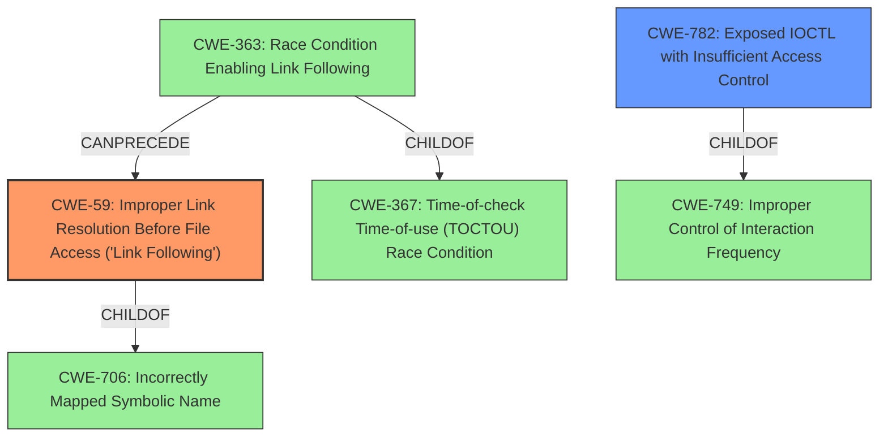

# Analysis Report for CVE-2021-23872

# Vulnerability Analysis Report: CVE-2021-23872

## Description


## Analysis (with Relationship Data)

# Summary
| CWE ID | CWE Name | Confidence | CWE Abstraction Level | CWE Vulnerability Mapping Label | CWE-Vulnerability Mapping Notes |
|---|---|---|---|---|---|
| CWE-59 | Improper Link Resolution Before File Access ('Link Following') | 0.9 | Base | Allowed | Primary CWE |
| CWE-782 | Exposed IOCTL with Insufficient Access Control | 0.7 | Variant | Allowed | Secondary Candidate |

## Evidence and Confidence

*   **Confidence Score:** 0.8
*   **Evidence Strength:** MEDIUM

## Relationship Analysis
The primary CWE is CWE-59, which describes the root cause of the vulnerability, involving the manipulation of symbolic links to achieve privilege escalation. CWE-59 is related to CWE-706 (incorrectly mapping symbolic name) since it is a child of it. The relationship between CWE-363 and CWE-59 shows how a race condition can lead to the exploitation of the link following vulnerability. CWE-782 is a variant level that indicates the IOCTL is exposed without proper access controls.



## Vulnerability Chain
The vulnerability chain begins with the **manipulation of a symbolic link** (CWE-59) within the IOCTL interface, which allows a local user to **gain elevated privileges**.

## Summary of Analysis
The initial analysis focused on the description of a **privilege escalation** vulnerability achieved by **manipulating a symbolic link** in the IOCTL interface. This pointed towards CWE-59 (Improper Link Resolution Before File Access), as the root cause. The **weakness** is that the software doesn't properly validate or restrict the use of symbolic links, allowing an attacker to redirect file operations to unintended locations, leading to **privilege escalation**.

The Retriever results and Complete CWE Specifications were reviewed to confirm this assessment. CWE-59 aligns well with the vulnerability description.

CWE-269 (Improper Privilege Management) was considered but deemed less specific, as it represents a broader class of privilege-related issues. The vulnerability is not simply about improper privilege management in general, but specifically about the use of symbolic links to bypass intended privilege boundaries. Therefore, CWE-59 is more accurate.

CWE-732 (Incorrect Permission Assignment for Critical Resource) was also considered, but it focuses on incorrect permission assignments rather than the exploitation of symbolic links. While incorrect permissions could potentially contribute to the vulnerability, the core issue is the **improper handling of symbolic links**, making CWE-59 the more appropriate choice.

CWE-782 (Exposed IOCTL with Insufficient Access Control) was considered as an additional CWE, since the IOCTL interface is where the **manipulation of the symbolic link** occurs.

The final decision to assign CWE-59 as the primary CWE is based on the direct evidence from the vulnerability description, the alignment of the CWE description with the vulnerability details, and the mapping guidance that favors the most specific CWE. The evidence from the vulnerability description is the phrase "**manipulating a symbolic link** in the IOCTL interface".
The vulnerability description states "**Privilege Escalation** vulnerability in the File Lock component of McAfee Total Protection (MTP) prior to 16.0.32 allows a local user to gain elevated privileges by manipulating a symbolic link in the IOCTL interface."

# Relevant CWE Information:

# Enhanced Context (25 CWEs)

## CWE-59: Improper Link Resolution Before File Access ('Link Following')
**Abstraction:** Base
**Status:** Draft

### Description
The product attempts to access a file based on the filename, but it does not properly prevent that filename from identifying a link or shortcut that resolves to an unintended resource.

## CWE-782: Exposed IOCTL with Insufficient Access Control
**Abstraction:** Variant
**Status:** Draft

### Description
The product implements an IOCTL with functionality that should be restricted, but it does not properly enforce access control for the IOCTL.


## CWE Relationship Analysis

Current CWEs represent these abstraction levels: .


### Vulnerability Chain Analysis

**Chain starting from CWE-732:**
- 732 (Incorrect Permission Assignment for Critical Resource) - ROOT


**Chain starting from CWE-782:**
- 782 (Exposed IOCTL with Insufficient Access Control) - ROOT


### CWE Relationship Diagram

```mermaid
graph TD
    classDef primary fill:#f96,stroke:#333,stroke-width:2px
    classDef secondary fill:#69f,stroke:#333
    classDef tertiary fill:#9e9,stroke:#333
```


*Report generated on 2025-04-02 04:42:15*
