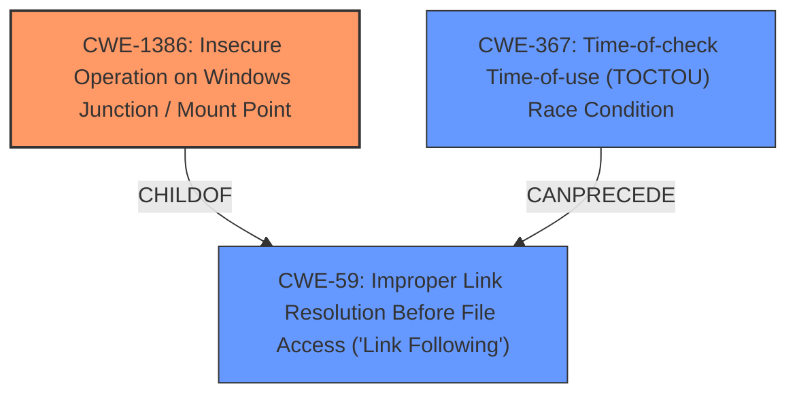

# Analysis Report for CVE-2021-23873

# Vulnerability Analysis Report: CVE-2021-23873

## Description


## Analysis (with Relationship Data)

# Summary
| CWE ID | CWE Name | Confidence | CWE Abstraction Level | CWE Vulnerability Mapping Label | CWE-Vulnerability Mapping Notes |
|---|---|---|---|---|---|
| CWE-1386 | Insecure Operation on Windows Junction / Mount Point | 0.9 | Base | Allowed | Primary CWE |
| CWE-59 | Improper Link Resolution Before File Access ('Link Following') | 0.7 | Base | Allowed | Secondary Candidate |
| CWE-367 | Time-of-check Time-of-use (TOCTOU) Race Condition | 0.6 | Base | Allowed | Secondary Candidate |

## Evidence and Confidence

*   **Confidence Score:** 0.9
*   **Evidence Strength:** HIGH

## Relationship Analysis
The primary CWE is CWE-1386, which is a specific type of insecure operation that involves Windows junctions and mount points. CWE-59 is a parent of CWE-1386, representing a broader class of vulnerabilities related to improper link resolution. CWE-367 (TOCTOU) represents a potential race condition that could enable the link following, but it is not explicitly mentioned as being present. The relationships show how a general link following issue can manifest as a more specific problem related to Windows junctions, potentially involving a race condition. Abstraction levels guided the selection, favoring the more specific Base level CWE-1386.



## Vulnerability Chain
The vulnerability chain starts with the attacker's ability to manipulate a junction link. The **WEAKNESS** lies in the application's failure to properly handle these manipulated links, leading to arbitrary file deletion as the SYSTEM user. This results in a denial-of-service condition.
  - Root Cause: **Improper handling of junction links (CWE-1386)**
  - Weakness: **Arbitrary file deletion** due to the manipulated junction link.
  - Impact: **Denial of Service**

## Summary of Analysis
The initial analysis focused on the **vector** "manipulating Junction link" and the resulting "Privilege Escalation". The presence of directory junctions and the arbitrary file deletion clearly points to **CWE-1386: Insecure Operation on Windows Junction / Mount Point**. The CVE Reference Links Content Summary confirms the root cause: "The application is susceptible to a denial-of-service vulnerability through the abuse of directory junctions."

The graph relationships highlight that CWE-1386 is a child of CWE-59, which means it's a specific type of link following issue. While CWE-59 could apply, CWE-1386 is more precise. CWE-367, while present in the retriever results, is not explicitly supported by the description.

The selected CWEs are at the optimal level of specificity because CWE-1386 directly addresses the insecure operation on Windows junctions, while CWE-59 and CWE-367 are broader and less directly applicable, respectively. The primary decision is based on the evidence: "an attacker can create a directory junction that, when processed by the QuickClean feature, results in the deletion of an arbitrary file, leading to a denial-of-service condition."

Relevant CWE Information:

# Enhanced Context (25 CWEs)
The following CWEs were identified as potentially relevant to this vulnerability:

## CWE-664: Improper Control of a Resource Through its Lifetime
**Abstraction Level**: Pillar
**Similarity Score**: 0.77
**Source**: dense

**Description**:
The product does not maintain or incorrectly maintains control over a resource throughout its lifetime of creation, use, and release.

**Mapping Guidance**:
- Usage: Discouraged
- Rationale: This CWE entry is high-level when lower-level children are available.

*Not Selected:* CWE-664 is too high-level.

## CWE-1220: Insufficient Granularity of Access Control
**Abstraction Level**: Base
**Similarity Score**: 0.76
**Source**: dense

**Description**:
The product implements access controls via a policy or other feature with the intention to disable or restrict accesses (reads and/or writes) to assets in a system from untrusted agents. However, implemented access controls lack required granularity, which renders the control policy too broad because it allows accesses from unauthorized agents to the security-sensitive assets.

**Mapping Guidance**:
- Usage: Allowed
- Rationale: This CWE entry is at the Base level of abstraction, which is a preferred level of abstraction for mapping to the root causes of vulnerabilities.

*Not Selected:* While there's a privilege escalation component, the root cause is the handling of the junction link.

## CWE-274: Improper Handling of Insufficient Privileges
**Abstraction Level**: Base
**Similarity Score**: 0.76
**Source**: dense

**Description**:
The product does not handle or incorrectly handles when it has insufficient privileges to perform an operation, leading to resultant weaknesses.

**Mapping Guidance**:
- Usage: Discouraged
- Rationale: This CWE entry could be deprecated in a future version of CWE.

*Not Selected:* This is not about insufficient privileges, but the incorrect handling of junctions.

## CWE-653: Improper Isolation or Compartmentalization
**Abstraction Level**: Class
**Similarity Score**: 0.76
**Source**: dense

**Description**:
The product does not properly compartmentalize or isolate functionality, processes, or resources that require different privilege levels, rights, or permissions.

**Mapping Guidance**:
- Usage: Allowed
- Rationale: This CWE entry is at the Base level of abstraction, which is a preferred level of abstraction for mapping to the root causes of vulnerabilities.

*Not Selected:* The core issue is not about isolation but the specific exploitation of junctions.

## CWE-59: Improper Link Resolution Before File Access ('Link Following')
**Abstraction Level**: Base
**Similarity Score**: 0.76
**Source**: dense

**Description**:
The product attempts to access a file based on the filename, but it does not properly prevent that filename from identifying a link or shortcut that resolves to an unintended resource.

**Mapping Guidance**:
- Usage: Allowed
- Rationale: This CWE entry is at the Base level of abstraction, which is a preferred level of abstraction for mapping to the root causes of vulnerabilities.

*Secondary Candidate:* As discussed in the Relationship Analysis, this is a parent of CWE-1386 and a broader classification.

## CWE-668: Exposure of Resource to Wrong Sphere
**Abstraction Level**: Class
**Similarity Score**: 0.76
**Source**: dense

**Description**:
The product exposes a resource to the wrong control sphere, providing unintended actors with inappropriate access to the resource.

**Mapping Guidance**:
- Usage: Discouraged
- Rationale: CWE-668 is high-level and is often misused as a catch-all when lower-level CWE IDs might be applicable. It is sometimes used for low-information vulnerability reports [REF-1287]. It is a level-1 Class (i.e., a child of a Pillar). It is not useful for trend analysis.

*Not Selected:* Too general; CWE-1386 is more specific.

## CWE-280: Improper Handling of Insufficient Permissions or Privileges
**Abstraction Level**: Base
**Similarity Score**: 0.75
**Source**: dense

**Description**:
The product does not handle or incorrectly handles when it has insufficient privileges to access resources or functionality as specified by their permissions. This may cause it to follow unexpected code paths that may leave the product in an invalid state.

**Mapping Guidance**:
- Usage: Allowed
- Rationale: This CWE entry is at the Base level of abstraction, which is a preferred level of abstraction for mapping to the root causes of vulnerabilities.

*Not Selected:* Not directly related to insufficient permissions.

## CWE-691: Insufficient Control Flow Management
**Abstraction Level**: Pillar
**Similarity Score**: 0.75
**Source**: dense

**Description**:
The code does not sufficiently manage its control flow during execution, creating conditions in which the control flow can be modified in unexpected ways.

**Mapping Guidance**:
- Usage: Discouraged
- Rationale: This CWE entry is extremely high-level, a Pillar. However, classification research is limited for weaknesses of this type, so there can be gaps or organizational difficulties within CWE that force use of this weakness, even at such a high level of abstraction.

*Not Selected:* Far too general and does not describe the specific vulnerability.

## CWE-73: External Control


## CWE Relationship Analysis

Current CWEs represent these abstraction levels: .


### Vulnerability Chain Analysis

**Chain starting from CWE-691:**
- 691 (Insufficient Control Flow Management) - ROOT


**Chain starting from CWE-664:**
- 664 (Improper Control of a Resource Through its Lifetime) - ROOT


### CWE Relationship Diagram

```mermaid
graph TD
    classDef primary fill:#f96,stroke:#333,stroke-width:2px
    classDef secondary fill:#69f,stroke:#333
    classDef tertiary fill:#9e9,stroke:#333
```


*Report generated on 2025-04-02 15:45:33*
