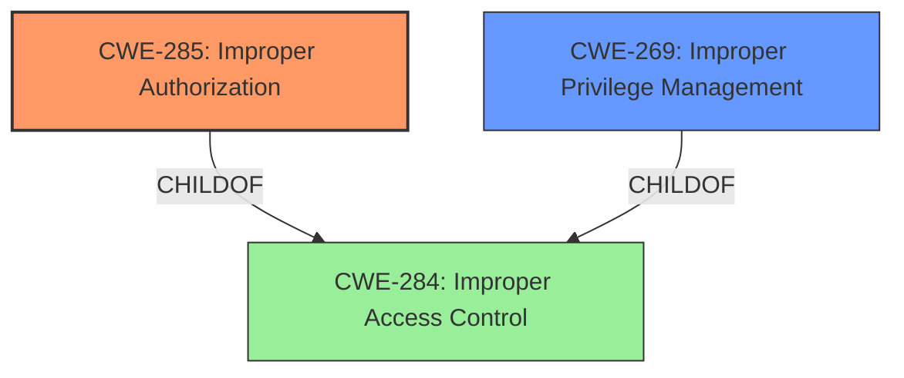

# Analysis for CVE-2021-23876

# Summary
| CWE ID | CWE Name | Confidence | CWE Abstraction Level | CWE Vulnerability Mapping Label | CWE-Vulnerability Mapping Notes |
|---|---|---|---|---|---|
| CWE-285 | Improper Authorization | 0.7 | Class | Primary | Discouraged |
| CWE-269 | Improper Privilege Management | 0.6 | Class | Secondary | Discouraged |

## Evidence and Confidence

*   **Confidence Score:** 0.7
*   **Evidence Strength:** MEDIUM

## Relationship Analysis
The primary CWE is CWE-285, "Improper Authorization," because the vulnerability involves a **bypass** of a Remote Procedure Call, indicating a failure to properly authorize the action. CWE-269, "Improper Privilege Management," is a related concern, as gaining elevated privileges is a direct consequence of the authorization bypass. Both are Class level CWEs and have a child-parent relationship to CWE-284.

## Vulnerability Chain
The vulnerability chain starts with a **bypass** in the Remote Procedure Call (RPC) (**Improper Authorization**), which leads to elevated privileges and arbitrary file modification as the SYSTEM user, ultimately causing a Denial of Service (DoS).

## Summary of Analysis
The initial assessment focused on the "**Bypass Remote Procedure call**" phrase in the vulnerability description. The retriever results suggested several CWEs, including CWE-269 (Improper Privilege Management), CWE-59 (Improper Link Resolution Before File Access), and CWE-367 (Time-of-check Time-of-use Race Condition). However, the "**bypass**" aspect strongly indicates an authorization issue, making CWE-285 (Improper Authorization) a more relevant primary CWE.

The vulnerability description explicitly states, "**Bypass Remote Procedure call** in McAfee Total Protection (MTP) prior to 16.0.30 allows a local user to gain elevated privileges and perform arbitrary file modification as the SYSTEM user potentially causing Denial of Service via executing carefully constructed malware." This statement directly supports the selection of CWE-285 (Improper Authorization) as the primary weakness because the **bypass** allows unauthorized actions. Gaining elevated privileges as the SYSTEM user is a consequence of this **bypass**, leading to arbitrary file modification and DoS.

CWE-285 is a Class-level CWE, and the mapping guidance discourages its use when lower-level CWEs are applicable. However, in this case, the description does not provide enough detail to pinpoint a more specific authorization failure. The retriever suggested considering CWE-862 (Missing Authorization) or CWE-863 (Incorrect Authorization). Without additional information about the exact mechanism of the **bypass**, selecting a more specific CWE would be speculative. Therefore, CWE-285 is the most appropriate choice based on the available evidence.

CWE-269 (Improper Privilege Management) is also considered as a secondary CWE due to the "gain elevated privileges" impact, but is less descriptive of the root cause compared to the authorization **bypass**.

Relevant CWE Information:

# Enhanced Context (25 CWEs)
The following CWEs were identified as potentially relevant to this vulnerability:

## CWE-1289: Improper Validation of Unsafe Equivalence in Input
**Abstraction Level**: Base
**Similarity Score**: 0.81
**Source**: dense

**Description**:
The product receives an input value that is used as a resource identifier or other type of reference, but it does not validate or incorrectly validates that the input is equivalent to a potentially-unsafe value.
- Not selected because the vulnerability does not focus on the validation of input equivalence.

## CWE-807: Reliance on Untrusted Inputs in a Security Decision
**Abstraction Level**: Base
**Similarity Score**: 0.79
**Source**: dense

**Description**:
The product uses a protection mechanism that relies on the existence or values of an input, but the input can be modified by an untrusted actor in a way that bypasses the protection mechanism.
- Not selected because the root cause seems to be authorization and not an input issue.

## CWE-184: Incomplete List of Disallowed Inputs
**Abstraction Level**: Base
**Similarity Score**: 0.78
**Source**: dense

**Description**:
The product implements a protection mechanism that relies on a list of inputs (or properties of inputs) that are not allowed by policy or otherwise require other action to neutralize before additional processing takes place, but the list is incomplete.
- Not selected because it's more related to input handling.

## CWE-183: Permissive List of Allowed Inputs
**Abstraction Level**: Base
**Similarity Score**: 0.78
**Source**: dense

**Description**:
The product implements a protection mechanism that relies on a list of inputs (or properties of inputs) that are explicitly allowed by policy because the inputs are assumed to be safe, but the list is too permissive - that is, it allows an input that is unsafe, leading to resultant weaknesses.
- Not selected because it's more related to input handling.

## CWE-274: Improper Handling of Insufficient Privileges
**Abstraction Level**: Base
**Similarity Score**: 0.77
**Source**: dense

**Description**:
The product does not handle or incorrectly handles when it has insufficient privileges to perform an operation, leading to resultant weaknesses.
- Not selected because the product **bypasses** the privilege check instead of improperly handling it.

## CWE-179: Incorrect Behavior Order: Early Validation
**Abstraction Level**: Base
**Similarity Score**: 0.77
**Source**: dense

**Description**:
The product validates input before applying protection mechanisms that modify the input, which could allow an attacker to bypass the validation via dangerous inputs that only arise after the modification.
- Not selected because it focuses on the timing of validation.

## CWE-41: Improper Resolution of Path Equivalence
**Abstraction Level**: Base
**Similarity Score**: 0.76
**Source**: dense

**Description**:
The product is vulnerable to file system contents disclosure through path equivalence. Path equivalence involves the use of special characters in file and directory names. The associated manipulations are intended to generate multiple names for the same object.
- Not selected because the vulnerability's primary issue is not related to path equivalence or file system disclosure.

## CWE-280: Improper Handling of Insufficient Permissions or Privileges 
**Abstraction Level**: Base
**Similarity Score**: 0.76
**Source**: dense

**Description**:
The product does not handle or incorrectly handles when it has insufficient privileges to access resources or functionality as specified by their permissions. This may cause it to follow unexpected code paths that may leave the product in an invalid state.
- Not selected because the product **bypasses** the privilege check instead of improperly handling it.

## CWE-703: Improper Check or Handling of Exceptional Conditions
**Abstraction Level**: Pillar
**Similarity Score**: 0.76
**Source**: dense

**Description**:
The product does not properly anticipate or handle exceptional conditions that rarely occur during normal operation of the product.
- Not selected because it is too high-level.

## CWE-754: Improper Check for Unusual or Exceptional Conditions
**Abstraction Level**: Class
**Similarity Score**: 0.76
**Source**: dense

**Description**:
The product does not check or incorrectly checks for unusual or exceptional conditions that are not expected to occur frequently during day to day operation of the product.
- Not selected because it focuses on checks for unusual conditions.

## CWE-367: Time-of-check Time-of-use (TOCTOU) Race Condition
**Abstraction Level**: Base
**Similarity Score**: 6835.32
**Source**: sparse

**Description**:
The product checks the state of a resource before using that resource, but the resource's state can change between the check and the use in a way that invalidates the results of the check. This can cause the product to perform invalid actions when the resource is in an unexpected state.
- Not selected because it does not appear to be a race condition.

## CWE-59: Improper Link Resolution Before File Access ('Link Following')
**Abstraction Level**: Base
**Similarity Score**: 6757.62
**Source**: sparse

**Description**:
The product attempts to access a file based on the filename, but it does not properly prevent that filename from identifying a link or shortcut that resolves to an unintended resource.
- Not selected because it does not appear to be a link following issue.

## CWE-863: Incorrect Authorization
**Abstraction Level**: Class
**Similarity Score**: 6505.