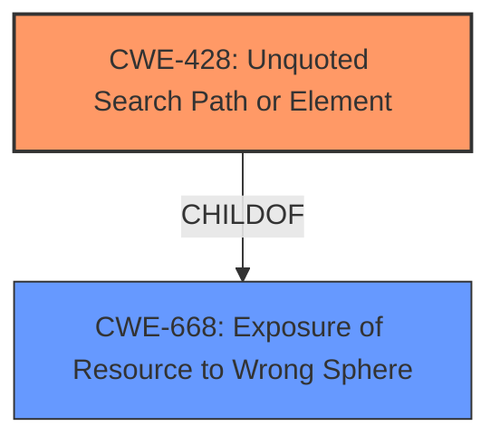

# Analysis Report for CVE-2021-23879

# Vulnerability Analysis Report: CVE-2021-23879

## Description


## Analysis (with Relationship Data)

# Summary
| CWE ID | CWE Name | Confidence | CWE Abstraction Level | CWE Vulnerability Mapping Label | CWE-Vulnerability Mapping Notes |
|---|---|---|---|---|---|
| CWE-428 | Unquoted Search Path or Element | 1.0 | Base | Allowed | Primary CWE |

## Evidence and Confidence

*   **Confidence Score:** 1.0
*   **Evidence Strength:** HIGH

## Relationship Analysis
The primary relationship that influenced the decision was the ChildOf relationship between CWE-428 and CWE-668 (Exposure of Resource to Wrong Sphere). While CWE-668 is a more general class, CWE-428 provides the specific mechanism of an unquoted search path, aligning perfectly with the vulnerability description.



## Vulnerability Chain
The vulnerability chain starts with the **unquoted service path** (root cause), which allows local administrators to place malicious executables in a compromised folder. The final impact is the execution of arbitrary code with higher-level privileges.

## Summary of Analysis
The initial analysis focused on identifying the root cause of the vulnerability. The description explicitly mentions an "**unquoted service path**," which immediately points to CWE-428. The vulnerability allows local administrators to execute arbitrary code due to the lack of proper quoting in the service path.

The following is the supporting evidence from the Vulnerability Description Key Phrases:
- **rootcause:** **unquoted service path**

CWE-428 (Unquoted Search Path or Element) precisely describes this scenario: "The product uses a search path that contains an unquoted element, in which the element contains whitespace or other separators. This can cause the product to access resources in a parent path."

The retriever results also list CWE-428 as the top candidate.
CWE-428's Mapping Guidance states:
**Usage:** Allowed
**Rationale:** This CWE entry is at the Base level of abstraction, which is a preferred level of abstraction for mapping to the root causes of vulnerabilities.

Given the explicit mention of an unquoted service path and the perfect alignment with CWE-428's description, a high confidence score is justified.

Other CWEs Considered:

*   CWE-427 (Uncontrolled Search Path Element): While related, CWE-427 is more general and focuses on scenarios where the search path itself is modifiable by an attacker. In this case, the path is fixed but contains an unquoted element.
*   CWE-732 (Incorrect Permission Assignment for Critical Resource): This CWE is too broad and doesn't directly address the unquoted path issue. The problem isn't necessarily about incorrect permissions but about the **lack of proper quoting**.
*   CWE-269 (Improper Privilege Management): This is a class-level CWE and too general. The issue is not about improperly managing privileges in general, but stems from a specific coding error (**unquoted service path**).


## CWE Relationship Analysis

Current CWEs represent these abstraction levels: .


### Vulnerability Chain Analysis

**Chain starting from CWE-732:**
- 732 (Incorrect Permission Assignment for Critical Resource) - ROOT


**Chain starting from CWE-428:**
- 428 (Unquoted Search Path or Element) - ROOT


### CWE Relationship Diagram

```mermaid
graph TD
    classDef primary fill:#f96,stroke:#333,stroke-width:2px
    classDef secondary fill:#69f,stroke:#333
    classDef tertiary fill:#9e9,stroke:#333
```


*Report generated on 2025-04-02 07:01:27*
