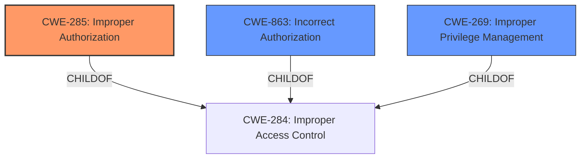

# Enhanced Analysis for CVE-2021-23880

# Summary
| CWE ID | CWE Name | Confidence | CWE Abstraction Level | CWE Vulnerability Mapping Label | CWE-Vulnerability Mapping Notes |
|---|---|---|---|---|---|
| CWE-285 | Improper Authorization | 0.9 | Class | Primary | Discouraged |
| CWE-863 | Incorrect Authorization | 0.7 | Class | Secondary | Allowed-with-Review |
| CWE-269 | Improper Privilege Management | 0.6 | Class | Secondary | Discouraged |

## Evidence and Confidence

*   **Confidence Score:** 0.9
*   **Evidence Strength:** HIGH

## Relationship Analysis
The primary CWE is CWE-285 (**Improper Authorization**) because the vulnerability lies in the product's failure to properly check whether the authenticated local administrator has the correct authorization to perform the uninstallation. While CWE-269 (**Improper Privilege Management**) and CWE-863 (**Incorrect Authorization**) were also considered, CWE-285 better captures the high-level authorization failure.

The relationships that impacted the decision include:
  - CWE-285 and CWE-863 are children of CWE-284 (**Improper Access Control**), indicating they are more specific types of access control failures.
  - CWE-269 (**Improper Privilege Management**) is also a child of CWE-284, suggesting it is related to but distinct from authorization issues.
  - The abstraction levels (all Class) guide selection towards the most appropriate level of detail.



## Vulnerability Chain
The vulnerability chain consists of the following:
  1.  **Root Cause:** **Improper Access Control** (**Improper Authorization**)
  2.  **Weakness:** Failure to properly authorize the authenticated local administrator to perform the uninstallation.
  3.  **Impact:** Uninstallation of the anti-malware engine.

## Summary of Analysis
The initial analysis focused on the **Improper Access Control** root cause and the ability for an authenticated local administrator to uninstall the anti-malware engine. The primary candidate was CWE-285 (**Improper Authorization**) because the vulnerability involves the product not properly performing an authorization check. The vulnerability description states "**Improper Access Control** in attribute in McAfee Endpoint Security (ENS) for Windows prior to 10.7.0 February 2021 Update allows authenticated local administrator user to perform an uninstallation of the anti-malware engine via the running of a specific command with the correct parameters."

CWE-285 is a better fit than CWE-284 (**Improper Access Control**) because CWE-285 is more specific, relating directly to authorization. The mapping guidance for CWE-284 explicitly discourages its use due to its high-level nature and recommends using more specific descendants like CWE-862 (**Missing Authorization**), CWE-863 (**Incorrect Authorization**), or CWE-732 (**Incorrect Permission Assignment for Critical Resource**).

CWE-863 (**Incorrect Authorization**) was considered as a secondary candidate since the authorization check is performed but incorrectly. However, since the root cause is the lack of proper authorization, CWE-285 is a better primary mapping.

CWE-269 (**Improper Privilege Management**) was also considered but deemed less suitable as the core issue is not about managing privileges in general, but specifically about failing to authorize an action.

The selected CWEs are at the optimal level of specificity, providing a clear and accurate representation of the vulnerability based on the provided evidence and relationship context.

Relevant CWE Information:

# Enhanced Context (25 CWEs)
The following CWEs were identified as potentially relevant to this vulnerability:

## CWE-668: Exposure of Resource to Wrong Sphere
**Abstraction Level**: Class
**Similarity Score**: 0.76
**Source**: dense

**Description**:
The product exposes a resource to the wrong control sphere, providing unintended actors with inappropriate access to the resource.

**Mapping Guidance**:
- Usage: Discouraged
- Rationale: CWE-668 is high-level and is often misused as a catch-all when lower-level CWE IDs might be applicable. It is sometimes used for low-information vulnerability reports [REF-1287]. It is a level-1 Class (i.e., a child of a Pillar). It is not useful for trend analysis.


## CWE-664: Improper Control of a Resource Through its Lifetime
**Abstraction Level**: Pillar
**Similarity Score**: 0.76
**Source**: dense

**Description**:
The product does not maintain or incorrectly maintains control over a resource throughout its lifetime of creation, use, and release.

**Mapping Guidance**:
- Usage: Discouraged
- Rationale: This CWE entry is high-level when lower-level children are available.


## CWE-653: Improper Isolation or Compartmentalization
**Abstraction Level**: Class
**Similarity Score**: 0.74
**Source**: dense

**Description**:
The product does not properly compartmentalize or isolate functionality, processes, or resources that require different privilege levels, rights, or permissions.

**Mapping Guidance**:
- Usage: Allowed
- Rationale: This CWE entry is at the Base level of abstraction, which is a preferred level of abstraction for mapping to the root causes of vulnerabilities.


## CWE-59: Improper Link Resolution Before File Access ('Link Following')
**Abstraction Level**: Base
**Similarity Score**: 0.74
**Source**: dense

**Description**:
The product attempts to access a file based on the filename, but it does not properly prevent that filename from identifying a link or shortcut that resolves to an unintended resource.

**Mapping Guidance**:
- Usage: Allowed
- Rationale: This CWE entry is at the Base level of abstraction, which is a preferred level of abstraction for mapping to the root causes of vulnerabilities.


## CWE-610: Externally Controlled Reference to a Resource in Another Sphere
**Abstraction Level**: Class
**Similarity Score**: 0.74
**Source**: dense

**Description**:
The product uses an externally controlled name or reference that resolves to a resource that is outside of the intended control sphere.

**Mapping Guidance**:
- Usage: Discouraged
- Rationale: This CWE entry is a level-1 Class (i.e., a child of a Pillar). It might have lower-level children that would be more appropriate


## CWE-552: Files or Directories Accessible to External Parties
**Abstraction Level**: Base
**Similarity Score**: 0.73
**Source**: dense

**Description**:
The product makes files or directories accessible to unauthorized actors, even though they should not be.

**Mapping Guidance**:
- Usage: Allowed
- Rationale: This CWE entry is at the Base level of abstraction, which is a preferred level of abstraction for mapping to the root causes of vulnerabilities.


## CWE-73: External Control of File Name or Path
**Abstraction Level**: Base
**Similarity Score**: 0.73
**Source**: dense

**Description**:
The product allows user input to control or influence paths or file names that are used in filesystem operations.

**Mapping Guidance**:
- Usage: Allowed
- Rationale: This CWE entry is at the Base level of abstraction, which is a preferred level of abstraction for mapping to the root causes of vulnerabilities.


## CWE-1220: Insufficient Granularity of Access Control
**Abstraction Level**: Base
**Similarity Score**: 0.73
**Source**: dense

**Description**:
The product implements access controls via a policy or other feature with the intention to disable or restrict accesses (reads and/or writes) to assets in a system from untrusted agents. However, implemented access controls lack required granularity, which renders the control policy too broad because it allows accesses from unauthorized agents to the security-sensitive assets.

**Mapping Guidance**:
- Usage: Allowed
- Rationale: This CWE entry is at the Base level of abstraction, which is a preferred level of abstraction for mapping to the root causes of vulnerabilities.


## CWE-274: Improper Handling of Insufficient Privileges
**Abstraction Level**: Base
**Similarity Score**: 0.73
**Source**: dense

**Description**:
The product does not handle or incorrectly handles when it has insufficient privileges to perform an operation, leading to resultant weaknesses.

**Mapping Guidance**:
- Usage: Discouraged
- Rationale: This CWE entry could be deprecated in a future version of CWE.


## CWE-404: Improper Resource Shutdown or Release
**Abstraction Level**: Class
**Similarity Score


## CWE Relationship Analysis

Current CWEs represent these abstraction levels: .


### Vulnerability Chain Analysis

**Chain starting from CWE-732:**
- 732 (Incorrect Permission Assignment for Critical Resource) - ROOT


**Chain starting from CWE-664:**
- 664 (Improper Control of a Resource Through its Lifetime) - ROOT


### CWE Relationship Diagram

```mermaid
graph TD
    classDef primary fill:#f96,stroke:#333,stroke-width:2px
    classDef secondary fill:#69f,stroke:#333
    classDef tertiary fill:#9e9,stroke:#333
```