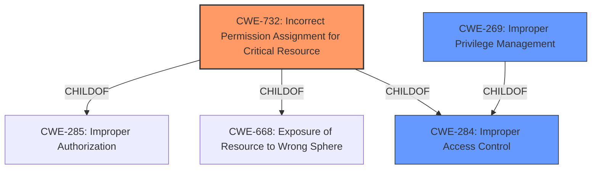

# Analysis for CVE-2021-23882

# Summary
| CWE ID | CWE Name | Confidence | CWE Abstraction Level | CWE Vulnerability Mapping Label | CWE-Vulnerability Mapping Notes |
|---|---|---|---|---|---|
| CWE-732 | Incorrect Permission Assignment for Critical Resource | 0.8 | Class | Primary | Allowed-with-Review |
| CWE-284 | Improper Access Control | 0.5 | Pillar | Secondary | Discouraged |
| CWE-269 | Improper Privilege Management | 0.4 | Class | Secondary | Discouraged |

## Evidence and Confidence

*   **Confidence Score:** 0.8
*   **Evidence Strength:** MEDIUM

## Relationship Analysis
The primary CWE selected is CWE-732, which is a Class-level CWE. It is related to CWE-285 (Improper Authorization) and CWE-668 (Exposure of Resource to Wrong Sphere) through ChildOf relationships. CWE-284 is a Pillar-level CWE, making it a very high-level classification, and parent of CWE-732. CWE-269, while relevant, is discouraged for usage as it's often misused and indicates a technical impact rather than a root cause.

## Vulnerability Chain
The vulnerability chain starts with the **improper access control**, specifically an **incorrect permission assignment**, which allows a local administrator to place carefully crafted files in the installation directory. This, in turn, prevents the installation of some ENS files.

Root Cause: **Improper Access Control** due to **Incorrect Permission Assignment**.
Impact: Prevention of ENS files installation.

## Summary of Analysis
The initial analysis identified **Improper Access Control** as the primary weakness. However, the description also mentions that local administrators can place carefully crafted files to prevent installation, suggesting that the permissions on the installation directory are incorrectly configured. This leads to the selection of CWE-732 (Incorrect Permission Assignment for Critical Resource) as the primary CWE.

The vulnerability description states: "**Improper Access Control** vulnerability in McAfee Endpoint Security (ENS) for Windows prior to 10.7.0 February 2021 Update allows local administrators to prevent the installation of some ENS files by placing carefully crafted files where ENS will be installed. This is only applicable to clean installations of ENS as the Access Control rules will prevent modification prior to up an upgrade." This statement directly supports the classification as **improper access control**, and more specifically, an **incorrect permission assignment**, as the local administrator's ability to place files in the installation directory points to a permission issue.

CWE-284 (Improper Access Control) is considered a secondary CWE because the provided information highlights a specific type of access control issue, which is the permission assignment. While CWE-284 broadly covers access control issues, CWE-732 is more specific to the root cause.

CWE-269 (Improper Privilege Management) was considered but ultimately deemed less appropriate than CWE-732. While the local administrator's ability to affect the system hints at privilege issues, the more direct cause is the incorrect permission assignment on the installation directory.

The selected CWEs are at an optimal level of specificity. CWE-732 is a Class-level CWE, which is more specific than the Pillar-level CWE-284. The evidence directly supports the incorrect permission assignment aspect, making CWE-732 the most suitable choice.
Relevant CWE Information:

### CWE-732: Incorrect Permission Assignment for Critical Resource
The product specifies permissions for a security-critical resource in a way that allows that resource to be read or modified by unintended actors. In this case, the installation directory is the security-critical resource, and local administrators (potentially unintended actors in this context) can modify it.

### CWE-284: Improper Access Control
The product does not restrict or incorrectly restricts access to a resource from an unauthorized actor. This is a broader category that encompasses the specific permission assignment issue described in the vulnerability.

### CWE-269: Improper Privilege Management
The product does not properly assign, modify, track, or check privileges for an actor, creating an unintended sphere of control for that actor. This is less specific than CWE-732, as the vulnerability's root cause is the incorrect permission assignment on the installation directory, rather than a general privilege management issue.