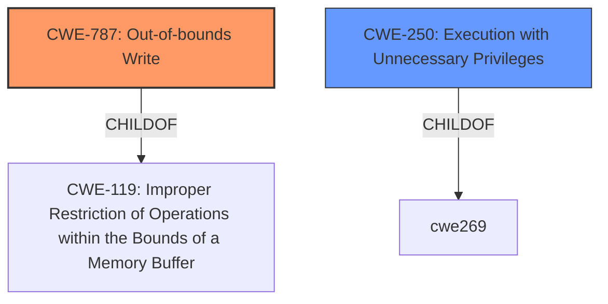

# Analysis for CVE-2021-23887

# Summary
| CWE ID | CWE Name | Confidence | CWE Abstraction Level | CWE Vulnerability Mapping Label | CWE-Vulnerability Mapping Notes |
|---|---|---|---|---|---|
| CWE-787 | Out-of-bounds Write | 0.75 | Base | Allowed | Primary CWE |
| CWE-250 | Execution with Unnecessary Privileges | 0.5 | Base | Allowed | Secondary CWE |

## Evidence and Confidence

*   **Confidence Score:** 0.7
*   **Evidence Strength:** MEDIUM

## Relationship Analysis
The primary relationship that influenced the decision was the parent-child relationship between CWE-787 and CWE-119 (Improper Restriction of Operations within the Bounds of a Memory Buffer). CWE-787 is a specific type of buffer overflow, and the vulnerability description clearly indicates an out-of-bounds write. CWE-250 is related to the unnecessary privileges that amplify the impact of the vulnerability.

## Vulnerability Chain
The vulnerability chain starts with the **improper handling** in the McAfee DLP, leading to a scenario where an attacker can modify memory. This leads to **out-of-bounds write**, and finally the **privilege escalation** impact.

## Summary of Analysis
The primary CWE is CWE-787 (Out-of-bounds Write). The vulnerability description states that a local, low-privileged attacker can write to arbitrary controlled kernel addresses. The attacker achieves this by launching applications, suspending them, modifying the memory, and restarting them when they are monitored by McAfee DLP through the hdlphook driver. This clearly indicates an out-of-bounds write condition.

The retriever results also list CWE-787, and its description matches the **out-of-bounds write** condition.

The evidence comes directly from the "Vulnerability Description": "allows a local, low privileged, attacker to write to arbitrary controlled kernel addresses... modifying the memory".

CWE-250 (Execution with Unnecessary Privileges) is considered as a secondary CWE. The vulnerability allows a low-privileged attacker to write to kernel addresses. The fact that the application is running with privileges that allow such access contributes to the severity of the vulnerability.

Other CWEs considered but not selected:

*   CWE-269 (Improper Privilege Management): While privilege escalation is the end result, the root cause is the out-of-bounds write, not a general issue with privilege management. The mapping guidance discourages using CWE-269 when a more specific cause can be identified.
*   CWE-59 (Improper Link Resolution Before File Access ('Link Following')): This CWE is not relevant because the vulnerability does not involve symbolic links or file access issues.
*   CWE-668 (Exposure of Resource to Wrong Sphere): This is too high-level and doesn't accurately describe the root cause.
*   CWE-367 (Time-of-check Time-of-use (TOCTOU) Race Condition): While there is a timing aspect (suspending and restarting applications), the core issue is the memory modification, not a race condition.
*   CWE-732 (Incorrect Permission Assignment for Critical Resource): The vulnerability is not related to incorrect permission assignments.
*   CWE-200 (Exposure of Sensitive Information to an Unauthorized Actor): The vulnerability is not about exposing sensitive information.
*   CWE-427 (Uncontrolled Search Path Element): The vulnerability doesn't involve search paths or DLL loading.

The selected CWEs are at the Base level of abstraction, which is the preferred level for mapping root causes.

Relevant CWE Information:

# Enhanced Context (25 CWEs)
The following CWEs were identified as potentially relevant to this vulnerability:

## CWE-59: Improper Link Resolution Before File Access ('Link Following')
**Abstraction Level**: Base
**Similarity Score**: 0.76
**Source**: dense

**Description**:
The product attempts to access a file based on the filename, but it does not properly prevent that filename from identifying a link or shortcut that resolves to an unintended resource.

**Mapping Guidance**:
- Usage: Allowed
- Rationale: This CWE entry is at the Base level of abstraction, which is a preferred level of abstraction for mapping to the root causes of vulnerabilities.

## CWE-667: Improper Locking
**Abstraction Level**: Class
**Similarity Score**: 0.76
**Source**: dense

**Description**:
The product does not properly acquire or release a lock on a resource, leading to unexpected resource state changes and behaviors.

**Mapping Guidance**:
- Usage: Allowed-with-Review
- Rationale: This CWE entry is a Class and might have Base-level children that would be more appropriate

## CWE-404: Improper Resource Shutdown or Release
**Abstraction Level**: Class
**Similarity Score**: 0.76
**Source**: dense

**Description**:
The product does not release or incorrectly releases a resource before it is made available for re-use.

**Mapping Guidance**:
- Usage: Allowed-with-Review
- Rationale: This CWE entry is a Class and might have Base-level children that would be more appropriate

## CWE-226: Sensitive Information in Resource Not Removed Before Reuse
**Abstraction Level**: Base
**Similarity Score**: 0.75
**Source**: dense

**Description**:
The product releases a resource such as memory or a file so that it can be made available for reuse, but it does not clear or "zeroize" the information contained in the resource before the product performs a critical state transition or makes the resource available for reuse by other entities.

**Mapping Guidance**:
- Usage: Allowed
- Rationale: This CWE entry is at the Base level of abstraction, which is a preferred level of abstraction for mapping to the root causes of vulnerabilities.

## CWE-125: Out-of-bounds Read
**Abstraction Level**: Base
**Similarity Score**: 0.75
**Source**: dense

**Description**:
The product reads data past the end, or before the beginning, of the intended buffer.

**Mapping Guidance**:
- Usage: Allowed
- Rationale: This CWE entry is at the Base level of abstraction, which is a preferred level of abstraction for mapping to the root causes of vulnerabilities.

## CWE-788: Access of Memory Location After End of Buffer
**Abstraction Level**: Base
**Similarity Score**: 0.75
**Source**: dense

**Description**:
The product reads or writes to a buffer using an index or pointer that references a memory location after the end of the buffer.

**Mapping Guidance**:
- Usage: Discouraged
- Rationale: The CWE entry might be misused when lower-level CWE entries might be available. It also overlaps existing CWE entries and might be deprecated in the future.

## CWE-191: Integer Underflow (Wrap or Wraparound)
**Abstraction Level**: Base
**Similarity Score**: 0.75
**Source**: dense

**Description**:
The product subtracts one value from another, such that the result is less than the minimum allowable integer value, which produces a value that is not equal to the correct result.

**Mapping Guidance**:
- Usage: Allowed
- Rationale: This CWE entry is at the Base level of abstraction, which is a preferred level of abstraction for mapping to the root causes of vulnerabilities.

## CWE-131: Incorrect Calculation of Buffer Size
**Abstraction Level**: Base
**Similarity Score**: 0.74
**Source**: dense

**Description**:
The product does not correctly calculate the size to be used when allocating a buffer, which could lead to a buffer overflow.

**Mapping Guidance**:
- Usage: Allowed
- Rationale: This CWE entry is at the Base level of abstraction, which is a preferred level of abstraction for mapping to the root causes of vulnerabilities.

## CWE-73: External Control of File Name or Path
**Abstraction Level**: Base
**Similarity Score**: 0.74
**Source**: dense

**Description**:
The product allows user input to control or influence paths or file names that are used in filesystem operations.

**Mapping Guidance**:
- Usage: Allowed
- Rationale: This CWE entry is at the Base level of abstraction, which is a preferred level of abstraction for mapping to the root causes of vulnerabilities.

## CWE-908: Use of Uninitialized Resource
**Abstraction Level**: Base
**Similarity Score**: 0.74
**Source**: dense

**Description**:
The product uses or accesses a resource that has not been initialized.

**Mapping Guidance**:
- Usage: Allowed
- Rationale: This CWE entry is at the Base level of abstraction, which is a preferred level of abstraction for mapping