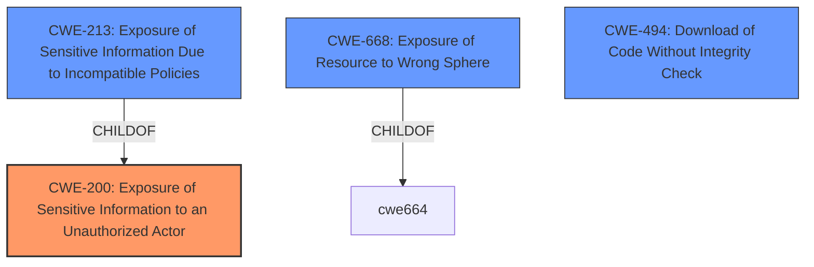

# Raw Analyzer Response for CVE-2021-23890

# Summary
| CWE ID | CWE Name | Confidence | CWE Abstraction Level | CWE Vulnerability Mapping Label | CWE-Vulnerability Mapping Notes |
|---|---|---|---|---|---|
| CWE-200 | Exposure of Sensitive Information to an Unauthorized Actor | 0.8 | Class | Primary | Allowed. The Agent Handler **exposes sensitive information** (McAfee product packages) to an **unauthenticated user**. |
| CWE-494 | Download of Code Without Integrity Check | 0.6 | Base | Secondary | Allowed. The software downloads code without verifying its integrity. |
| CWE-668 | Exposure of Resource to Wrong Sphere | 0.5 | Class | Secondary | Discouraged. The product **exposes a resource to the wrong control sphere**, providing unintended actors with inappropriate access to the resource. |

## Evidence and Confidence

*   **Confidence Score:** 0.7
*   **Evidence Strength:** MEDIUM

## Relationship Analysis
The primary CWE is CWE-200, which is a Class-level weakness. It has a child CWE-213 (Exposure of Sensitive Information Due to Incompatible Policies), but CWE-200 is more applicable. The secondary CWE is CWE-494 (Download of Code Without Integrity Check) because the McAfee Agent can be downloaded and installed without an integrity check. CWE-668 (Exposure of Resource to Wrong Sphere) is another related Class-level CWE. The analysis focuses on the root cause, which is the **exposure of sensitive information** leading to unauthorized access.

## Vulnerability Chain
The vulnerability chain begins with the **lack of authentication** and **exposure of the McAfee product packages**. This allows an **unauthenticated user** to download and install the packages, leading to a potential **information leak** of policy details from the ePO server.

## Summary of Analysis
The initial assessment identified CWE-200 as the primary weakness because the core issue is the **exposure of sensitive information** to an **unauthorized actor**. The vulnerability description explicitly mentions an **information leak** due to an **unauthenticated user** being able to download McAfee product packages. The "Retriever Results" also lists CWE-200 as the top combined result.

The final decision is based on the evidence in the vulnerability description, which clearly states that the vulnerability results in the **exposure of sensitive information**. The relationships between the CWEs support this classification, as CWE-200 is a general category for information exposure. The selection of CWE-200 is at an appropriate level of specificity.

The supporting evidence is: "Information leak vulnerability in the Agent Handler of McAfee ePolicy Orchestrator (ePO) prior to 5.10 Update 10 allows an unauthenticated user to download McAfee product packages...and then in turn get policy details from the ePO server."

CWE-213 was considered, but it's more specific to incompatible policies which isn't the primary issue here. CWE-668 was also considered, but it's a higher-level class and CWE-200 is a better fit. CWE-494 was included to show the lack of integrity check when the software is downloaded.