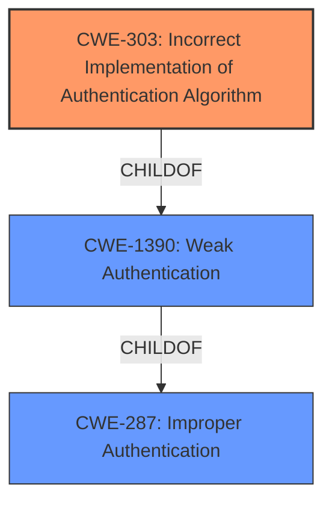

# Raw Analyzer Response for CVE-2021-23923

# Summary
| CWE ID | CWE Name | Confidence | CWE Abstraction Level | CWE Vulnerability Mapping Label | CWE-Vulnerability Mapping Notes |
|---|---|---|---|---|---|
| CWE-303 | Incorrect Implementation of Authentication Algorithm | 0.8 | Base | Allowed | Primary CWE |
| CWE-1390 | Weak Authentication | 0.6 | Class | Allowed-with-Review | Secondary Candidate |
| CWE-287 | Improper Authentication | 0.5 | Class | Discouraged | Secondary Candidate |

## Evidence and Confidence

*   **Confidence Score:** 0.8
*   **Evidence Strength:** HIGH

## Relationship Analysis
The primary CWE selected is CWE-303, which is a Base level CWE and a child of CWE-1390. CWE-1390 is itself a child of CWE-287. The vulnerability description indicates **broken authentication**, suggesting an implementation flaw in the authentication algorithm, making CWE-303 the most specific and appropriate choice. Although CWE-1390 and CWE-287 were considered, they are higher-level classifications and less descriptive of the root cause.

## Vulnerability Chain
The chain starts with the **broken authentication**, which is the root cause. The consequence is that Windows domain users are not properly authenticated, potentially leading to unauthorized access or other security breaches.

## Summary of Analysis
The initial assessment focused on identifying the root cause of the vulnerability. The description explicitly mentions "**Broken Authentication**," which guided the selection process towards authentication-related CWEs. Among the candidates, CWE-303 stood out because it specifically addresses cases where an authentication algorithm is incorrectly implemented.

The retriever results also pointed to CWE-303 with a high score, further reinforcing the selection. While CWE-1390 and CWE-287 were also considered, they are more general and less precise in describing the actual flaw.

The graph relationships confirmed the hierarchical structure, with CWE-303 being a child of CWE-1390 and CWE-287. This helped ensure that the chosen CWE was at the optimal level of specificity. The final decision was based on the explicit mention of **broken authentication** in the vulnerability description, the high relevance score of CWE-303, and its position in the CWE hierarchy.

Relevant CWE Information:

# Enhanced Context (25 CWEs)

## CWE-303: Incorrect Implementation of Authentication Algorithm
**Abstraction Level**: Base
**Similarity Score**: 0.79
**Source**: dense

**Description**:
The requirements for the product dictate the use of an established authentication algorithm, but the implementation of the algorithm is incorrect.

**Mapping Guidance**:
- Usage: Allowed
- Rationale: This CWE entry is at the Base level of abstraction, which is a preferred level of abstraction for mapping to the root causes of vulnerabilities.

**Technical Explanation:**

CWE-303 (Incorrect Implementation of Authentication Algorithm) accurately describes the vulnerability because the description explicitly mentions "**Broken Authentication**". This suggests that the intended authentication process is flawed due to an error in how the algorithm was implemented. The security implication is that users may not be properly authenticated, potentially leading to unauthorized access. This is the primary weakness. The vulnerability description specifically points to **broken authentication** as the root cause. The CWE description fits this scenario where the implementation of the authentication algorithm is incorrect.

## CWE-1390: Weak Authentication
**Abstraction Level**: Class
**Similarity Score**: 0.77
**Source**: dense

**Description**:
The product uses an authentication mechanism to restrict access to specific users or identities, but the mechanism does not sufficiently prove that the claimed identity is correct.

**Mapping Guidance**:
- Usage: Allowed-with-Review
- Rationale: This CWE entry is a Class and might have Base-level children that would be more appropriate

**Technical Explanation:**

CWE-1390 (Weak Authentication) is a related concern, as **broken authentication** can lead to a weak authentication mechanism. However, it is a higher-level classification. It indicates that the authentication mechanism in use is not strong enough to properly verify user identities. This could be a secondary factor contributing to the vulnerability. The CWE description fits the vulnerability description as it is a general case of authentication issues. However, it is less specific than CWE-303.

## CWE-287: Improper Authentication
**Abstraction Level**: Class
**Similarity Score**: 0.77
**Source**: dense

**Description**:
When an actor claims to have a given identity, the product does not prove or insufficiently proves that the claim is correct.

**Mapping Guidance**:
- Usage: Discouraged
- Rationale: This CWE entry might be misused when lower-level CWE entries are likely to be applicable. It is a level-1 Class (i.e., a child of a Pillar).

**Technical Explanation:**

CWE-287 (Improper Authentication) is a more general case of authentication issues. While it's relevant because the vulnerability involves authentication problems, it doesn't pinpoint the root cause as precisely as CWE-303. The weakness is a more abstract representation of the authentication failure. This is a very general case of authentication issues and thus a less descriptive fit.