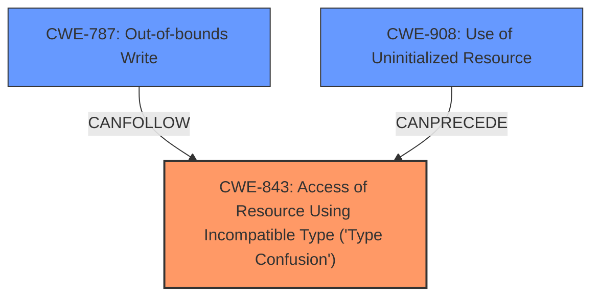

# Analysis for CVE-2021-23954

# Summary
| CWE ID | CWE Name | Confidence | CWE Abstraction Level | CWE Vulnerability Mapping Label | CWE-Vulnerability Mapping Notes |
|---|---|---|---|---|---|
| CWE-843 | Access of Resource Using Incompatible Type ('Type Confusion') | 0.9 | Base | Primary | Allowed |
| CWE-787 | Out-of-bounds Write | 0.6 | Base | Secondary | Allowed |
| CWE-908 | Use of Uninitialized Resource | 0.5 | Base | Secondary | Allowed |

## Evidence and Confidence

*   **Confidence Score:** 0.8
*   **Evidence Strength:** HIGH

## Relationship Analysis
The primary CWE is CWE-843, which is a Base level CWE and accurately reflects the **type confusion** vulnerability. CWE-787 and CWE-908 are considered as secondary because the **type confusion** could lead to an out-of-bounds write (CWE-787) or be caused by use of an uninitialized resource (CWE-908).

## Vulnerability Chain
The vulnerability chain starts with the **type confusion** (CWE-843) due to the incorrect handling of TDZ checks, potentially leading to memory corruption and a crash. The use of an uninitialized resource (CWE-908) could be a contributing factor to the type confusion. The memory corruption can then lead to an out-of-bounds write (CWE-787), ultimately resulting in a potentially exploitable crash.

## Summary of Analysis
The initial analysis identified CWE-843 as the primary weakness due to the **type confusion** caused by the new logical assignment operators. The CVE reference links content summary supports this, stating "The vulnerability stems from a **type confusion** that occurs when using logical assignment operators". The "Retriever Results" also lists CWE-843 as the top combined result.

CWE-787 (Out-of-bounds Write) is considered as a secondary weakness because the **type confusion** could lead to memory corruption and potentially an out-of-bounds write.

CWE-908 (Use of Uninitialized Resource) is also considered a secondary weakness as the improper handling of TDZ checks might lead to the use of an uninitialized resource, which then contributes to the **type confusion**.

The final selection is based on the evidence provided and the relationships between the CWEs. CWE-843 is at the optimal level of specificity because it directly addresses the root cause of the vulnerability which is a **type confusion**.

Relevant CWE Information:

# Enhanced Context (25 CWEs)

## CWE-667: Improper Locking
**Abstraction Level**: Class
**Similarity Score**: 0.79
**Source**: dense

**Description**:
The product does not properly acquire or release a lock on a resource, leading to unexpected resource state changes and behaviors.

**Mapping Guidance**:
- Usage: Allowed-with-Review
- Rationale: This CWE entry is a Class and might have Base-level children that would be more appropriate

*Not Selected:* This CWE is not applicable because the vulnerability does not involve improper locking.

## CWE-843: Access of Resource Using Incompatible Type ('Type Confusion')
**Abstraction Level**: Base
**Similarity Score**: 0.78
**Source**: dense

**Description**:
The product allocates or initializes a resource such as a pointer, object, or variable using one type, but it later accesses that resource using a type that is incompatible with the original type.

**Mapping Guidance**:
- Usage: Allowed
- Rationale: This CWE entry is at the Base level of abstraction, which is a preferred level of abstraction for mapping to the root causes of vulnerabilities.

*Selected:* The vulnerability stems from a type confusion that occurs when using logical assignment operators within JavaScript switch statements. The incorrect handling of TDZ checks led to a situation where the JavaScript engine could treat a `JS_UNINITIALIZED_LEXICAL` value as a regular JavaScript value, such as an object or a number. The description of CWE-843 directly matches the vulnerability, making it the most appropriate primary CWE.

## CWE-226: Sensitive Information in Resource Not Removed Before Reuse
**Abstraction Level**: Base
**Similarity Score**: 0.78
**Source**: dense

**Description**:
The product releases a resource such as memory or a file so that it can be made available for reuse, but it does not clear or "zeroize" the information contained in the resource before the product performs a critical state transition or makes the resource available for reuse by other entities.

**Mapping Guidance**:
- Usage: Allowed
- Rationale: This CWE entry is at the Base level of abstraction, which is a preferred level of abstraction for mapping to the root causes of vulnerabilities.

*Not Selected:* This CWE is not applicable because the vulnerability does not involve sensitive information not being removed before reuse.

## CWE-404: Improper Resource Shutdown or Release
**Abstraction Level**: Class
**Similarity Score**: 0.78
**Source**: dense

**Description**:
The product does not release or incorrectly releases a resource before it is made available for re-use.

**Mapping Guidance**:
- Usage: Allowed-with-Review
- Rationale: This CWE entry is a Class and might have Base-level children that would be more appropriate

*Not Selected:* This CWE is not applicable because the vulnerability does not involve improper resource shutdown or release.

## CWE-908: Use of Uninitialized Resource
**Abstraction Level**: Base
**Similarity Score**: 0.77
**Source**: dense

**Description**:
The product uses or accesses a resource that has not been initialized.

**Mapping Guidance**:
- Usage: Allowed
- Rationale: This CWE entry is at the Base level of abstraction, which is a preferred level of abstraction for mapping to the root causes of vulnerabilities.

*Selected:* The vulnerability involves the `JS_UNINITIALIZED_LEXICAL` magic value being exposed to user code. This can be viewed as using an uninitialized resource, which contributes to the type confusion. Thus it is included as a secondary CWE.

## CWE-125: Out-of-bounds Read
**Abstraction Level**: Base
**Similarity Score**: 0.77
**Source**: dense

**Description**:
The product reads data past the end, or before the beginning, of the intended buffer.

**Mapping Guidance**:
- Usage: Allowed
- Rationale: This CWE entry is at the Base level of abstraction, which is a preferred level of abstraction for mapping to the root causes of vulnerabilities.

*Not Selected:* Although memory corruption is mentioned, the description points to a type confusion leading to memory corruption. There is no clear indication of an out-of-bounds read.

## CWE-822: Untrusted Pointer Dereference
**Abstraction Level**: Base
**Similarity Score**: 0.77
**Source**: dense

**Description**:
The product obtains a value from an untrusted source, converts this value to a pointer, and dereferences the resulting pointer.

**Mapping Guidance**:
- Usage: Allowed
- Rationale: This CWE entry is at the Base level of abstraction, which is a preferred level of abstraction for mapping to the root causes of vulnerabilities.

*Not Selected:* This CWE is not directly applicable, as the vulnerability is about type confusion rather than directly dereferencing an untrusted pointer.

## CWE-362: Concurrent Execution using Shared Resource with Improper Synchronization ('Race Condition')
**Abstraction Level**: Class
**Similarity Score**: 0.76
**Source**: dense

**Description**:
The product contains a concurrent code sequence that requires temporary, exclusive access to a shared resource, but a timing window exists in which the shared resource can be modified by another code sequence operating concurrently.

**Mapping Guidance**:
- Usage: Allowed-with-Review
- Rationale: This CWE entry is a Class and might have Base-level children that would be more appropriate

*Not Selected:* This vulnerability does not appear to involve a race condition.

## CWE-824: Access of Uninitialized Pointer
**Abstraction Level**: Base
**Similarity Score**: 0.76
**Source**: dense

**Description**:
The product accesses or uses a pointer that has not been initialized.

**Mapping Guidance**:
- Usage: Allowed
- Rationale: This CWE entry is at the Base level of abstraction, which is a preferred level of abstraction for mapping to the root causes of vulnerabilities.

*Not Selected:* Similar to CWE-822, while related to memory issues, it's not the primary cause. The primary issue is the type confusion.

## CWE-366: Race Condition