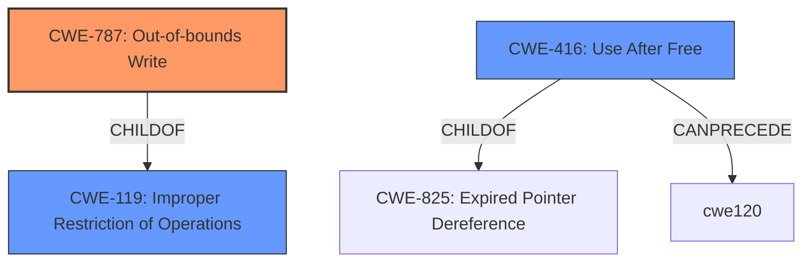

# Analysis for CVE-2021-23964

# Summary
| CWE ID | CWE Name | Confidence | CWE Abstraction Level | CWE Vulnerability Mapping Label | CWE-Vulnerability Mapping Notes |
|---|---|---|---|---|---|
| CWE-787 | Out-of-bounds Write | 0.9 | Base | Allowed | Primary CWE |
| CWE-416 | Use After Free | 0.7 | Variant | Allowed | Secondary Candidate |
| CWE-119 | Improper Restriction of Operations within the Bounds of a Memory Buffer | 0.6 | Class | Discouraged | Secondary Candidate |

## Evidence and Confidence

*   **Confidence Score:** 0.8
*   **Evidence Strength:** HIGH

## Relationship Analysis
The primary CWE is CWE-787, which is a base-level CWE and a child of CWE-119. The secondary CWE is CWE-416 which is a variant-level CWE and related to memory management issues. CWE-119 is a class-level CWE that is often misused, so it is less specific than CWE-787.

## Vulnerability Chain
The vulnerability chain starts with **memory safety bugs**, which can lead to **memory corruption**, potentially leading to arbitrary code execution. The specific type of memory corruption could be an out-of-bounds write (CWE-787) or a use-after-free (CWE-416).

## Summary of Analysis
The initial analysis focused on the presence of **memory safety bugs** and **memory corruption**. The primary CWE match from the provided information is CWE-787 (Out-of-bounds Write), which aligns with the concept of memory corruption. The CVE Reference Links Content Summary section confirms "Memory corruption" and lists "Use-after-free" and "Stack buffer overflow" as weaknesses.

The retriever results also list CWE-787 with a high score. The usage guidance for CWE-787 is "Allowed" and the abstraction level is "Base," which is a preferred level.

CWE-416 (Use After Free) is also listed as a Top CWE and is a plausible secondary weakness given the description of **memory safety bugs**.

CWE-119 (Improper Restriction of Operations within the Bounds of a Memory Buffer) is a class-level CWE and is discouraged due to being commonly misused in low-information vulnerability reports. However, it is a parent of CWE-787 and is related to memory buffer issues.

The selection of CWE-787 is based on the evidence of memory corruption and the description of **memory safety bugs**, which can lead to writing outside the intended buffer. The selection of CWE-416 is based on the "Use-after-free" weakness from the CVE Reference Links Content Summary section.

The final decision is to assign CWE-787 as the primary CWE due to its direct relevance to the **memory corruption** aspect of the vulnerability and CWE-416 as a secondary CWE due to the presence of the "Use-after-free" weakness. These CWEs are at the optimal level of specificity, as CWE-787 is a base-level CWE and CWE-416 is a variant-level CWE.

Relevant CWE Information:

# Enhanced Context (25 CWEs)

## CWE-267: Privilege Defined With Unsafe Actions
**Abstraction Level**: Base
**Similarity Score**: 0.76
**Source**: dense

**Description**:
A particular privilege, role, capability, or right can be used to perform unsafe actions that were not intended, even when it is assigned to the correct entity.

**Mapping Guidance**:
- Usage: Allowed
- Rationale: This CWE entry is at the Base level of abstraction, which is a preferred level of abstraction for mapping to the root causes of vulnerabilities.

**Why it was not selected:** This CWE is related to privilege issues, which are not explicitly mentioned in the vulnerability description.

## CWE-653: Improper Isolation or Compartmentalization
**Abstraction Level**: Class
**Similarity Score**: 0.76
**Source**: dense

**Description**:
The product does not properly compartmentalize or isolate functionality, processes, or resources that require different privilege levels, rights, or permissions.

**Mapping Guidance**:
- Usage: Allowed
- Rationale: This CWE entry is at the Base level of abstraction, which is a preferred level of abstraction for mapping to the root causes of vulnerabilities.

**Why it was not selected:** This CWE is related to isolation issues, which are not explicitly mentioned in the vulnerability description.

## CWE-668: Exposure of Resource to Wrong Sphere
**Abstraction Level**: Class
**Similarity Score**: 0.76
**Source**: dense

**Description**:
The product exposes a resource to the wrong control sphere, providing unintended actors with inappropriate access to the resource.

**Mapping Guidance**:
- Usage: Discouraged
- Rationale: CWE-668 is high-level and is often misused as a catch-all when lower-level CWE IDs might be applicable. It is sometimes used for low-information vulnerability reports [REF-1287]. It is a level-1 Class (i.e., a child of a Pillar). It is not useful for trend analysis.

**Why it was not selected:** This CWE is too high-level and other more specific CWEs are more appropriate.

## CWE-274: Improper Handling of Insufficient Privileges
**Abstraction Level**: Base
**Similarity Score**: 0.75
**Source**: dense

**Description**:
The product does not handle or incorrectly handles when it has insufficient privileges to perform an operation, leading to resultant weaknesses.

**Mapping Guidance**:
- Usage: Discouraged
- Rationale: This CWE entry could be deprecated in a future version of CWE.

**Why it was not selected:** This CWE is related to privilege issues, which are not explicitly mentioned in the vulnerability description.

## CWE-667: Improper Locking
**Abstraction Level**: Class
**Similarity Score**: 0.75
**Source**: dense

**Description**:
The product does not properly acquire or release a lock on a resource, leading to unexpected resource state changes and behaviors.

**Mapping Guidance**:
- Usage: Allowed-with-Review
- Rationale: This CWE entry is a Class and might have Base-level children that would be more appropriate

**Why it was not selected:** While locking issues might contribute to **memory safety bugs**, they are not the primary issue described.

## CWE-404: Improper Resource Shutdown or Release
**Abstraction Level**: Class
**Similarity Score**: 0.75
**Source**: dense

**Description**:
The product does not release or incorrectly releases a resource before it is made available for re-use.

**Mapping Guidance**:
- Usage: Allowed-with-Review
- Rationale: This CWE entry is a Class and might have Base-level children that would be more appropriate

**Why it was not selected:** While resource management issues might contribute to **memory safety bugs**, they are not the primary issue described.

## CWE-41: Improper Resolution of Path Equivalence
**Abstraction Level**: Base
**Similarity Score**: 0.75
**Source**: dense

**Description**:
The product is vulnerable to file system contents disclosure through path equivalence. Path equivalence involves the use of special characters in file and directory names. The associated manipulations are intended to generate multiple names for the same object.

**Mapping Guidance**:
- Usage: Allowed
- Rationale: This CWE entry is at the Base level of abstraction, which is a preferred level of abstraction for mapping to the root causes of vulnerabilities.

**Why it was not selected:** This CWE is related to file system issues, which are not relevant to the vulnerability description.

## CWE-1289: Improper Validation of Unsafe Equivalence in Input
**Abstraction Level**: Base
**Similarity Score**: 0.75
**Source**: dense

**Description**:
The product receives an input value that is used as a resource identifier or other type of reference, but it does not validate or incorrectly validates that the input is equivalent to a potentially-unsafe value.

**Mapping Guidance**:
- Usage: Allowed
- Rationale: This CWE entry is at the Base level of abstraction, which is a preferred level of abstraction for mapping to the root causes of vulnerabilities.

**Why it was not selected:** This CWE is related to input validation, which is not explicitly mentioned in the vulnerability description.

## CWE-266: Incorrect Privilege Assignment
**Abstraction Level