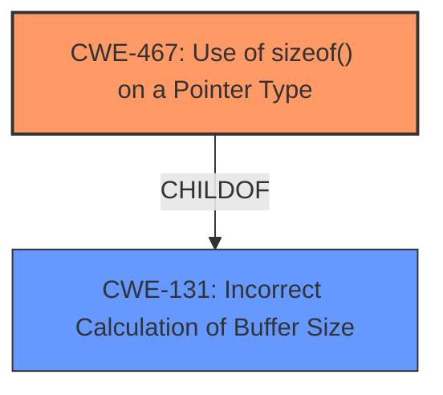

# Analysis for CVE-2021-23975

# Summary
| CWE ID | CWE Name | Confidence | CWE Abstraction Level | CWE Vulnerability Mapping Label | CWE-Vulnerability Mapping Notes |
|---|---|---|---|---|---|
| CWE-467 | Use of sizeof() on a Pointer Type | 0.9 | Variant | Allowed | Primary CWE |

## Evidence and Confidence

*   **Confidence Score:** 0.9
*   **Evidence Strength:** HIGH

## Relationship Analysis
The primary CWE selected is CWE-467, which is a Variant-level CWE. It is related to CWE-131 (Incorrect Calculation of Buffer Size) through a ChildOf relationship. The code calls sizeof() on a pointer type, which can be an incorrect calculation if the programmer intended to determine the size of the data that is being pointed to.

## Vulnerability Chain
The vulnerability chain involves an **incorrect function call** (`sizeof` instead of an API method that checks for invalid pointers) leading to the use of `sizeof()` on a pointer type, which can be an incorrect calculation if the programmer intended to determine the size of the data that is being pointed to.

## Summary of Analysis
The analysis is based on the vulnerability description, which clearly states that the root cause is an **incorrect function call**, specifically using `sizeof` on a pointer without validation. The CVE Reference Links Content Summary further supports this by stating: "The vulnerability stems from an incorrect usage of memory profiling code... Specifically, the code directly called the `sizeof` function on a pointer without first validating if the pointer was valid."

The Retriever Results list CWE-467 as the top candidate, which is the most specific and appropriate match. The CWE description aligns perfectly with the vulnerability: "The code calls sizeof() on a pointer type, which can be an incorrect calculation if the programmer intended to determine the size of the data that is being pointed to."

The mapping guidance for CWE-467 is "Allowed" and the rationale states: "This CWE entry is at the Variant level of abstraction, which is a preferred level of abstraction for mapping to the root causes of vulnerabilities."

Therefore, CWE-467 is the most appropriate CWE for this vulnerability.

Other considered CWEs that were not selected:
* CWE-415 (Double Free): This CWE is not applicable because the vulnerability does not involve calling `free()` twice on the same memory address.
* CWE-787 (Out-of-bounds Write): This CWE is not applicable because the vulnerability does not involve writing data past the end of a buffer.
* CWE-457 (Use of Uninitialized Variable): This CWE is not applicable because the vulnerability does not involve using a variable that has not been initialized.
* CWE-468 (Incorrect Pointer Scaling): While pointer issues are involved, the root cause is the incorrect usage of `sizeof()` rather than incorrect scaling.