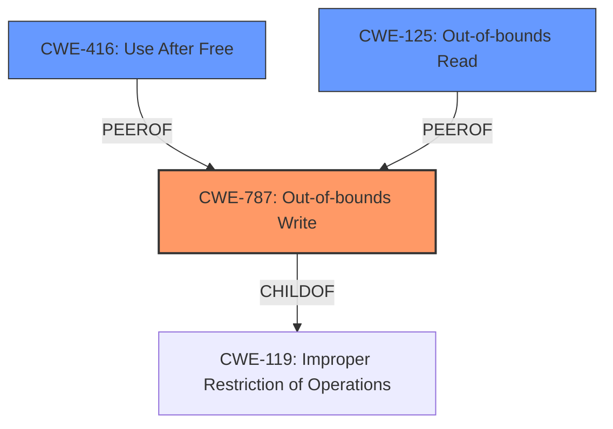

# Enhanced Analysis for CVE-2021-23983

# Summary
| CWE ID | CWE Name | Confidence | CWE Abstraction Level | CWE Vulnerability Mapping Label | CWE-Vulnerability Mapping Notes |
|---|---|---|---|---|---|
| CWE-787 | Out-of-bounds Write | 0.9 | Base | Allowed | Primary CWE |
| CWE-416 | Use After Free | 0.6 | Variant | Allowed | Secondary CWE |
| CWE-125 | Out-of-bounds Read | 0.5 | Base | Allowed | Secondary CWE |

## Evidence and Confidence

*   **Confidence Score:** 0.8
*   **Evidence Strength:** HIGH

## Relationship Analysis
The primary CWE is CWE-787 (**Out-of-bounds Write**), a **Base** level CWE. It's related to CWE-119 (**Improper Restriction of Operations within the Bounds of a Memory Buffer**), as it is a `ChildOf`. It can also `CANFOLLOW` other memory corruption CWEs. CWE-416 (**Use After Free**) and CWE-125 (**Out-of-bounds Read**) are considered as secondary CWEs.



## Vulnerability Chain
The vulnerability chain starts with an improper CSS transition leading to an **invalid property for a marker**. This results in **memory corruption**, specifically an **out-of-bounds write**, which can then lead to a **potentially exploitable crash**.

## Summary of Analysis
The analysis is primarily based on the provided vulnerability description and the CVE reference summary. The description clearly states that applying an **invalid property for a marker** can lead to **memory corruption** and a crash. The CVE reference summary confirms that the root cause is due to the application of invalid properties on a `::marker` pseudo-element, leading to an **out-of-bounds read** when accessing a property set.

The primary CWE selected is CWE-787 (**Out-of-bounds Write**). This is supported by the vulnerability description, which states that **memory corruption** occurred. Also, the CVE summary states that the vulnerability involves applying an invalid property to a marker, potentially triggering an out-of-bounds write. The selection is further supported by the retriever results, which identified CWE-787 as the top candidate with a high score.

CWE-416 (**Use After Free**) was considered because **memory corruption** could lead to a use-after-free scenario. However, the provided evidence doesn't explicitly mention freeing memory. It is included as a possibility but has a lower confidence score of 0.6.

CWE-125 (**Out-of-bounds Read**) was also considered, based on the CVE summary mentioning the application of invalid properties on a `::marker` pseudo-element, leading to an **out-of-bounds read** when accessing a property set. It is included as a possibility but has a lower confidence score of 0.5.

The selection of CWE-787 is at the optimal level of specificity because it directly addresses the **memory corruption** aspect of the vulnerability. It's a **Base** level CWE, which is preferred according to MITRE mapping guidance.

Relevant CWE Information:

# Enhanced Context (25 CWEs)
The following CWEs were identified as potentially relevant to this vulnerability:

## CWE-366: Race Condition within a Thread
**Abstraction Level**: Base
**Similarity Score**: 0.80

## CWE-667: Improper Locking
**Abstraction Level**: Class
**Similarity Score**: 0.78

## CWE-226: Sensitive Information in Resource Not Removed Before Reuse
**Abstraction Level**: Base
**Similarity Score**: 0.78

## CWE-362: Concurrent Execution using Shared Resource with Improper Synchronization ('Race Condition')
**Abstraction Level**: Class
**Similarity Score**: 0.78

## CWE-404: Improper Resource Shutdown or Release
**Abstraction Level**: Class
**Similarity Score**: 0.77

## CWE-909: Missing Initialization of Resource
**Abstraction Level**: Class
**Similarity Score**: 0.77

## CWE-908: Use of Uninitialized Resource
**Abstraction Level**: Base
**Similarity Score**: 0.76

## CWE-665: Improper Initialization
**Abstraction Level**: Class
**Similarity Score**: 0.76

## CWE-457: Use of Uninitialized Variable
**Abstraction Level**: Variant
**Similarity Score**: 0.76

## CWE-191: Integer Underflow (Wrap or Wraparound)
**Abstraction Level**: Base
**Similarity Score**: 0.76

## CWE-364: Signal Handler Race Condition
**Abstraction Level**: Base
**Similarity Score**: 7450.06

## CWE-362: Concurrent Execution using Shared Resource with Improper Synchronization ('Race Condition')
**Abstraction Level**: Class
**Similarity Score**: 6676.99

## CWE-190: Integer Overflow or Wraparound
**Abstraction Level**: Base
**Similarity Score**: 6521.48

## CWE-476: NULL Pointer Dereference
**Abstraction Level**: Base
**Similarity Score**: 6336.66

## CWE-367: Time-of-check Time-of-use (TOCTOU) Race Condition
**Abstraction Level**: Base
**Similarity Score**: 6306.36

## CWE-123: Write-what-where Condition
**Abstraction Level**: base
**Similarity Score**: 5.03

## CWE-364: Signal Handler Race Condition
**Abstraction Level**: base
**Similarity Score**: 5.03

## CWE-415: Double Free
**Abstraction Level**: variant
**Similarity Score**: 4.53

## CWE-787: Out-of-bounds Write
**Abstraction Level**: base
**Similarity Score**: 4.33

## CWE-825: Expired Pointer Dereference
**Abstraction Level**: base
**Similarity Score**: 4.33

## CWE-120: Buffer Copy without Checking Size of Input ('Classic Buffer Overflow')
**Abstraction Level**: base
**Similarity Score**: 4.33

## CWE-190: Integer Overflow or Wraparound
**Abstraction Level**: base
**Similarity Score**: 4.33

## CWE-681: Incorrect Conversion between Numeric Types
**Abstraction Level**: base
**Similarity Score**: 4.33

## CWE-1284: Improper Validation of Specified Quantity in Input
**Abstraction Level**: base
**Similarity Score**: 4.33

## CWE-789: Memory Allocation with Excessive Size Value
**Abstraction Level**: variant
**Similarity Score**: 3.75

CWE-362 (**Concurrent Execution using Shared Resource with Improper Synchronization ('Race Condition')**) was considered due to the potential for race conditions during CSS transitions. However, the description doesn't emphasize concurrency, making it less applicable than CWE-787.

CWE-190 (**Integer Overflow or Wraparound**) was also considered but is not directly supported by the evidence, which points more towards memory corruption due to improper property handling rather than integer manipulation.

CWE-457 (**Use of Uninitialized Variable**) was considered but the root cause of the issue is not from using an uninitialized variable. The primary issue occurs when an **invalid property for a marker** is applied, leading to **memory corruption**.

CWE-476 (**NULL Pointer Dereference**) was considered, but there is no mention of NULL pointer dereference in the provided description or summary.


## CWE Relationship Analysis

Current CWEs represent these abstraction levels: .


### Vulnerability Chain Analysis

**Chain starting from CWE-787:**
- 787 (Out-of-bounds Write) - ROOT


**Chain starting from CWE-123:**
- 123 (Write-what-where Condition) - ROOT


### CWE Relationship Diagram

```mermaid
graph TD
    classDef primary fill:#f96,stroke:#333,stroke-width:2px
    classDef secondary fill:#69f,stroke:#333
    classDef tertiary fill:#9e9,stroke:#333
```