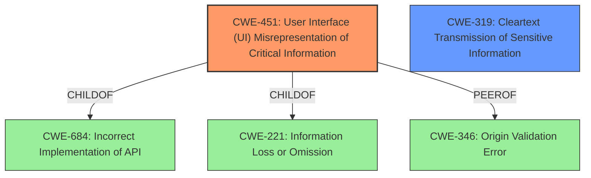

# Raw Analyzer Response for CVE-2021-23985

# Summary
| CWE ID | CWE Name | Confidence | CWE Abstraction Level | CWE Vulnerability Mapping Label | CWE-Vulnerability Mapping Notes |
|---|---|---|---|---|---|
| CWE-451 | User Interface (UI) Misrepresentation of Critical Information | 0.9 | Class | Primary | Allowed-with-Review |
| CWE-319 | Cleartext Transmission of Sensitive Information | 0.6 | Base | Secondary | Allowed |

## Evidence and Confidence

*   **Confidence Score:** 0.75
*   **Evidence Strength:** MEDIUM

## Relationship Analysis
The primary CWE identified is CWE-451, which is a Class-level CWE. While ideally a Base or Variant level CWE would be preferred, CWE-451 directly addresses the **improper user notification** aspect of the vulnerability, where the user is not adequately informed about the enabled Devtools remote debugging feature. The weakness is that the user interface fails to represent this critical information, which misleads the user. CWE-451 has a child-of relationship with CWE-684 (Incorrect Implementation of API) and CWE-221 (Information Loss or Omission). CWE-346 (Origin Validation Error) is a peer.

The secondary CWE considered is CWE-319 (Cleartext Transmission of Sensitive Information). This addresses the impact of the vulnerability, where the attacker can monitor plaintext network traffic.

## Vulnerability Chain
The vulnerability chain starts with the attacker altering specific `about:config` values. This leads to the **improper user notification** (CWE-451), allowing the attacker to monitor browsing activity and plaintext network traffic (CWE-319).

## Summary of Analysis
Initially, the primary concern was the **improper user notification** related to the Devtools remote debugging feature, as that's the root cause explicitly mentioned in "Vulnerability Description Key Phrases". The key evidence supporting CWE-451 is the lack of visual cue when DevTools remote debugging is enabled, which directly relates to the UI failing to represent critical information. This aligns with the description of CWE-451: "The user interface (UI) does not properly represent critical information to the user, allowing the information - or its source - to be obscured or spoofed."
The secondary aspect is the impact: monitoring of plaintext network traffic by a remote attacker. This is covered by CWE-319 "Cleartext Transmission of Sensitive Information".
The decision to classify CWE-451 as primary and CWE-319 as secondary is based on the nature of the fix, which involves providing a visual cue. This directly addresses the **improper user notification** aspect.

The selected CWEs are at the optimal level of specificity, given the information provided. While CWE-451 is a Class, it directly captures the essence of the UI misrepresentation issue. A more specific child CWE may be appropriate if more detailed information about the UI flaw was available.

Relevant CWE Information:
# Enhanced Context (25 CWEs)
The following CWEs were identified as potentially relevant to this vulnerability:

## CWE-125: Out-of-bounds Read
**Abstraction Level**: Base
**Similarity Score**: 0.77
**Source**: dense
**Description**:
The product reads data past the end, or before the beginning, of the intended buffer.
**Rationale for not selecting**: This vulnerability does not involve out-of-bounds read.

## CWE-404: Improper Resource Shutdown or Release
**Abstraction Level**: Class
**Similarity Score**: 0.77
**Source**: dense
**Description**:
The product does not release or incorrectly releases a resource before it is made available for re-use.
**Rationale for not selecting**: This vulnerability does not involve resource shutdown or release.

## CWE-226: Sensitive Information in Resource Not Removed Before Reuse
**Abstraction Level**: Base
**Similarity Score**: 0.77
**Source**: dense
**Description**:
The product releases a resource such as memory or a file so that it can be made available for reuse, but it does not clear or "zeroize" the information contained in the resource before the product performs a critical state transition or makes the resource available for reuse by other entities.
**Rationale for not selecting**: The vulnerability does not involve resource reuse and sensitive data.

## CWE-667: Improper Locking
**Abstraction Level**: Class
**Similarity Score**: 0.76
**Source**: dense
**Description**:
The product does not properly acquire or release a lock on a resource, leading to unexpected resource state changes and behaviors.
**Rationale for not selecting**: The vulnerability does not involve locking issues.

## CWE-668: Exposure of Resource to Wrong Sphere
**Abstraction Level**: Class
**Similarity Score**: 0.76
**Source**: dense
**Description**:
The product exposes a resource to the wrong control sphere, providing unintended actors with inappropriate access to the resource.
**Rationale for not selecting**: While there is an exposure to a remote attacker, CWE-668 is too general, and there are more specific CWEs that apply.

## CWE-131: Incorrect Calculation of Buffer Size
**Abstraction Level**: Base
**Similarity Score**: 0.76
**Source**: dense
**Description**:
The product does not correctly calculate the size to be used when allocating a buffer, which could lead to a buffer overflow.
**Rationale for not selecting**: The vulnerability does not involve calculation of buffer size.

## CWE-130: Improper Handling of Length Parameter Inconsistency
**Abstraction Level**: Base
**Similarity Score**: 0.76
**Source**: dense
**Description**:
The product parses a formatted message or structure, but it does not handle or incorrectly handles a length field that is inconsistent with the actual length of the associated data.
**Rationale for not selecting**: The vulnerability does not involve handling of length parameter inconsistency.

## CWE-653: Improper Isolation or Compartmentalization
**Abstraction Level**: Class
**Similarity Score**: 0.76
**Source**: dense
**Description**:
The product does not properly compartmentalize or isolate functionality, processes, or resources that require different privilege levels, rights, or permissions.
**Rationale for not selecting**: The vulnerability doesn't involve compartmentalization.

## CWE-191: Integer Underflow (Wrap or Wraparound)
**Abstraction Level**: Base
**Similarity Score**: 0.76
**Source**: dense
**Description**:
The product subtracts one value from another, such that the result is less than the minimum allowable integer value, which produces a value that is not equal to the correct result.
**Rationale for not selecting**: The vulnerability does not involve integer underflow.

## CWE-538: Insertion of Sensitive Information into Externally-Accessible File or Directory
**Abstraction Level**: Base
**Similarity Score**: 0.76
**Source**: dense
**Description**:
The product places sensitive information into files or directories that are accessible to actors who are allowed to have access to the files, but not to the sensitive information.
**Rationale for not selecting**: The vulnerability doesn't involve the insertion of sensitive information into files.

## CWE-451: User Interface (UI) Misrepresentation of Critical Information
**Abstraction Level**: Class
**Similarity Score**: 7089.23
**Source**: sparse
**Description**:
The user interface (UI) does not properly represent critical information to the user, allowing the information - or its source - to be obscured or spoofed. This is often a component in phishing attacks.
**Rationale for selecting**: This directly applies to the **improper user notification**.

## CWE-923: Improper Restriction of Communication Channel to Intended Endpoints
**Abstraction Level**: Class
**Similarity Score**: 6264.39
**Source**: sparse
**Description**:
The product establishes a communication channel to (or from) an endpoint for privileged or protected operations, but it does not properly ensure that it is communicating with the correct endpoint.
**Rationale for not selecting**: The communication channel is established. The problem is the user is not informed about it.

## CWE-319: Cleartext Transmission of Sensitive Information
**Abstraction Level**: Base
**Similarity Score**: 6111.85