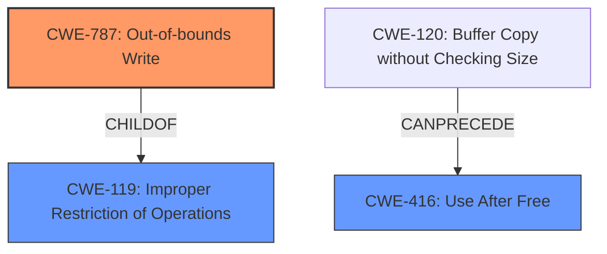

# Analysis Report for CVE-2021-23987

# Vulnerability Analysis Report: CVE-2021-23987

## Description


## Analysis (with Relationship Data)

# Summary
| CWE ID  | CWE Name  | Confidence | CWE Abstraction Level | CWE Vulnerability Mapping Label | CWE-Vulnerability Mapping Notes |
|-----------------|-----------------------------------------------------------------|--------------------|---------------------------|-----------------------------------|------------------------------------------------------------------------------------------------------|
| CWE-787 | Out-of-bounds Write | 1 | Base | Allowed | Primary CWE. The vulnerability involves memory corruption due to memory safety bugs, which can lead to writing data outside the intended buffer. |
| CWE-119 | Improper Restriction of Operations within the Bounds of a Memory Buffer | 0.7 | Class | Discouraged | Secondary candidate. While the description indicates memory corruption, CWE-119 is too general. CWE-787, a child of CWE-119, is more specific. |
| CWE-416 | Use After Free | 0.5 | Variant | Allowed | Secondary candidate. The vulnerability description mentions "memory safety bugs" that could lead to memory corruption, but there's no explicit "use after free". |

## Evidence and Confidence

*   **Confidence Score:** 0.8
*   **Evidence Strength:** MEDIUM

## Relationship Analysis
The primary relationship influencing the selection was the ChildOf relationship between CWE-787 and CWE-119. CWE-787 (Out-of-bounds Write) is a child of CWE-119 (Improper Restriction of Operations within the Bounds of a Memory Buffer), making it a more specific classification for memory corruption issues involving writing outside buffer boundaries. Also considered was the CANPRECEDE relationship between CWE-120 and CWE-416, but was not chosen because the description did not point to a use after free.



## Vulnerability Chain
The vulnerability chain starts with **memory safety bugs**, which cause **memory corruption** and leads to potential **arbitrary code execution**.

## Summary of Analysis
The primary assessment is based on the vulnerability description which states "**memory safety bugs** present in Firefox 86 and Firefox ESR 78.8. Some of these bugs showed evidence of **memory corruption** and we presume that with enough effort some of these could have been exploited to run arbitrary code."

The "CWE for similar CVE Descriptions" section lists CWE-787 as the primary match. The retriever results list CWE-787 as the second-best match and CWE-119 as the top match. However, the mapping guidance for CWE-119 discourages its use when more specific CWEs are available. Since the vulnerability involves memory corruption potentially leading to writing outside buffer boundaries, CWE-787 is a more appropriate and specific classification. While CWE-416 (Use After Free) and CWE-120 (Buffer Copy without Checking Size) were considered, there isn't enough evidence to support these. CWE-787 is at the base level of abstraction, which is the preferred level. The final decision is based on the direct evidence of memory corruption and the goal of identifying the most specific weakness.


## CWE Relationship Analysis

Current CWEs represent these abstraction levels: .


### Vulnerability Chain Analysis

**Chain starting from CWE-787:**
- 787 (Out-of-bounds Write) - ROOT


**Chain starting from CWE-119:**
- 119 (Improper Restriction of Operations within the Bounds of a Memory Buffer) - ROOT


### CWE Relationship Diagram

```mermaid
graph TD
    classDef primary fill:#f96,stroke:#333,stroke-width:2px
    classDef secondary fill:#69f,stroke:#333
    classDef tertiary fill:#9e9,stroke:#333
```


*Report generated on 2025-04-01 19:26:30*
