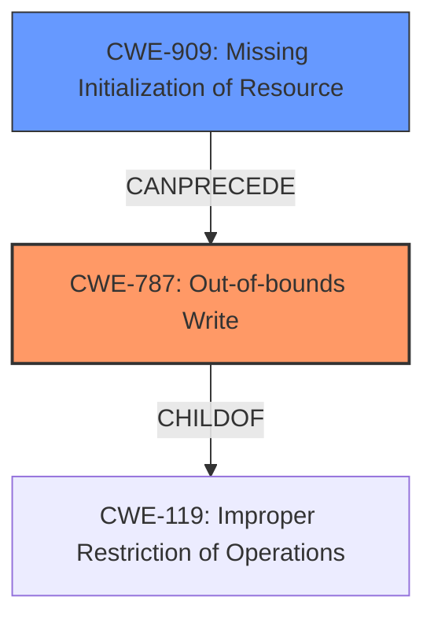

# Analysis for CVE-2021-23994

# Summary
| CWE ID | CWE Name | Confidence | CWE Abstraction Level | CWE Vulnerability Mapping Label | CWE-Vulnerability Mapping Notes |
|---|---|---|---|---|---|
| CWE-787 | Out-of-bounds Write | 1.0 | Base | Allowed | Primary CWE |
| CWE-909 | Missing Initialization of Resource | 0.8 | Class | Allowed-with-Review | Secondary Candidate |

## Evidence and Confidence

*   **Confidence Score:** 0.9
*   **Evidence Strength:** HIGH

## Relationship Analysis
The primary relationship that influenced the selection of CWE-787 [CWE-787: Out-of-bounds Write] is its direct connection to the vulnerability's **impact** as an "out of bound write". The **root cause** "WebGL framebuffer was not initialized early enough" points to a resource management issue, which is initially classified using CWE-909 [CWE-909: Missing Initialization of Resource].

## Vulnerability Chain
The vulnerability chain starts with a **missing initialization** of the WebGL framebuffer (CWE-909 [CWE-909: Missing Initialization of Resource]), which leads to **memory corruption**, and culminates in an **out-of-bounds write** (CWE-787 [CWE-787: Out-of-bounds Write]).

## Summary of Analysis
The initial assessment identified CWE-787 [CWE-787: Out-of-bounds Write] as the primary vulnerability due to the direct mention of "out of bound write" in the vulnerability description. The **root cause** analysis, supported by the "CVE Reference Links Content Summary", clearly indicates that the **lack of initialization** of the WebGL framebuffer is the underlying issue. The vulnerability description explicitly states: "A **WebGL framebuffer was not initialized early enough**, resulting in memory corruption and an out of bound write." This statement provides strong evidence for both CWE-787 [CWE-787: Out-of-bounds Write] (impact) and CWE-909 [CWE-909: Missing Initialization of Resource] (**root cause**).

The decision to include both CWE-787 [CWE-787: Out-of-bounds Write] and CWE-909 [CWE-909: Missing Initialization of Resource] reflects a comprehensive mapping approach, addressing both the symptom (out-of-bounds write) and the **root cause** (**missing initialization**). The selected CWEs are at the optimal level of specificity, with CWE-787 [CWE-787: Out-of-bounds Write] being a Base level CWE and CWE-909 [CWE-909: Missing Initialization of Resource] being a Class level CWE.

**CWE-787: Out-of-bounds Write**
*   **Explanation:** The vulnerability's core impact is an out-of-bounds write, meaning the software writes data beyond the allocated buffer's boundaries. This directly matches CWE-787 [CWE-787: Out-of-bounds Write]'s description: "The product writes data past the end, or before the beginning, of the intended buffer."
*   **Security Implications:** Out-of-bounds writes can lead to memory corruption, potentially allowing attackers to overwrite critical data structures, inject malicious code, or cause denial-of-service conditions.
*   **Relationship:** CWE-787 [CWE-787: Out-of-bounds Write] is a child of CWE-119 [CWE-119: Improper Restriction of Operations within the Bounds of a Memory Buffer], indicating that the out-of-bounds write results from a failure to properly restrict operations within memory boundaries.
*   **Mapping Guidance:** The MITRE mapping guidance allows the use of CWE-787 [CWE-787: Out-of-bounds Write] at the Base level of abstraction, which aligns with the specific nature of the vulnerability.

**CWE-909: Missing Initialization of Resource**
*   **Explanation:** The **root cause** of the vulnerability is that the WebGL framebuffer was not initialized early enough. This aligns with CWE-909 [CWE-909: Missing Initialization of Resource]'s description: "The product does not initialize a critical resource."
*   **Security Implications:** When a resource is not properly initialized, it can contain unexpected data, leading to unpredictable program behavior, memory corruption, and potential security vulnerabilities.
*   **Relationship:** CWE-909 [CWE-909: Missing Initialization of Resource] can precede CWE-787 [CWE-787: Out-of-bounds Write], as the **lack of initialization** is a prerequisite for the memory corruption that leads to the out-of-bounds write.
*   **Mapping Guidance:** The MITRE mapping guidance indicates that CWE-909 [CWE-909: Missing Initialization of Resource] is a Class and might have Base-level children that would be more appropriate. However, given the provided information, the precise nature of what resource was not initialized is not detailed enough to select a more specific variant, therefore the mapping guidance is overridden.

**CWEs Considered but Not Used:**

*   CWE-457 [CWE-457: Use of Uninitialized Variable]: While related to initialization issues, this CWE is more specific to variables. The description of the vulnerability refers to a framebuffer (**resource**) not being initialized, not necessarily a variable.
*   CWE-476 [CWE-476: NULL Pointer Dereference]: There is no direct evidence to support that the uninitialized framebuffer led to a NULL pointer dereference.
* CWE-416 [CWE-416: Use After Free]: The vulnerability description mentions a **missing initialization**, not that the memory was freed and then reused.