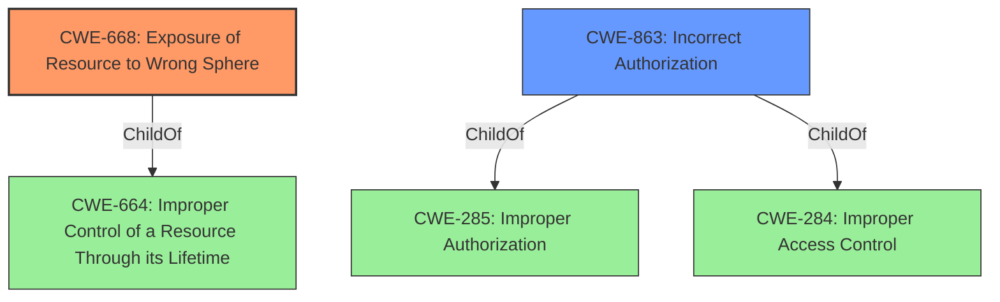

# Analysis Report for CVE-2021-24001

# Vulnerability Analysis Report: CVE-2021-24001

## Description


## Analysis (with Relationship Data)

# Summary
| CWE ID | CWE Name | Confidence | CWE Abstraction Level | CWE Vulnerability Mapping Label | CWE-Vulnerability Mapping Notes |
|---|---|---|---|---|---|
| CWE-668 | Exposure of Resource to Wrong Sphere | 0.9 | Class | Allowed-with-Review | Primary CWE |
| CWE-863 | Incorrect Authorization | 0.7 | Class | Allowed-with-Review | Secondary Candidate |

## Evidence and Confidence

*   **Confidence Score:** 0.8
*   **Evidence Strength:** HIGH

## Relationship Analysis
The primary relationship impacting the decision is the parent-child relationship between CWE-664 and CWE-668. CWE-668, Exposure of Resource to Wrong Sphere, is a child of CWE-664, Improper Control of a Resource Through its Lifetime. The vulnerability involves a compromised content process manipulating session history due to testing infrastructure not being restricted to testing-only configurations. This can be seen as exposing the session history resource to the wrong sphere of control. While CWE-668 is a Class-level CWE, and the guidance discourages its use, the specificity of the description makes it more appropriate than its parent.



## Vulnerability Chain
The vulnerability chain starts with the **improper access control** where testing functionality was exposed outside of testing environments. This leads to a vulnerable message handling where the `ContentParent::RecvSessionHistoryUpdate` message handler was not intended to be used by untrusted content processes, and ultimately enables session history manipulation.

## Summary of Analysis
The initial assessment focused on the root cause of the vulnerability: the **improper restriction** of testing infrastructure, which led to session history manipulation by a compromised content process.

The provided evidence explicitly states: "A compromised content process could have performed session history manipulations it should not have been able to due to testing infrastructure that was not restricted to testing-only configurations." This directly supports the selection of CWE-668, Exposure of Resource to Wrong Sphere, as the primary CWE. The session history is the resource, and the compromised content process is the "wrong sphere."

The retriever results and relationship analysis reinforce this choice. CWE-668 is the top combined result. The mapping guidance for CWE-668 discourages its use because it is a Class-level CWE and suggests looking for more specific CWEs. However, in this case, the description of CWE-668 aligns well with the vulnerability.

CWE-863, Incorrect Authorization, was also considered because the issue involves a process performing actions it should not have been authorized to perform. However, the root cause is the exposure of the testing functionality, making CWE-668 more appropriate as the primary CWE. CWE-863 could be considered a secondary CWE because the **improper access control** leads to **incorrect authorization**.

The selected CWEs are at an appropriate level of specificity. While a more specific variant might exist, the available information does not provide enough detail to justify selecting a more granular CWE.

Relevant CWE Information:

**CWE-668: Exposure of Resource to Wrong Sphere**

The product exposes a resource to the wrong control sphere, providing unintended actors with inappropriate access to the resource. This perfectly describes the vulnerability where the session history was exposed to a compromised content process when it should have been restricted to testing environments.

**CWE-863: Incorrect Authorization**

The product performs an authorization check when an actor attempts to access a resource or perform an action, but it does not correctly perform the check. This is applicable as the compromised content process was able to perform session history manipulations it was not authorized to do.


## CWE Relationship Analysis

Current CWEs represent these abstraction levels: .


### Vulnerability Chain Analysis

**Chain starting from CWE-664:**
- 664 (Improper Control of a Resource Through its Lifetime) - ROOT


**Chain starting from CWE-284:**
- 284 (Improper Access Control) - ROOT


### CWE Relationship Diagram

```mermaid
graph TD
    classDef primary fill:#f96,stroke:#333,stroke-width:2px
    classDef secondary fill:#69f,stroke:#333
    classDef tertiary fill:#9e9,stroke:#333
```


*Report generated on 2025-04-02 04:28:12*
