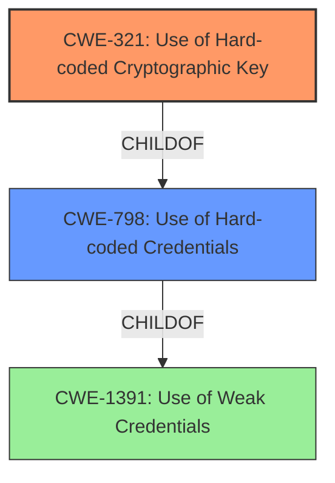

# Raw Analyzer Response for CVE-2021-24005

# Summary
| CWE ID | CWE Name | Confidence | CWE Abstraction Level | CWE Vulnerability Mapping Label | CWE-Vulnerability Mapping Notes |
|---|---|---|---|---|---|
| CWE-321 | Use of Hard-coded Cryptographic Key | 1.0 | Variant | Allowed | Primary CWE |
| CWE-798 | Use of Hard-coded Credentials | 0.8 | Base | Allowed | Secondary Candidate |

## Evidence and Confidence

*   **Confidence Score:** 0.9
*   **Evidence Strength:** HIGH

## Relationship Analysis
The primary CWE is CWE-321, a Variant of CWE-798. CWE-321 is more specific, as it focuses on cryptographic keys, while CWE-798 is a more general case of credentials. The relationship influenced the selection of CWE-321 as the primary, due to its specificity.

## Vulnerability Chain
The vulnerability chain starts with the **hard-coded cryptographic key** (CWE-321), leading to the ability to decrypt sensitive data.

## Summary of Analysis
The analysis is based on the provided evidence, which clearly states that the vulnerability is due to the usage of **hard-coded cryptographic keys**. The vulnerability description states: "Usage of **hard-coded cryptographic keys** to encrypt configuration files and debug logs in FortiAuthenticator versions before 6.3.0 may allow an attacker with access to the files or the CLI configuration to decrypt the sensitive data, via knowledge of the hard-coded key."

The CVE Reference Links Content Summary further reinforces this: "The vulnerability stems from the usage of **hard-coded cryptographic keys** within FortiAuthenticator to encrypt configuration files, debug logs, and user passwords. These keys are the same across all appliances."

The graph relationships show that CWE-321 is a child of CWE-798, making it a more specific classification.

The selection of CWE-321 is at the optimal level of specificity because it directly addresses the use of hard-coded cryptographic keys.

Relevant CWE Information:

# Enhanced Context (25 CWEs)

## CWE-916: Use of Password Hash With Insufficient Computational Effort
**Abstraction Level**: Base
**Similarity Score**: 0.80
**Source**: dense

**Description**:
The product generates a hash for a password, but it uses a scheme that does not provide a sufficient level of computational effort that would make password cracking attacks infeasible or expensive.

**Mapping Guidance**:
- Usage: Allowed
- Rationale: This CWE entry is at the Base level of abstraction, which is a preferred level of abstraction for mapping to the root causes of vulnerabilities.

*Not selected* because the vulnerability is not related to password hashing but to hard-coded keys.

## CWE-1240: Use of a Cryptographic Primitive with a Risky Implementation
**Abstraction Level**: Base
**Similarity Score**: 0.77
**Source**: dense

**Description**:
To fulfill the need for a cryptographic primitive, the product implements a cryptographic algorithm using a non-standard, unproven, or disallowed/non-compliant cryptographic implementation.

**Mapping Guidance**:
- Usage: Allowed
- Rationale: This CWE entry is at the Base level of abstraction, which is a preferred level of abstraction for mapping to the root causes of vulnerabilities.

*Not selected* because the vulnerability stems from the hard-coded key itself, not the cryptographic implementation.

## CWE-328: Use of Weak Hash
**Abstraction Level**: Base
**Similarity Score**: 0.77
**Source**: dense

**Description**:
The product uses an algorithm that produces a digest (output value) that does not meet security expectations for a hash function that allows an adversary to reasonably determine the original input (preimage attack), find another input that can produce the same hash (2nd preimage attack), or find multiple inputs that evaluate to the same hash (birthday attack).

**Mapping Guidance**:
- Usage: Allowed
- Rationale: This CWE entry is at the Base level of abstraction, which is a preferred level of abstraction for mapping to the root causes of vulnerabilities.

*Not selected* because the vulnerability is not related to the use of weak hashing algorithms.

## CWE-1391: Use of Weak Credentials
**Abstraction Level**: Class
**Similarity Score**: 0.77
**Source**: dense

**Description**:
The product uses weak credentials (such as a default key or hard-coded password) that can be calculated, derived, reused, or guessed by an attacker.

**Mapping Guidance**:
- Usage: Allowed-with-Review
- Rationale: This CWE entry is a Class and might have Base-level children that would be more appropriate

*Not selected* because the vulnerability stems from hard-coded credentials, which is a more specific case.

## CWE-798: Use of Hard-coded Credentials
**Abstraction Level**: Base
**Similarity Score**: 0.75
**Source**: dense

**Description**:
The product contains hard-coded credentials, such as a password or cryptographic key.

**Mapping Guidance**:
- Usage: Allowed
- Rationale: This CWE entry is at the Base level of abstraction, which is a preferred level of abstraction for mapping to the root causes of vulnerabilities.

*Selected as secondary* because while CWE-321 is more specific, CWE-798 is still relevant as it covers the general case of hard-coded credentials.

## CWE-321: Use of Hard-coded Cryptographic Key
**Abstraction Level**: Variant
**Similarity Score**: 0.75
**Source**: dense

**Description**:
The use of a hard-coded cryptographic key significantly increases the possibility that encrypted data may be recovered.

**Mapping Guidance**:
- Usage: Allowed
- Rationale: This CWE entry is at the Variant level of abstraction, which is a preferred level of abstraction for mapping to the root causes of vulnerabilities.

*Selected as primary* because it directly addresses the use of hard-coded cryptographic keys, which is the root cause of the vulnerability.

## CWE-330: Use of Insufficiently Random Values
**Abstraction Level**: Class
**Similarity Score**: 0.74
**Source**: dense

**Description**:
The product uses insufficiently random numbers or values in a security context that depends on unpredictable numbers.

**Mapping Guidance**:
- Usage: Discouraged
- Rationale: This CWE entry is a level-1 Class (i.e., a child of a Pillar). It might have lower-level children that would be more appropriate

*Not selected* because the vulnerability is not related to random number generation.