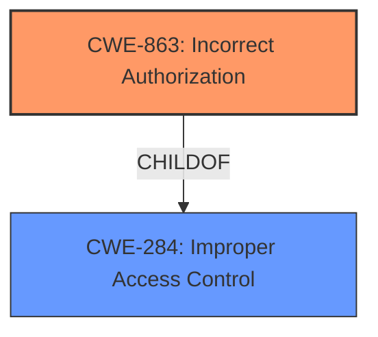

# Analysis Report for CVE-2021-24006

# Vulnerability Analysis Report: CVE-2021-24006

## Description


## Analysis (with Relationship Data)

# Summary
| CWE ID | CWE Name | Confidence | CWE Abstraction Level | CWE Vulnerability Mapping Label | CWE-Vulnerability Mapping Notes |
|---|---|---|---|---|---|
| CWE-863 | Incorrect Authorization | 1.0 | Class | Allowed-with-Review | Primary CWE |
| CWE-284 | Improper Access Control | 0.7 | Pillar | Discouraged | Secondary Candidate |

## Evidence and Confidence

*   **Confidence Score:** 0.9
*   **Evidence Strength:** HIGH

## Relationship Analysis
The primary relationship influencing the CWE selection is that CWE-863 (Incorrect Authorization) is a child of CWE-284 (Improper Access Control). While the description mentions "improper access control," the more specific "incorrect authorization" is applicable because the vulnerability involves an authorization check being performed incorrectly, allowing access to the SD-WAN Orchestrator panel when it should not be allowed. CWE-284 is a high-level Pillar, and the guidance discourages its use when more specific children are available.



## Vulnerability Chain
The vulnerability chain starts with the **improper access control**, leading to unauthorized access to the SD-WAN Orchestrator panel.
  - **Root Cause:** **Improper Access Control** / **Incorrect Authorization**
  - **Impact:** Unauthorized Access to SD-WAN Orchestrator panel

## Summary of Analysis
The initial analysis focused on the **improper access control** aspect of the vulnerability. The vulnerability description mentions that an authenticated attacker with a restricted user profile can access the SD-WAN Orchestrator panel via directly visiting its URL, which constitutes an **improper access control**.

The retriever results listed CWE-284 (Improper Access Control) and CWE-863 (Incorrect Authorization) as potential candidates. However, the mapping guidance for CWE-284 discourages its use because it is a high-level Pillar. CWE-863 is a child of CWE-284 and represents a more specific scenario where authorization checks are performed incorrectly.

The evidence supporting CWE-863 includes the vulnerability description stating that the attacker, though authenticated and having a restricted profile, is still able to access the SD-WAN Orchestrator panel. This indicates that the authorization mechanism in place is **incorrectly** allowing this access.

Therefore, the final decision is to select CWE-863 (Incorrect Authorization) as the primary CWE and CWE-284 (Improper Access Control) as a secondary consideration because it is a parent of CWE-863. The selection is based on the evidence from the vulnerability description, the retriever results, and the mapping guidance provided by MITRE. The selected CWEs are at the optimal level of specificity because CWE-863 directly addresses the **incorrect authorization** mechanism, while CWE-284 is a broader categorization of the weakness.

Relevant CWE Information:

# Enhanced Context (25 CWEs)
The following CWEs were identified as potentially relevant to this vulnerability:

## CWE-668: Exposure of Resource to Wrong Sphere
**Abstraction Level**: Class
**Similarity Score**: 0.75
**Source**: dense

**Description**:
The product exposes a resource to the wrong control sphere, providing unintended actors with inappropriate access to the resource.

**Mapping Guidance**:
- Usage: Discouraged
- Rationale: CWE-668 is high-level and is often misused as a catch-all when lower-level CWE IDs might be applicable. It is sometimes used for low-information vulnerability reports [REF-1287]. It is a level-1 Class (i.e., a child of a Pillar). It is not useful for trend analysis.

*Reason for not selecting* - The focus is on **incorrect authorization** rather than a resource being exposed to the wrong sphere in general. CWE-863 is more specific.

## CWE-653: Improper Isolation or Compartmentalization
**Abstraction Level**: Class
**Similarity Score**: 0.74
**Source**: dense

**Description**:
The product does not properly compartmentalize or isolate functionality, processes, or resources that require different privilege levels, rights, or permissions.

**Mapping Guidance**:
- Usage: Allowed
- Rationale: This CWE entry is at the Base level of abstraction, which is a preferred level of abstraction for mapping to the root causes of vulnerabilities.

*Reason for not selecting* - While isolation could be a factor, the primary issue is that the existing authorization is **incorrect**, not necessarily a lack of isolation.

## CWE-274: Improper Handling of Insufficient Privileges
**Abstraction Level**: Base
**Similarity Score**: 0.74
**Source**: dense

**Description**:
The product does not handle or incorrectly handles when it has insufficient privileges to perform an operation, leading to resultant weaknesses.

**Mapping Guidance**:
- Usage: Discouraged
- Rationale: This CWE entry could be deprecated in a future version of CWE.

*Reason for not selecting* - The problem is not that the attacker has insufficient privileges, but rather that the authorization check is **incorrect**, granting access when it should be denied.

## CWE-1220: Insufficient Granularity of Access Control
**Abstraction Level**: Base
**Similarity Score**: 0.74
**Source**: dense

**Description**:
The product implements access controls via a policy or other feature with the intention to disable or restrict accesses (reads and/or writes) to assets in a system from untrusted agents. However, implemented access controls lack required granularity, which renders the control policy too broad because it allows accesses from unauthorized agents to the security-sensitive assets.

**Mapping Guidance**:
- Usage: Allowed
- Rationale: This CWE entry is at the Base level of abstraction, which is a preferred level of abstraction for mapping to the root causes of vulnerabilities.

*Reason for not selecting* - While granularity might be a factor, the core issue is the **incorrect** authorization logic, not the granularity of the controls.

## CWE-280: Improper Handling of Insufficient Permissions or Privileges 
**Abstraction Level**: Base
**Similarity Score**: 0.73
**Source**: dense

**Description**:
The product does not handle or incorrectly handles when it has insufficient privileges to access resources or functionality as specified by their permissions. This may cause it to follow unexpected code paths that may leave the product in an invalid state.

**Mapping Guidance**:
- Usage: Allowed
- Rationale: This CWE entry is at the Base level of abstraction, which is a preferred level of abstraction for mapping to the root causes of vulnerabilities.

*Reason for not selecting* - Similar to CWE-274, the attacker is not being prevented due to insufficient privileges; the authorization check itself is **incorrect**.

## CWE-664: Improper Control of a Resource Through its Lifetime
**Abstraction Level**: Pillar
**Similarity Score**: 0.73
**Source**: dense

**Description**:
The product does not maintain or incorrectly maintains control over a resource throughout its lifetime of creation, use, and release.

**Mapping Guidance**:
- Usage: Discouraged
- Rationale: This CWE entry is high-level when lower-level children are available.

*Reason for not selecting* - Too general; the problem is the **incorrect** authorization, not a general failure to control the resource.

## CWE-41: Improper Resolution of Path Equivalence
**Abstraction Level**: Base
**Similarity Score**: 0.73
**Source**: dense

**Description**:
The product is vulnerable to file system contents disclosure through path equivalence. Path equivalence involves the use of special characters in file and directory names. The associated manipulations are intended to generate multiple names for the same object.

**Mapping Guidance**:
- Usage: Allowed
- Rationale: This CWE entry is at the Base level of abstraction, which is a preferred level of abstraction for mapping to the root causes of vulnerabilities.

*Reason for not selecting* - Not relevant to the vulnerability description.

## CWE-639: Authorization Bypass Through User-Controlled Key
**Abstraction Level**: Base
**Similarity Score**: 0.73
**Source**: dense

**Description**:
The system's authorization functionality does not prevent one user from gaining access to another user's data or record by modifying the key value identifying the data.

**Mapping Guidance**:
- Usage: Allowed
- Rationale: This CWE entry is at the Base level of abstraction, which is a preferred level of abstraction for mapping to the root causes of vulnerabilities.

*Reason for not selecting* - This is a specific type of authorization bypass, but the provided description doesn't indicate user-controlled keys are involved.

## CWE-807: Reliance on Untrusted Inputs in a Security Decision
**Abstraction Level**: Base
**Similarity Score**: 0.73
**Source**: dense

**Description**:
The product uses a protection mechanism that relies on the existence or values of an input, but the input can be modified by an untrusted actor in a way that


## CWE Relationship Analysis

Current CWEs represent these abstraction levels: .


### Vulnerability Chain Analysis

**Chain starting from CWE-664:**
- 664 (Improper Control of a Resource Through its Lifetime) - ROOT


**Chain starting from CWE-284:**
- 284 (Improper Access Control) - ROOT


### CWE Relationship Diagram

```mermaid
graph TD
    classDef primary fill:#f96,stroke:#333,stroke-width:2px
    classDef secondary fill:#69f,stroke:#333
    classDef tertiary fill:#9e9,stroke:#333
```


*Report generated on 2025-04-01 22:31:29*
