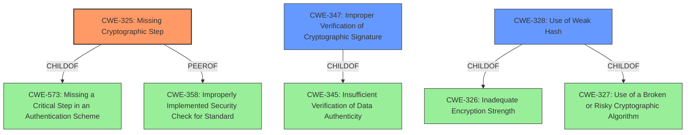

# Raw Analyzer Response for CVE-2021-24020

# Summary
| CWE ID | CWE Name | Confidence | CWE Abstraction Level | CWE Vulnerability Mapping Label | CWE-Vulnerability Mapping Notes |
|---|---|---|---|---|---|
| CWE-325 | Missing Cryptographic Step | 1 | Base | Allowed | Primary CWE |
| CWE-347 | Improper Verification of Cryptographic Signature | 0.7 | Base | Allowed | Secondary Candidate |
| CWE-328 | Use of Weak Hash | 0.6 | Base | Allowed | Secondary Candidate |

## Evidence and Confidence

*   **Confidence Score:** 0.8
*   **Evidence Strength:** HIGH

## Relationship Analysis
The primary CWE, CWE-325, is a Base level CWE that is a child of CWE-573 (Missing a Critical Step in an Authentication Scheme) and has a peer relationship with CWE-358 (Improperly Implemented Security Check for Standard). The secondary CWE, CWE-347, is a Base level CWE and a child of CWE-345 (Insufficient Verification of Data Authenticity). The final candidate CWE-328 is a Base level CWE that is a child of both CWE-326 (Inadequate Encryption Strength) and CWE-327 (Use of a Broken or Risky Cryptographic Algorithm). Selecting CWE-325 as the primary is based on the explicit mention of a "**missing cryptographic step**" in the vulnerability description, which aligns perfectly with CWE-325's description. The other candidates are considered because they represent potential consequences or related issues arising from the missing step, such as "**improper verification**" of the signature (CWE-347) or the use of a "**weak hash**" (CWE-328) due to the algorithmic flaw.

## Vulnerability Chain
The vulnerability chain starts with a **missing cryptographic step** (CWE-325) in the hash digest algorithm. This leads to a situation where the hash digest algorithm becomes vulnerable to extension attacks. Consequently, this allows an unauthenticated attacker to tamper with signed URLs, ultimately resulting in a bypass of signature verification and potentially leading to improper access control. The chain can be summarized as: CWE-325 (Root Cause) -> CWE-328 (Weak Hash due to the missing step) -> CWE-347 (Improper Verification of Cryptographic Signature) -> Authentication Bypass/Improper Access Control (Impact).

## Summary of Analysis
The initial analysis focused on identifying the root cause of the vulnerability, which was explicitly stated as a "**missing cryptographic step in the hash digest algorithm**". This perfectly aligns with the description of CWE-325 (Missing Cryptographic Step), making it the primary candidate. The "CVE Reference Links Content Summary" reinforces this by stating: "Root cause of vulnerability: A missing cryptographic step in the implementation of the hash digest algorithm."

The retriever results also support this, with CWE-325 being the top-ranked CWE. The relationship analysis further clarifies the context, placing CWE-325 within a chain of events leading to signature bypass.

While other CWEs like CWE-347 (Improper Verification of Cryptographic Signature) and CWE-328 (Use of Weak Hash) are relevant, they are considered secondary because they are consequences of the missing cryptographic step, rather than the root cause itself. CWE-327 (Use of a Broken or Risky Cryptographic Algorithm) was considered, but it is a Class level CWE, and the vulnerability description specifically points to a missing step, making CWE-325 a more accurate and specific Base level classification.

The final decision to select CWE-325 as the primary CWE is based on the direct evidence from the vulnerability description, supported by the retriever results and reinforced by the understanding of the vulnerability chain. It is at the optimal level of specificity (Base) and aligns with MITRE's mapping guidance.