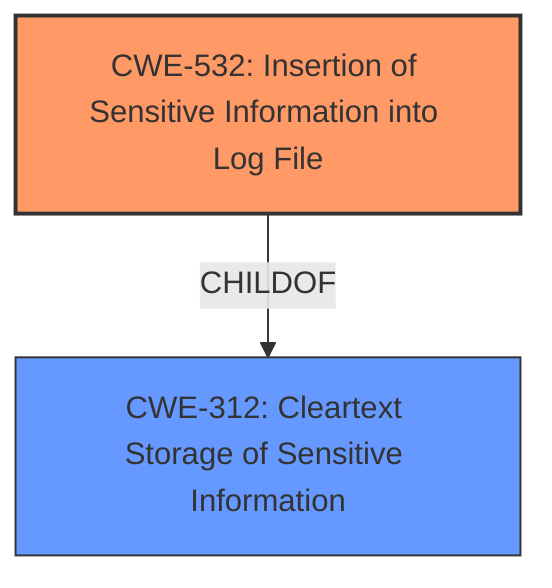

# Enhanced Analysis for CVE-2021-24024

# Summary
| CWE ID  | CWE Name | Confidence | CWE Abstraction Level | CWE Vulnerability Mapping Label | CWE-Vulnerability Mapping Notes |
|-----------------|----------------------------------------------------|-------------------|--------------------------|-----------------------------------|------------------------------------|
| CWE-532 | Insertion of Sensitive Information into Log File | 1 | Base | Allowed | Primary CWE |
| CWE-312 | Cleartext Storage of Sensitive Information | 0.7 | Base | Allowed | Secondary Candidate |

## Evidence and Confidence

*   **Confidence Score:** 0.85
*   **Evidence Strength:** HIGH

## Relationship Analysis
The primary CWE is CWE-532, which directly addresses the insertion of sensitive information into log files. CWE-312, Cleartext Storage of Sensitive Information, is a parent of CWE-532, but CWE-532 is a more specific and accurate description of the vulnerability. The relationship analysis confirms that choosing the more specific base CWE is preferred.



## Vulnerability Chain
The vulnerability chain starts with the **clear text storage of sensitive information** (passwords) and leads to the **impact** of allowing a remote authenticated attacker to read other local users' passwords in log files.
  - Root Cause: **Clear Text Storage of Sensitive Information**
  - Weakness: Insertion of Sensitive Information into Log File
  - Impact: Remote authenticated attacker can read other local users' passwords

## Summary of Analysis
The analysis is based on the provided vulnerability description and supporting evidence from the CVE reference links. The root cause is the **clear text storage of sensitive information**, which results in the insertion of sensitive information into log files. This allows a remote authenticated attacker to read other local users' passwords.

The primary CWE selected is CWE-532 (Insertion of Sensitive Information into Log File), as it directly matches the vulnerability description. The evidence from the CVE reference links confirms the plain text storage of passwords in log files.

The relationship analysis supports this decision, as CWE-532 is a more specific child of CWE-312 (Cleartext Storage of Sensitive Information). The mapping guidance for CWE-532 states that it is at the Base level of abstraction, which is a preferred level for mapping vulnerabilities.

The selected CWE is at the optimal level of specificity because it precisely describes the weakness: sensitive information being written to a log file. While CWE-312 is related, it is more general and doesn't capture the specific context of log files.

Relevant CWE Information:

# Enhanced Context (25 CWEs)
The following CWEs were identified as potentially relevant to this vulnerability:

## CWE-274: Improper Handling of Insufficient Privileges
**Abstraction Level**: Base
**Similarity Score**: 0.77
**Source**: dense

**Description**:
The product does not handle or incorrectly handles when it has insufficient privileges to perform an operation, leading to resultant weaknesses.

**Mapping Guidance**:
- Usage: Discouraged
- Rationale: This CWE entry could be deprecated in a future version of CWE.

**Summary:** This CWE is not relevant as the vulnerability is not about insufficient privileges but about storing sensitive information in clear text in log files.

## CWE-639: Authorization Bypass Through User-Controlled Key
**Abstraction Level**: Base
**Similarity Score**: 0.77
**Source**: dense

**Description**:
The system's authorization functionality does not prevent one user from gaining access to another user's data or record by modifying the key value identifying the data.

**Mapping Guidance**:
- Usage: Allowed
- Rationale: This CWE entry is at the Base level of abstraction, which is a preferred level of abstraction for mapping to the root causes of vulnerabilities.

**Summary:** This CWE is not relevant as the vulnerability is not about authorization bypass but about storing sensitive information in clear text in log files.

## CWE-280: Improper Handling of Insufficient Permissions or Privileges 
**Abstraction Level**: Base
**Similarity Score**: 0.76
**Source**: dense

**Description**:
The product does not handle or incorrectly handles when it has insufficient privileges to access resources or functionality as specified by their permissions. This may cause it to follow unexpected code paths that may leave the product in an invalid state.

**Mapping Guidance**:
- Usage: Allowed
- Rationale: This CWE entry is at the Base level of abstraction, which is a preferred level of abstraction for mapping to the root causes of vulnerabilities.

**Summary:** This CWE is not relevant as the vulnerability is not about handling of insufficient permissions but about storing sensitive information in clear text in log files.

## CWE-552: Files or Directories Accessible to External Parties
**Abstraction Level**: Base
**Similarity Score**: 0.76
**Source**: dense

**Description**:
The product makes files or directories accessible to unauthorized actors, even though they should not be.

**Mapping Guidance**:
- Usage: Allowed
- Rationale: This CWE entry is at the Base level of abstraction, which is a preferred level of abstraction for mapping to the root causes of vulnerabilities.

**Summary:** While there's an element of unauthorized access (reading the log files), the root cause is the presence of sensitive information in cleartext, making CWE-532 a better fit.

## CWE-668: Exposure of Resource to Wrong Sphere
**Abstraction Level**: Class
**Similarity Score**: 0.76
**Source**: dense

**Description**:
The product exposes a resource to the wrong control sphere, providing unintended actors with inappropriate access to the resource.

**Mapping Guidance**:
- Usage: Discouraged
- Rationale: CWE-668 is high-level and is often misused as a catch-all when lower-level CWE IDs might be applicable. It is sometimes used for low-information vulnerability reports [REF-1287]. It is a level-1 Class (i.e., a child of a Pillar). It is not useful for trend analysis.

**Summary:** This CWE is too high-level. The specific issue is the storage of sensitive data in logs.

## CWE-23: Relative Path Traversal
**Abstraction Level**: Base
**Similarity Score**: 0.76
**Source**: dense

**Description**:
The product uses external input to construct a pathname that should be within a restricted directory, but it does not properly neutralize sequences such as ".." that can resolve to a location that is outside of that directory.

**Mapping Guidance**:
- Usage: Allowed
- Rationale: This CWE entry is at the Base level of abstraction, which is a preferred level of abstraction for mapping to the root causes of vulnerabilities.

**Summary:** This CWE is not relevant as the vulnerability is not related to path traversal issues.

## CWE-1220: Insufficient Granularity of Access Control
**Abstraction Level**: Base
**Similarity Score**: 0.76
**Source**: dense

**Description**:
The product implements access controls via a policy or other feature with the intention to disable or restrict accesses (reads and/or writes) to assets in a system from untrusted agents. However, implemented access controls lack required granularity, which renders the control policy too broad because it allows accesses from unauthorized agents to the security-sensitive assets.

**Mapping Guidance**:
- Usage: Allowed
- Rationale: This CWE entry is at the Base level of abstraction, which is a preferred level of abstraction for mapping to the root causes of vulnerabilities.

**Summary:** This CWE is not relevant as the vulnerability is not about insufficient granularity of access control but about storing sensitive information in clear text in log files.

## CWE-41: Improper Resolution of Path Equivalence
**Abstraction Level**: Base
**Similarity Score**: 0.76
**Source**: dense

**Description**:
The product is vulnerable to file system contents disclosure through path equivalence. Path equivalence involves the use of special characters in file and directory names. The associated manipulations are intended to generate multiple names for the same object.

**Mapping Guidance**:
- Usage: Allowed
- Rationale: This CWE entry is at the Base level of abstraction, which is a preferred level of abstraction for mapping to the root causes of vulnerabilities.

**Summary:** This CWE is not relevant as the vulnerability is not related to path equivalence issues.

## CWE-73: External Control of File Name or Path
**Abstraction Level**: Base
**Similarity Score**: 0.76
**Source**: dense

**Description**:
The product allows user input to control or influence paths or file names that are used in filesystem operations.

**Mapping Guidance**:
- Usage: Allowed
- Rationale: This CWE entry is at the Base level of abstraction, which is a preferred level of abstraction for mapping to the root causes of vulnerabilities.

**Summary:** This CWE is not relevant as the vulnerability is not related to external control of file name or path.

## CWE-664: Improper Control of a Resource Through its Lifetime
**Abstraction Level**: Pillar
**Similarity Score**: 0.76
**


## CWE Relationship Analysis

Current CWEs represent these abstraction levels: .


### Vulnerability Chain Analysis

**Chain starting from CWE-664:**
- 664 (Improper Control of a Resource Through its Lifetime) - ROOT


**Chain starting from CWE-41:**
- 41 (Improper Resolution of Path Equivalence) - ROOT


### CWE Relationship Diagram

```mermaid
graph TD
    classDef primary fill:#f96,stroke:#333,stroke-width:2px
    classDef secondary fill:#69f,stroke:#333
    classDef tertiary fill:#9e9,stroke:#333
```