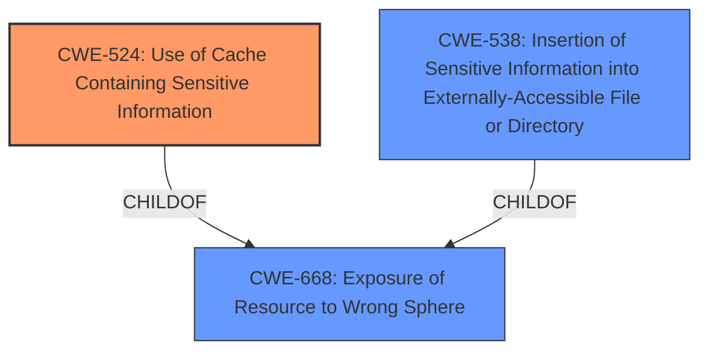

# Analysis for CVE-2021-24027

# Summary
| CWE ID | CWE Name | Confidence | CWE Abstraction Level | CWE Vulnerability Mapping Label | CWE-Vulnerability Mapping Notes |
|---|---|---|---|---|---|
| CWE-524 | Use of Cache Containing Sensitive Information | 0.9 | Base | Allowed | Primary CWE. The **cache configuration issue** allowed a third party with access to the device’s external storage to read cached TLS material. |
| CWE-668 | Exposure of Resource to Wrong Sphere | 0.7 | Class | Discouraged | Secondary CWE. The cached TLS material was exposed to the wrong control sphere due to the **cache configuration issue**. |
| CWE-538 | Insertion of Sensitive Information into Externally-Accessible File or Directory | 0.6 | Base | Allowed | Secondary CWE. The sensitive TLS material was cached in an externally accessible location. |

## Evidence and Confidence

*   **Confidence Score:** 0.8
*   **Evidence Strength:** HIGH

## Relationship Analysis
The primary CWE is CWE-524 (Use of Cache Containing Sensitive Information), which is a Base level CWE and a child of CWE-668 (Exposure of Resource to Wrong Sphere), a Class level CWE. The vulnerability involves sensitive information being stored in a cache accessible to unauthorized parties. CWE-538 (Insertion of Sensitive Information into Externally-Accessible File or Directory) is also relevant as it describes the storage of sensitive information in a location accessible to external parties.

## Vulnerability Chain
The chain of events is as follows:
1.  **Root Cause:** **Cache configuration issue**.
2.  Weakness: Use of Cache Containing Sensitive Information (CWE-524)
3.  Impact: A third party with access to the device's external storage could read cached TLS material.

## Summary of Analysis
The initial analysis correctly identified CWE-524 as the primary weakness, given the description of a **cache configuration issue** leading to the exposure of TLS material. The vulnerability description clearly states that "a third party with access to the devices external storage to read cached TLS material," which directly aligns with the description of CWE-524: "The code uses a cache that contains sensitive information, but the cache can be read by an actor outside of the intended control sphere."

The relationship graph helped to solidify the understanding that while CWE-668 is a parent, CWE-524 is more specific. The inclusion of CWE-538 further clarifies that the sensitive information was placed in an externally accessible location, amplifying the risk.

The selected CWEs are at the optimal level of specificity. CWE-524 is a Base level CWE, which is preferred for mapping to root causes. While CWE-668 is a Class level CWE and broader, it still applies as the resource was exposed to the wrong control sphere.

Relevant CWE Information:
- Vulnerability Description Key Phrases: "rootcause: **cache configuration issue**"
- CVE Reference Links Content Summary: "**Root cause of vulnerability:** A cache configuration issue. **Weaknesses/vulnerabilities present:** Improper cache configuration allowed access to sensitive TLS material."