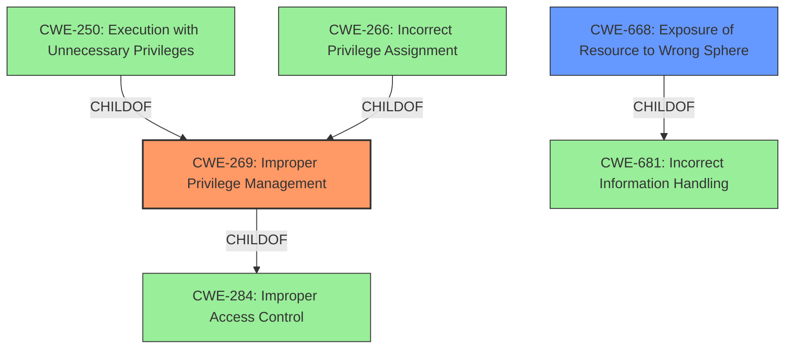

# Analysis for CVE-2021-24038

# Summary
| CWE ID | CWE Name | Confidence | CWE Abstraction Level | CWE Vulnerability Mapping Label | CWE-Vulnerability Mapping Notes |
|---|---|---|---|---|---|
| CWE-269 | Improper Privilege Management | 0.7 | Class | Primary | The vulnerability involves the exposure of a privileged process handle to an unprivileged process due to a bug in handle management. |
| CWE-668 | Exposure of Resource to Wrong Sphere | 0.6 | Class | Secondary | The vulnerability results in exposing a privileged process handle to an unprivileged process. |

## Evidence and Confidence

*   **Confidence Score:** 0.7
*   **Evidence Strength:** MEDIUM

## Relationship Analysis
The primary CWE selected is CWE-269 (Improper Privilege Management), which is a Class-level CWE. CWE-668 (Exposure of Resource to Wrong Sphere) is also considered as a secondary CWE. CWE-269 is a child of CWE-284 (Improper Access Control) and has child CWEs like CWE-250 (Execution with Unnecessary Privileges) and CWE-266 (Incorrect Privilege Assignment). However, the description does not provide enough detail to pinpoint a more specific Base or Variant CWE. CWE-668 is a Class level CWE and is often misused as a catch-all when lower-level CWE IDs might be applicable. It is a child of the Pillar CWE-681 (Incorrect Information Handling).

## Vulnerability Chain
The vulnerability chain starts with a **bug with management of handles in OVRServiceLauncher.exe**, leading to the exposure of a privileged process handle to an unprivileged process. This exposure results in local privilege escalation. The root cause is the improper handle management, which is a type of privilege management issue.

## Summary of Analysis
The initial assessment identified CWE-269 (Improper Privilege Management) as the primary candidate due to the **bug with management of handles** which led to the exposure of privileged process handles. The retriever results also listed CWE-269 as the top candidate.

The vulnerability description key phrases and CVE reference links content summary both support the classification of a privilege management issue. Specifically, the root cause is a **bug with management of handles**, which results in the ability to "expose a privileged process handle to an unprivileged process," leading to local privilege escalation.

CWE-269 is a Class-level CWE, and the mapping guidance suggests avoiding it if more specific CWEs exist. However, the provided information does not offer enough detail to identify a more specific weakness. While CWE-250 (Execution with Unnecessary Privileges), CWE-266 (Incorrect Privilege Assignment), and CWE-267 (Privilege Defined With Unsafe Actions) are related, they do not precisely capture the described vulnerability.

CWE-668 (Exposure of Resource to Wrong Sphere) is also considered since the vulnerability results in exposing a privileged process handle to an unprivileged process.

The selection of CWE-269 is based on the evidence of **improper handle management** leading to privilege exposure. While a more specific CWE would be preferred, the current information is insufficient. A confidence score of 0.7 reflects the moderate confidence in the classification, considering the limitations of the provided details.

Relevant CWE Information:

# Enhanced Context (25 CWEs)
The following CWEs were identified as potentially relevant to this vulnerability:

## CWE-667: Improper Locking
**Abstraction Level**: Class
**Similarity Score**: 0.76
**Source**: dense

**Description**:
The product does not properly acquire or release a lock on a resource, leading to unexpected resource state changes and behaviors.

**Mapping Guidance**:
- Usage: Allowed-with-Review
- Rationale: This CWE entry is a Class and might have Base-level children that would be more appropriate

This was considered, but it's related to resource locking and is not relevant to the vulnerability which has to do with exposing process handles.

## CWE-668: Exposure of Resource to Wrong Sphere
**Abstraction Level**: Class
**Similarity Score**: 0.76
**Source**: dense

**Description**:
The product exposes a resource to the wrong control sphere, providing unintended actors with inappropriate access to the resource.

**Mapping Guidance**:
- Usage: Discouraged
- Rationale: CWE-668 is high-level and is often misused as a catch-all when lower-level CWE IDs might be applicable. It is sometimes used for low-information vulnerability reports [REF-1287]. It is a level-1 Class (i.e., a child of a Pillar). It is not useful for trend analysis.

This was considered as a secondary CWE since the vulnerability exposes a privileged process handle to an unprivileged process.

## CWE-266: Incorrect Privilege Assignment
**Abstraction Level**: Base
**Similarity Score**: 0.76
**Source**: dense

**Description**:
A product incorrectly assigns a privilege to a particular actor, creating an unintended sphere of control for that actor.

**Mapping Guidance**:
- Usage: Allowed
- Rationale: This CWE entry is at the Base level of abstraction, which is a preferred level of abstraction for mapping to the root causes of vulnerabilities.

This was considered, but the root cause is not an incorrect assignment of privilege, but instead a bug in the management of handles.

## CWE-274: Improper Handling of Insufficient Privileges
**Abstraction Level**: Base
**Similarity Score**: 0.75
**Source**: dense

**Description**:
The product does not handle or incorrectly handles when it has insufficient privileges to perform an operation, leading to resultant weaknesses.

**Mapping Guidance**:
- Usage: Discouraged
- Rationale: This CWE entry could be deprecated in a future version of CWE.

This was not selected as the vulnerability does not have to do with insufficient privileges.

## CWE-59: Improper Link Resolution Before File Access ('Link Following')
**Abstraction Level**: Base
**Similarity Score**: 0.75
**Source**: dense

**Description**:
The product attempts to access a file based on the filename, but it does not properly prevent that filename from identifying a link or shortcut that resolves to an unintended resource.

**Mapping Guidance**:
- Usage: Allowed
- Rationale: This CWE entry is at the Base level of abstraction, which is a preferred level of abstraction for mapping to the root causes of vulnerabilities.

This was not selected because it's not related to file access.

## CWE-653: Improper Isolation or Compartmentalization
**Abstraction Level**: Class
**Similarity Score**: 0.75
**Source**: dense

**Description**:
The product does not properly compartmentalize or isolate functionality, processes, or resources that require different privilege levels, rights, or permissions.

**Mapping Guidance**:
- Usage: Allowed
- Rationale: This CWE entry is at the Base level of abstraction, which is a preferred level of abstraction for mapping to the root causes of vulnerabilities.

This was considered, but the main issue is with the improper handle management, not the lack of compartmentalization.

## CWE-41: Improper Resolution of Path Equivalence
**Abstraction Level**: Base
**Similarity Score**: 0.75
**Source**: dense

**Description**:
The product is vulnerable to file system contents disclosure through path equivalence. Path equivalence involves the use of special characters in file and directory names. The associated manipulations are intended to generate multiple names for the same object.

**Mapping Guidance**:
- Usage: Allowed
- Rationale: This CWE entry is at the Base level of abstraction, which is a preferred level of abstraction for mapping to the root causes of vulnerabilities.

This was not selected as it's not related to path equivalence.

## CWE-267: Privilege Defined With Unsafe Actions
**Abstraction Level**: Base
**Similarity Score**: 0.75
**Source**: dense

**Description**:
A particular privilege, role, capability, or right can be used to perform unsafe actions that were not intended, even when it is assigned to the correct entity.

**Mapping Guidance**:
- Usage: Allowed
- Rationale: This CWE