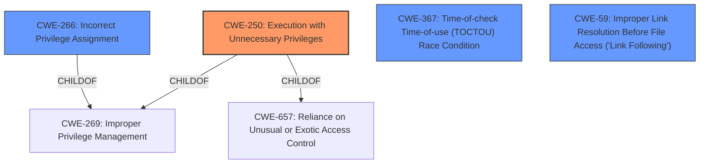

# Raw Analyzer Response for CVE-2021-24087

# Summary
| CWE ID  | CWE Name                                                                   | Confidence | CWE Abstraction Level | CWE Vulnerability Mapping Label | CWE-Vulnerability Mapping Notes |
| :-------- | :------------------------------------------------------------------------- | :---------- | :---------------------- | :------------------------------ | :------------------------------ |
| CWE-250   | Execution with Unnecessary Privileges                                      | 0.75      | Base                    | Primary CWE                     | Allowed                       |
| CWE-266   | Incorrect Privilege Assignment                                             | 0.50      | Base                    | Secondary Candidate             | Allowed                       |
| CWE-367   | Time-of-check Time-of-use (TOCTOU) Race Condition                          | 0.25      | Base                    | Secondary Candidate             | Allowed                       |
| CWE-59    | Improper Link Resolution Before File Access ('Link Following')            | 0.25      | Base                    | Secondary Candidate             | Allowed                       |

## Evidence and Confidence

*   **Confidence Score:** 0.75
*   **Evidence Strength:** MEDIUM

## Relationship Analysis
The primary CWE, CWE-250, is related to CWE-269 (Improper Privilege Management) and CWE-657 (Reliance on Unusual or Exotic Access Control). CWE-266, a potential secondary CWE, is a child of CWE-269, indicating a hierarchical relationship. CWE-367 and CWE-59 were considered based on retriever results but are less directly supported by the evidence. The abstraction levels were considered, favoring Base level CWEs where possible.

## Vulnerability Chain
The vulnerability chain begins with the **incorrect** or **unnecessary privilege** being granted, leading to an **elevation of privilege**. The specifics of how this elevation occurs are not detailed. Potential steps involving race conditions or link following are speculative based on retriever results.

## Summary of Analysis
The primary focus is on **elevation of privilege** in the Azure IoT CLI extension. The most direct mapping for this is CWE-250, Execution with Unnecessary Privileges, as the extension is running with more privileges than required, leading to the vulnerability. This is supported by the vulnerability description indicating an **impact** of "Elevation of Privilege".

CWE-266, Incorrect Privilege Assignment, was considered as a secondary candidate because it addresses the **incorrect assignment of privilege**, but it is less directly supported by the vulnerability description, which doesn't specify the mechanism of assignment, only the resulting **elevation of privilege**.

CWE-367 (Time-of-check Time-of-use (TOCTOU) Race Condition) and CWE-59 (Improper Link Resolution Before File Access ('Link Following')) were also considered because they appeared in the retriever results. However, these are speculative since there is no specific evidence in the vulnerability description or CVE details to support a race condition or link following. Therefore, these are not selected as primary or secondary CWEs.

The selection of CWE-250 is at the optimal level of specificity because it directly addresses the observed **elevation of privilege**. The retriever results suggest other potential contributing factors (race conditions, link following), but these are not explicitly supported by the available evidence.
Relevant CWE Information:

# Enhanced Context (25 CWEs)
The following CWEs were identified as potentially relevant to this vulnerability:

## CWE-1289: Improper Validation of Unsafe Equivalence in Input
**Abstraction Level**: Base
**Similarity Score**: 0.80
**Source**: dense

**Description**:
The product receives an input value that is used as a resource identifier or other type of reference, but it does not validate or incorrectly validates that the input is equivalent to a potentially-unsafe value.

**Mapping Guidance**:
- Usage: Allowed
- Rationale: This CWE entry is at the Base level of abstraction, which is a preferred level of abstraction for mapping to the root causes of vulnerabilities.

## CWE-184: Incomplete List of Disallowed Inputs
**Abstraction Level**: Base
**Similarity Score**: 0.76
**Source**: dense

**Description**:
The product implements a protection mechanism that relies on a list of inputs (or properties of inputs) that are not allowed by policy or otherwise require other action to neutralize before additional processing takes place, but the list is incomplete.

**Mapping Guidance**:
- Usage: Allowed
- Rationale: This CWE entry is at the Base level of abstraction, which is a preferred level of abstraction for mapping to the root causes of vulnerabilities.

## CWE-807: Reliance on Untrusted Inputs in a Security Decision
**Abstraction Level**: Base
**Similarity Score**: 0.76
**Source**: dense

**Description**:
The product uses a protection mechanism that relies on the existence or values of an input, but the input can be modified by an untrusted actor in a way that bypasses the protection mechanism.

**Mapping Guidance**:
- Usage: Allowed
- Rationale: This CWE entry is at the Base level of abstraction, which is a preferred level of abstraction for mapping to the root causes of vulnerabilities.

## CWE-183: Permissive List of Allowed Inputs
**Abstraction Level**: Base
**Similarity Score**: 0.76
**Source**: dense

**Description**:
The product implements a protection mechanism that relies on a list of inputs (or properties of inputs) that are explicitly allowed by policy because the inputs are assumed to be safe, but the list is too permissive - that is, it allows an input that is unsafe, leading to resultant weaknesses.

**Mapping Guidance**:
- Usage: Allowed
- Rationale: This CWE entry is at the Base level of abstraction, which is a preferred level of abstraction for mapping to the root causes of vulnerabilities.

## CWE-606: Unchecked Input for Loop Condition
**Abstraction Level**: Base
**Similarity Score**: 0.76
**Source**: dense

**Description**:
The product does not properly check inputs that are used for loop conditions, potentially leading to a denial of service or other consequences because of excessive looping.

**Mapping Guidance**:
- Usage: Allowed
- Rationale: This CWE entry is at the Base level of abstraction, which is a preferred level of abstraction for mapping to the root causes of vulnerabilities.

## CWE-179: Incorrect Behavior Order: Early Validation
**Abstraction Level**: Base
**Similarity Score**: 0.76
**Source**: dense

**Description**:
The product validates input before applying protection mechanisms that modify the input, which could allow an attacker to bypass the validation via dangerous inputs that only arise after the modification.

**Mapping Guidance**:
- Usage: Allowed
- Rationale: This CWE entry is at the Base level of abstraction, which is a preferred level of abstraction for mapping to the root causes of vulnerabilities.

## CWE-41: Improper Resolution of Path Equivalence
**Abstraction Level**: Base
**Similarity Score**: 0.75
**Source**: dense

**Description**:
The product is vulnerable to file system contents disclosure through path equivalence. Path equivalence involves the use of special characters in file and directory names. The associated manipulations are intended to generate multiple names for the same object.

**Mapping Guidance**:
- Usage: Allowed
- Rationale: This CWE entry is at the Base level of abstraction, which is a preferred level of abstraction for mapping to the root causes of vulnerabilities.

## CWE-1286: Improper Validation of Syntactic Correctness of Input
**Abstraction Level**: Base
**Similarity Score**: 0.75
**Source**: dense

**Description**:
The product receives input that is expected to be well-formed - i.e., to comply with a certain syntax - but it does not validate or incorrectly validates that the input complies with the syntax.

**Mapping Guidance**:
- Usage: Allowed
- Rationale: This CWE entry is at the Base level of abstraction, which is a preferred level of abstraction for mapping to the root causes of vulnerabilities.

## CWE-1288: Improper Validation of Consistency within Input
**Abstraction Level**: Base
**Similarity Score**: 0.75
**Source**: dense

**Description**:
The product receives a complex input with multiple elements or fields that must be consistent with each other, but it does