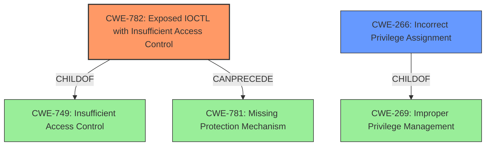

# Raw Analyzer Response for CVE-2021-24090

# Summary
| CWE ID  | CWE Name                                                        | Confidence | CWE Abstraction Level | CWE Vulnerability Mapping Label | CWE-Vulnerability Mapping Notes |
| :-------- | :-------------------------------------------------------------- | :--------- | :---------------------- | :------------------------------ | :------------------------------ |
| CWE-782 | Exposed IOCTL with Insufficient Access Control                   | 0.75       | Variant                 | Allowed                         | Primary CWE                    |
| CWE-266 | Incorrect Privilege Assignment                                    | 0.50       | Base                    | Allowed                         | Secondary Candidate           |

## Evidence and Confidence

*   **Confidence Score:** 0.60
*   **Evidence Strength:** MEDIUM

## Relationship Analysis
The primary CWE selected is CWE-782, which is a Variant of CWE-749 (Insufficient Access Control). This indicates a hierarchical relationship where CWE-782 is a more specific instance of a broader access control issue. CWE-782 also has a CanPrecede relationship to CWE-781 (Missing Protection Mechanism). The secondary CWE is CWE-266, which can be a child of CWE-269 (Improper Privilege Management). The relationships show a progression from a lack of access control on an exposed IOCTL to potential privilege escalation. The Variant level of CWE-782 was chosen for its specificity in describing the exposed IOCTL.

## Vulnerability Chain
The vulnerability chain begins with the **root cause**, an exposed IOCTL lacking sufficient access control (CWE-782). This **improper** exposure can lead to an attacker gaining **incorrect** privilege assignment (CWE-266), ultimately resulting in the **impact** of Elevation of Privilege.

## Summary of Analysis
The initial assessment focused on the vulnerability description indicating an "Elevation of Privilege" in "Windows Error Reporting". The primary selection, CWE-782, is justified because it directly addresses the scenario of an exposed IOCTL without proper access control, which aligns with the potential **root cause** of the vulnerability. The retriever identified CWE-782 as having a high relevance score (0.549). The vulnerability description key phrases supports that the impact is "Elevation of Privilege".

The selection of CWE-782 is based on the evidence that the IOCTL is exposed and lacks sufficient access control.

> The product implements an IOCTL with functionality that should be restricted, but it does not properly enforce access control for the IOCTL.

CWE-266 was considered as a secondary weakness because it addresses the outcome of **incorrect** privilege assignment, which stems from the **improper** IOCTL access.

> A product incorrectly assigns a privilege to a particular actor, creating an unintended sphere of control for that actor.

The selected CWEs are at the optimal level of specificity. CWE-782 is a Variant that directly addresses the IOCTL exposure, while CWE-266 is a Base that covers the broader issue of privilege assignment.

Relevant CWE Information:

# Enhanced Context (25 CWEs)

## CWE-59: Improper Link Resolution Before File Access ('Link Following')
**Abstraction Level**: Base
**Similarity Score**: 0.81
**Source**: dense

**Description**:
The product attempts to access a file based on the filename, but it does not properly prevent that filename from identifying a link or shortcut that resolves to an unintended resource.

**Mapping Guidance**:
- Usage: Allowed
- Rationale: This CWE entry is at the Base level of abstraction, which is a preferred level of abstraction for mapping to the root causes of vulnerabilities.

## CWE-41: Improper Resolution of Path Equivalence
**Abstraction Level**: Base
**Similarity Score**: 0.80
**Source**: dense

**Description**:
The product is vulnerable to file system contents disclosure through path equivalence. Path equivalence involves the use of special characters in file and directory names. The associated manipulations are intended to generate multiple names for the same object.

**Mapping Guidance**:
- Usage: Allowed
- Rationale: This CWE entry is at the Base level of abstraction, which is a preferred level of abstraction for mapping to the root causes of vulnerabilities.

## CWE-73: External Control of File Name or Path
**Abstraction Level**: Base
**Similarity Score**: 0.79
**Source**: dense

**Description**:
The product allows user input to control or influence paths or file names that are used in filesystem operations.

**Mapping Guidance**:
- Usage: Allowed
- Rationale: This CWE entry is at the Base level of abstraction, which is a preferred level of abstraction for mapping to the root causes of vulnerabilities.

## CWE-23: Relative Path Traversal
**Abstraction Level**: Base
**Similarity Score**: 0.79
**Source**: dense

**Description**:
The product uses external input to construct a pathname that should be within a restricted directory, but it does not properly neutralize sequences such as ".." that can resolve to a location that is outside of that directory.

**Mapping Guidance**:
- Usage: Allowed
- Rationale: This CWE entry is at the Base level of abstraction, which is a preferred level of abstraction for mapping to the root causes of vulnerabilities.

## CWE-668: Exposure of Resource to Wrong Sphere
**Abstraction Level**: Class
**Similarity Score**: 0.78
**Source**: dense

**Description**:
The product exposes a resource to the wrong control sphere, providing unintended actors with inappropriate access to the resource.

**Mapping Guidance**:
- Usage: Discouraged
- Rationale: CWE-668 is high-level and is often misused as a catch-all when lower-level CWE IDs might be applicable. It is sometimes used for low-information vulnerability reports [REF-1287]. It is a level-1 Class (i.e., a child of a Pillar). It is not useful for trend analysis.

## CWE-274: Improper Handling of Insufficient Privileges
**Abstraction Level**: Base
**Similarity Score**: 0.77
**Source**: dense

**Description**:
The product does not handle or incorrectly handles when it has insufficient privileges to perform an operation, leading to resultant weaknesses.

**Mapping Guidance**:
- Usage: Discouraged
- Rationale: This CWE entry could be deprecated in a future version of CWE.

## CWE-552: Files or Directories Accessible to External Parties
**Abstraction Level**: Base
**Similarity Score**: 0.77
**Source**: dense

**Description**:
The product makes files or directories accessible to unauthorized actors, even though they should not be.

**Mapping Guidance**:
- Usage: Allowed
- Rationale: This CWE entry is at the Base level of abstraction, which is a preferred level of abstraction for mapping to the root causes of vulnerabilities.

## CWE-497: Exposure of Sensitive System Information to an Unauthorized Control Sphere
**Abstraction Level**: Base
**Similarity Score**: 0.77
**Source**: dense

**Description**:
The product does not properly prevent sensitive system-level information from being accessed by unauthorized actors who do not have the same level of access to the underlying system as the product does.

**Mapping Guidance**:
- Usage: Allowed
- Rationale: This CWE entry is at the Base level of abstraction, which is a preferred level of abstraction for mapping to the root causes of vulnerabilities.

## CWE-212: Improper Removal of Sensitive Information Before Storage or Transfer
**Abstraction Level**: Base
**Similarity Score**: 0.77
**Source**: dense

**Description**:
The product stores, transfers, or shares a resource that contains sensitive information, but it does not properly remove that information before the product makes the resource available to unauthorized actors.

**Mapping Guidance**:
- Usage: Allowed
- Rationale: This CWE entry is at the Base level of abstraction, which is a preferred level of abstraction for mapping to the root causes of vulnerabilities.

## CWE-427: Uncontrolled Search Path Element
**Abstraction Level**: Base
**Similarity Score**: 0.77
**Source**: dense

**Description**:
The product uses a fixed or controlled search path to find resources, but one or more locations in that path can be under the control of unintended actors.

**Mapping Guidance**:
- Usage: Allowed
- Rationale: This CWE entry is at the Base level of abstraction, which is