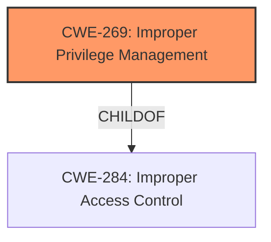

# Analysis Report for CVE-2021-24092

# Vulnerability Analysis Report: CVE-2021-24092

## Description


## Analysis (with Relationship Data)

# Summary
| CWE ID    | CWE Name                                                                          | Confidence | CWE Abstraction Level | CWE Vulnerability Mapping Label | CWE-Vulnerability Mapping Notes |
| --------- | --------------------------------------------------------------------------------- | ---------- | --------------------- | ------------------------------- | ------------------------------- |
| CWE-269   | Improper Privilege Management                                                      | 0.75       | Class                 | Allowed                          |                                 |

## Evidence and Confidence

*   **Confidence Score:** 0.75
*   **Evidence Strength:** LOW

## Relationship Analysis
The primary relationship that influenced my decision was the ChildOf relationship between CWE-269 and CWE-284 (Improper Access Control). CWE-269 is a Class-level CWE, which suggests that more specific Base or Variant CWEs might exist. However, based on the limited information available, CWE-269 appears to be the most appropriate. There are no chain relationships available given the limited information.



## Vulnerability Chain
Given the limited information, a detailed vulnerability chain cannot be established. However, the general chain would be:
1.  **Root Cause:** Improper Privilege Management (CWE-269)
2.  **Impact:** Elevation of Privilege

## Summary of Analysis
Based on the provided vulnerability description, the most fitting CWE is CWE-269 (Improper Privilege Management). The description explicitly mentions "Elevation of Privilege," which aligns with the potential impact of improper privilege management. The evidence strength is low because the provided description is very generic, and the key phrases don't directly indicate any root cause. The "CWE for similar CVE Descriptions" section lists CWE-NVD-noinfo as the primary match. However, "Elevation of Privilege" is a strong indicator of privilege management issues, and CWE-269 is listed as one of the Top CWEs for similar CVEs.

The Retriever Results listed several CWEs, including CWE-65, CWE-59, CWE-1285, CWE-23, CWE-131, and CWE-295. However, these CWEs relate to file access, path traversal, or buffer sizes, which aren't directly mentioned in the vulnerability description. CWE-269 is the most appropriate based on the limited information.

I am overriding the "CWE for similar CVE Descriptions" primary match of CWE-NVD-noinfo because the vulnerability description indicates an elevation of privilege.

Relevant CWE Information:

# Enhanced Context (25 CWEs)

## CWE-269: Improper Privilege Management
**Abstraction:** Class
**Status:** Draft

### Description
The product does not properly assign, modify, track, or check privileges for an actor, creating an unintended sphere of control for that actor.

### Extended Description
Not provided

### Alternative Terms
None

### Relationships
ChildOf -> CWE-284

### Mapping Guidance
**Usage:** Discouraged
**Rationale:** CWE-269 is commonly misused. It can be conflated with "privilege escalation," which is a technical impact that is listed in many low-information vulnerability reports [REF-1287]. It is not useful for trend analysis.
**Comments:** If an error or mistake allows privilege escalation, then use the CWE ID for that mistake. Avoid using CWE-269 when only phrases such as "privilege escalation" or "gain privileges" are available, as these indicate technical impact of the vulnerability - not the root cause weakness. If the root cause seems to be directly related to privileges, then examine the children of CWE-269 for additional hints, such as Execution with Unnecessary Privileges (CWE-250) or Incorrect Privilege Assignment (CWE-266).
**Reasons:**
- Frequent Misuse

### Additional Notes
**[Maintenance]** The relationships between privileges, permissions, and actors (e.g. users and groups) need further refinement within the Research view. One complication is that these concepts apply to two different pillars, related to control of resources (CWE-664) and protection mechanism failures (CWE-693).

### Observed Examples
- **CVE-2001-1555:** Terminal privileges are not reset when a user logs out.
- **CVE-2001-1514:** Does not properly pass security context to child processes in certain cases, allows privilege escalation.
- **CVE-2001-0128:** Does not properly compute roles.

Other CWEs Considered:

*   CWE-65, CWE-59, CWE-1285, CWE-23, CWE-131, CWE-781, CWE-426, CWE-191, CWE-295: These were all considered and rejected because they relate to file access, path traversal, buffer sizes, or certificate validation, which are not directly indicated in the vulnerability description. They were listed in the retriever results but do not match the context of the provided information.
*   CWE-NVD-noinfo: This was the primary CWE match for similar CVE descriptions, but it is a placeholder and does not provide specific information about the **weakness**. Therefore, it was not selected.


## CWE Relationship Analysis

Current CWEs represent these abstraction levels: .


### Vulnerability Chain Analysis

**Chain starting from CWE-664:**
- 664 (Improper Control of a Resource Through its Lifetime) - ROOT


**Chain starting from CWE-284:**
- 284 (Improper Access Control) - ROOT


### CWE Relationship Diagram

```mermaid
graph TD
    classDef primary fill:#f96,stroke:#333,stroke-width:2px
    classDef secondary fill:#69f,stroke:#333
    classDef tertiary fill:#9e9,stroke:#333
```


*Report generated on 2025-04-02 02:57:10*
