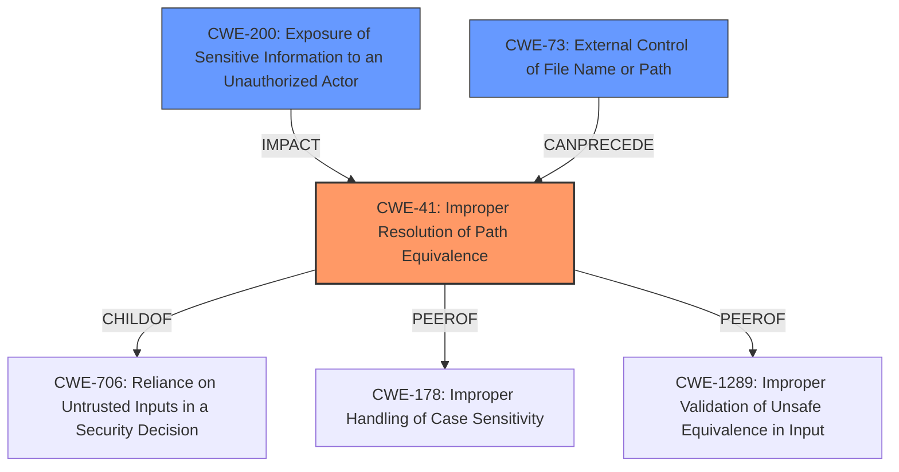

# Raw Analyzer Response for CVE-2021-24122

# Summary
| CWE ID    | CWE Name                                                                                                 | Confidence | CWE Abstraction Level | CWE Vulnerability Mapping Label | CWE-Vulnerability Mapping Notes |
| :--------- | :------------------------------------------------------------------------------------------------------- | :---------- | :---------------------- | :------------------------------ | :------------------------------ |
| CWE-41 | Improper Resolution of Path Equivalence | 0.75 | Base | Allowed | Primary CWE |
| CWE-200 | Exposure of Sensitive Information to an Unauthorized Actor | 0.4 | Class | Discouraged | Secondary Candidate CWE |
| CWE-73 | External Control of File Name or Path | 0.3 | Base | Allowed | Secondary Candidate CWE |

## Evidence and Confidence

*   **Confidence Score:** 0.75
*   **Evidence Strength:** HIGH

## Relationship Analysis
The primary CWE is CWE-41, which is at the Base level, indicating a specific type of weakness related to path equivalence. CWE-41 has peer relationships with CWE-178 and CWE-1289, suggesting similar types of input handling issues. It is a child of CWE-706, indicating that it is a specific type of "Reliance on Untrusted Inputs in a Security Decision." CWE-200 is a class-level CWE related to information exposure, and CWE-73 relates to external control of file names, both are related to the impact of this vulnerability.

## Vulnerability Chain
The chain of root cause and weaknesses for the Vulnerability Description is as follows:
  - **Root Cause:** **Unexpected behavior of JRE API File.getCanonicalPath()** due to **inconsistent behavior of Windows API (FindFirstFileW)**.
  - **Weakness:** Improper Resolution of Path Equivalence (CWE-41).
  - **Impact:** JSP source code disclosure.

## Summary of Analysis
The initial analysis focused on identifying the root cause of the vulnerability and mapping it to the most appropriate CWE. The **rootcause** identified in the vulnerability description is the **unexpected behavior of the JRE API File.getCanonicalPath() and the inconsistent behavior of the Windows API (FindFirstFileW)**. This leads to an **improper resolution of path equivalence**, which in turn results in JSP source code disclosure. The selection of CWE-41 as the primary CWE is based on its description, which aligns with the vulnerability's root cause related to file system contents disclosure through path equivalence.

The retriever results also support this selection, with CWE-41 having a high similarity score. The "CVE Reference Links Content Summary" section provides evidence that the **inconsistent behavior of the Windows API** leads to the vulnerability.

While CWE-200 (Exposure of Sensitive Information) is a potential candidate due to the impact of JSP source code disclosure, it is a class-level CWE and is discouraged for use as a primary mapping when more specific CWEs are available. CWE-73 (External Control of File Name or Path) was considered, but it focuses more on user-controlled file names, which is not the primary issue here.

The final decision to use CWE-41 is based on the evidence from the vulnerability description, the retriever results, and the CWE's description, which accurately reflects the **root cause** of the vulnerability. The confidence level is rated as high due to the clear alignment between the vulnerability description and the selected CWE.

Relevant CWE Information:

# Enhanced Context (25 CWEs)
The following CWEs were identified as potentially relevant to this vulnerability:

## CWE-668: Exposure of Resource to Wrong Sphere
**Abstraction Level**: Class
**Similarity Score**: 0.78
**Source**: dense

**Description**:
The product exposes a resource to the wrong control sphere, providing unintended actors with inappropriate access to the resource.

**Mapping Guidance**:
- Usage: Discouraged
- Rationale: CWE-668 is high-level and is often misused as a catch-all when lower-level CWE IDs might be applicable. It is sometimes used for low-information vulnerability reports [REF-1287]. It is a level-1 Class (i.e., a child of a Pillar). It is not useful for trend analysis.

## CWE-41: Improper Resolution of Path Equivalence
**Abstraction Level**: Base
**Similarity Score**: 0.77
**Source**: dense

**Description**:
The product is vulnerable to file system contents disclosure through path equivalence. Path equivalence involves the use of special characters in file and directory names. The associated manipulations are intended to generate multiple names for the same object.

**Mapping Guidance**:
- Usage: Allowed
- Rationale: This CWE entry is at the Base level of abstraction, which is a preferred level of abstraction for mapping to the root causes of vulnerabilities.

## CWE-552: Files or Directories Accessible to External Parties
**Abstraction Level**: Base
**Similarity Score**: 0.75
**Source**: dense

**Description**:
The product makes files or directories accessible to unauthorized actors, even though they should not be.

**Mapping Guidance**:
- Usage: Allowed
- Rationale: This CWE entry is at the Base level of abstraction, which is a preferred level of abstraction for mapping to the root causes of vulnerabilities.

## CWE-23: Relative Path Traversal
**Abstraction Level**: Base
**Similarity Score**: 0.75
**Source**: dense

**Description**:
The product uses external input to construct a pathname that should be within a restricted directory, but it does not properly neutralize sequences such as ".." that can resolve to a location that is outside of that directory.

**Mapping Guidance**:
- Usage: Allowed
- Rationale: This CWE entry is at the Base level of abstraction, which is a preferred level of abstraction for mapping to the root causes of vulnerabilities.

## CWE-610: Externally Controlled Reference to a Resource in Another Sphere
**Abstraction Level**: Class
**Similarity Score**: 0.75
**Source**: dense

**Description**:
The product uses an externally controlled name or reference that resolves to a resource that is outside of the intended control sphere.

**Mapping Guidance**:
- Usage: Discouraged
- Rationale: This CWE entry is a level-1 Class (i.e., a child of a Pillar). It might have lower-level children that would be more appropriate

## CWE-497: Exposure of Sensitive System Information to an Unauthorized Control Sphere
**Abstraction Level**: Base
**Similarity Score**: 0.75
**Source**: dense

**Description**:
The product does not properly prevent sensitive system-level information from being accessed by unauthorized actors who do not have the same level of access to the underlying system as the product does.

**Mapping Guidance**:
- Usage: Allowed
- Rationale: This CWE entry is at the Base level of abstraction, which is a preferred level of abstraction for mapping to the root causes of vulnerabilities.

## CWE-73: External Control of File Name or Path
**Abstraction Level**: Base
**Similarity Score**: 0.75
**Source**: dense

**Description**:
The product allows user input to control or influence paths or file names that are used in filesystem operations.

**Mapping Guidance**:
- Usage: Allowed
- Rationale: This CWE entry is at the Base level of abstraction, which is a preferred level of abstraction for mapping to the root causes of vulnerabilities.

## CWE-538: Insertion of Sensitive Information into Externally-Accessible File or Directory
**Abstraction Level**: Base
**Similarity Score**: 0.75
**Source**: dense

**Description**:
The product places sensitive information into files or directories that are accessible to actors who are allowed to have access to the files, but not to the sensitive information.

**Mapping Guidance**:
- Usage: Allowed
- Rationale: This CWE entry is at the Base level of abstraction, which is a preferred level of abstraction for mapping to the root causes of vulnerabilities.

## CWE-653: Improper Isolation or Compartmentalization
**Abstraction Level**: Class
**Similarity Score**: 0.74
**Source**: dense

**Description**: