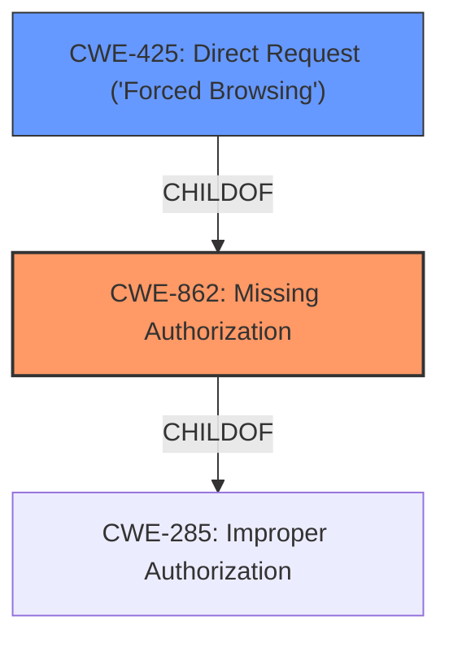

# Raw Analyzer Response for CVE-2021-24146

# Summary
| CWE ID | CWE Name | Confidence | CWE Abstraction Level | CWE Vulnerability Mapping Label | CWE-Vulnerability Mapping Notes |
|---|---|---|---|---|---|
| CWE-862 | Missing Authorization | 1.0 | Class | Primary | Allowed-with-Review |
| CWE-425 | Direct Request ('Forced Browsing') | 0.75 | Base | Secondary | Allowed |

## Evidence and Confidence

*   **Confidence Score:** 0.88
*   **Evidence Strength:** HIGH

## Relationship Analysis
The primary relationship that influenced the decision was the ChildOf relationship between CWE-425 (Direct Request) and CWE-862 (Missing Authorization). CWE-425 is a more specific case of CWE-862, where the missing authorization leads to direct access to resources. While CWE-425 is tempting as it's more specific, the description indicates a general **lack of authorization checks**, not just in the context of direct requests. Thus, CWE-862 is more appropriate as the primary classification.

## Vulnerability Chain
The vulnerability chain is relatively simple:

1.  **Root Cause:** **Lack of authorization checks** (CWE-862)
2.  **Impact:** Unauthenticated users can export all events data (information disclosure).
3.  **Attack Vector:** Direct HTTP requests to export endpoints (CWE-425, contributing to the exploitability).

## Summary of Analysis
The initial analysis identified several candidate CWEs, including CWE-639 (Authorization Bypass Through User-Controlled Key) and CWE-425 (Direct Request). However, the core of the vulnerability lies in the **lack of authorization checks**, making CWE-862 (Missing Authorization) the most suitable primary classification.

The vulnerability description explicitly states "**Lack of authorisation checks** in the Modern Events Calendar Lite WordPress plugin...did not properly restrict access to the export files, allowing unauthenticated users to exports all events data in CSV or XML format". This aligns directly with the description of CWE-862, which states "The product does not perform an authorization check when an actor attempts to access a resource or perform an action."

CWE-425 is added as a secondary classification because the attack vector involves direct requests to specific URLs, bypassing the intended access controls. This contributes to how the lack of authorization is exploited.

The selected CWEs are at the optimal level of specificity. CWE-862 is a Class-level CWE, but it accurately captures the fundamental weakness. While more specific Base-level CWEs exist, they don't fully encompass the general **lack of authorization checks** present in the vulnerability.

Relevant CWE Information:

# Enhanced Context (25 CWEs)
The following CWEs were identified as potentially relevant to this vulnerability:

## CWE-639: Authorization Bypass Through User-Controlled Key
**Abstraction Level**: Base
**Similarity Score**: 0.78
**Source**: dense

**Description**:
The system's authorization functionality does not prevent one user from gaining access to another user's data or record by modifying the key value identifying the data.

**Mapping Guidance**:
- Usage: Allowed
- Rationale: This CWE entry is at the Base level of abstraction, which is a preferred level of abstraction for mapping to the root causes of vulnerabilities.

**Why not selected:** This CWE is not appropriate because it describes a scenario where an authenticated user modifies a key to access another user's data. The vulnerability description indicates that unauthenticated users can export data, which is a different scenario.

## CWE-425: Direct Request ('Forced Browsing')
**Abstraction Level**: Base
**Similarity Score**: 0.77
**Source**: dense

**Description**:
The web application does not adequately enforce appropriate authorization on all restricted URLs, scripts, or files.

**Mapping Guidance**:
- Usage: Allowed
- Rationale: This CWE entry is at the Base level of abstraction, which is a preferred level of abstraction for mapping to the root causes of vulnerabilities.

**Why selected as secondary:** The vulnerability can be exploited by sending crafted HTTP requests to specific URLs. This supports the claim that the application does not adequately enforce appropriate authorization on all restricted URLs, scripts, or files.

## CWE-862: Missing Authorization
**Abstraction Level**: Class
**Similarity Score**: 0.307
**Source**: sparse

**Description**:
The product does not perform an authorization check when an actor attempts to access a resource or perform an action.

**Mapping Guidance**:
- Usage: Allowed-with-Review
- Rationale: This CWE entry is a Class and might have Base-level children that would be more appropriate

**Why selected as primary:** The vulnerability description explicitly states "**Lack of authorisation checks** in the Modern Events Calendar Lite WordPress plugin...did not properly restrict access to the export files, allowing unauthenticated users to exports all events data in CSV or XML format". This aligns directly with the description of CWE-862, which states "The product does not perform an authorization check when an actor attempts to access a resource or perform an action."