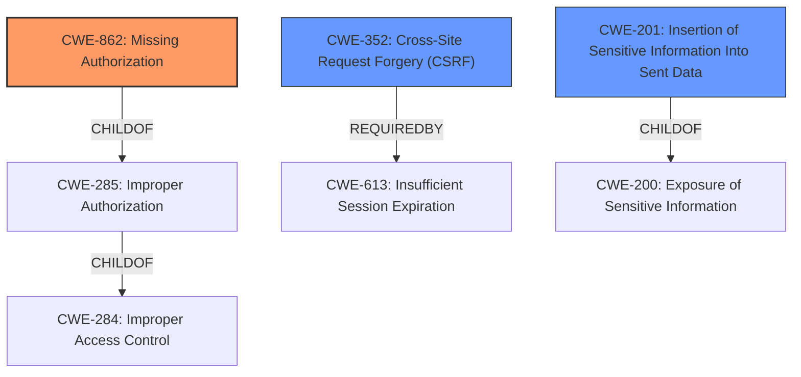

# Raw Analyzer Response for CVE-2021-24163

# Summary
| CWE ID | CWE Name | Confidence | CWE Abstraction Level | CWE Vulnerability Mapping Label | CWE-Vulnerability Mapping Notes |
|---|---|---|---|---|---|
| CWE-862 | Missing Authorization | 1.0 | Class | Allowed-with-Review | Primary CWE: The AJAX action lacks a capability check, allowing unauthorized users to trigger it. |
| CWE-352 | Cross-Site Request Forgery (CSRF) | 0.9 | Compound | Allowed | Secondary CWE: The AJAX action lacks nonce protection, making it vulnerable to CSRF attacks. |
| CWE-201 | Insertion of Sensitive Information Into Sent Data | 0.7 | Base | Allowed | Secondary CWE: The AJAX response includes the `client_secret` key, which is sensitive information that should not be exposed to low-level users. |

## Evidence and Confidence

*   **Confidence Score:** 0.9
*   **Evidence Strength:** HIGH

## Relationship Analysis
The primary weakness is the **missing authorization** (CWE-862), which is a class-level CWE. This means that the code doesn't check if the user has the necessary permissions to perform the action. Since there is no specific variant available, the class level is the most appropriate.

The **missing nonce protection** makes the action vulnerable to CSRF (CWE-352), which is a compound weakness. CSRF attacks occur when an attacker can trick a user into performing an action without their knowledge.

Additionally, the AJAX response **inserts sensitive information into sent data** (CWE-201) by including the `client_secret` key, which low-level users should not have access to.

## Vulnerability Chain
The vulnerability chain starts with the **missing capability check and nonce protection**, which allows low-level users to install and activate the SendWP plugin. This leads to the exposure of the `client_secret` key, which can be used to intercept emails.

1.  **Missing Authorization (CWE-862) and CSRF Protection (CWE-352):** The root cause is the lack of proper access control on the AJAX action.
2.  **Plugin Installation and Activation:** Unauthorized users can install and activate the SendWP plugin.
3.  **Sensitive Data Exposure (CWE-201):** The `client_secret` key is exposed in the AJAX response.
4.  **Mail Interception:** The attacker can use the `client_secret` key to intercept emails.
5.  **Potential Account Takeover:** Intercepting password reset emails could lead to account takeover.

## Summary of Analysis
The analysis is based on the provided vulnerability description and the CVE reference links content summary. The key phrases highlight the **missing capability check and nonce protection** as the root cause. The CVE reference links confirm this and provide more details on the impact and attack vectors.

The graph relationships helped to identify the appropriate level of specificity for the CWEs. CWE-862 is a class-level CWE, which is appropriate since there is no specific variant available. CWE-352 is a compound weakness, which is appropriate since the **missing nonce protection** makes the action vulnerable to CSRF attacks. CWE-201 is a base-level CWE, which is appropriate since the `client_secret` key is sensitive information that should not be exposed.

The selected CWEs are at the optimal level of specificity because they accurately represent the weaknesses and provide a clear understanding of the vulnerability. The MITRE mapping guidance was also considered when selecting the CWEs.

The primary weakness is CWE-862, as the **missing authorization** is the main reason why the vulnerability exists. The secondary weaknesses are CWE-352 and CWE-201, as they are contributing factors to the overall vulnerability.