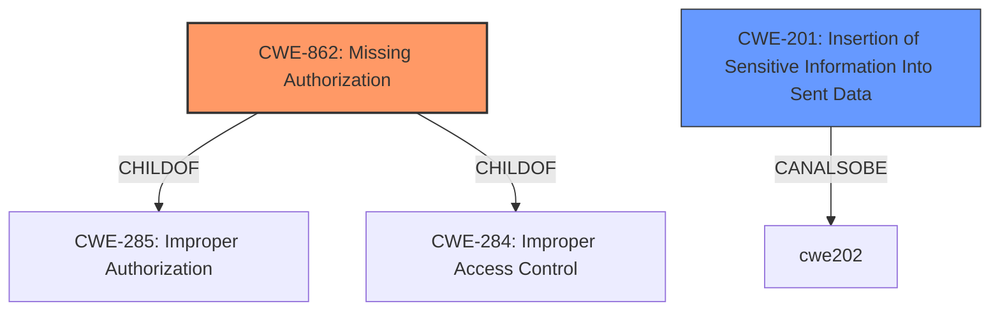

# Raw Analyzer Response for CVE-2021-24164

# Summary
| CWE ID  | CWE Name                                                      | Confidence | CWE Abstraction Level | CWE Vulnerability Mapping Label | CWE-Vulnerability Mapping Notes |
| :-------- | :------------------------------------------------------------ | :--------- | :---------------------- | :------------------------------ | :------------------------------ |
| **CWE-862** | **Missing Authorization**                                     | 0.9        | Class                   | Primary CWE                     | Allowed-with-Review             |
| CWE-201   | Insertion of Sensitive Information Into Sent Data           | 0.7        | Base                    | Secondary Candidate             | Allowed                       |

## Evidence and Confidence

*   **Confidence Score:** 0.8
*   **Evidence Strength:** HIGH

## Relationship Analysis
The primary CWE is CWE-862 **[Missing Authorization]**, which is a Class-level CWE. There are no specific children of CWE-862 that fit the description better. The vulnerability involves a lack of authorization checks, allowing low-level users to access functionality they shouldn't. CWE-201 **[Insertion of Sensitive Information Into Sent Data]** is related as the URL and client_id are sensitive information that is sent to low level users.

## Vulnerability Chain
The chain of events in this vulnerability is as follows:

1.  **Root Cause:** **Missing Authorization** (CWE-862) - The `wp_ajax_nf_oauth` AJAX action lacks a capability check.
2.  **Weakness:** Low-level users are able to trigger the `wp_ajax_nf_oauth` action.
3.  **Impact:** Low-level users can retrieve the connection URL and client\_id (**insertion of sensitive information into sent data** CWE-201).

## Summary of Analysis
The primary weakness is the **lack of authorization** check, which allows low-level users to access sensitive information.

Evidence:
*   "The `wp_ajax_nf_oauth` AJAX action, used to retrieve the connection URL for establishing an OAuth connection with the Ninja Forms Add-On Management portal, **lacks a capability check**."
*   "Missing capability check on the `wp_ajax_nf_oauth` AJAX action allows low-level users to trigger the action and obtain sensitive information."
*   "low-level users, such as subscribers, were able to trigger the action, wp_ajax_nf_oauth, and retrieve the connection url needed to establish a connection."

The retriever results also suggest CWE-862 as a strong candidate.

CWE-862 **[Missing Authorization]** is the most appropriate because the vulnerability centers around the fact that no authorization check is performed, allowing unauthorized access to sensitive data. It is at the class level which is the best level of abstraction.

CWE-201 **[Insertion of Sensitive Information Into Sent Data]** is a secondary concern, as it describes the impact of the missing authorization. The vulnerability description specifies that the action allows low-level users to obtain sensitive information (connection URL and client\_id). This aligns with CWE-201's description, "The code transmits data to another actor, but a portion of the data includes sensitive information that should not be accessible to that actor."

The other CWEs like CWE-352 **[Cross-Site Request Forgery (CSRF)]** and CWE-863 **[Incorrect Authorization]** were considered but are not as fitting. The vulnerability doesn't explicitly involve CSRF, and it's more about a complete absence of authorization rather than an incorrect one.