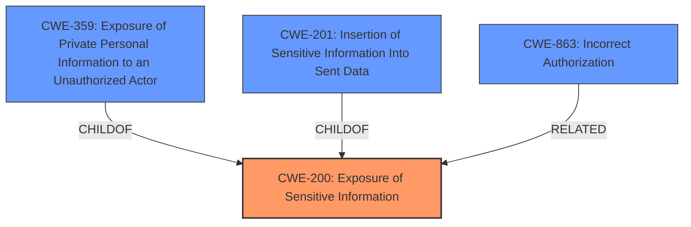

# Raw Analyzer Response for CVE-2021-24170

# Summary
| CWE ID | CWE Name | Confidence | CWE Abstraction Level | CWE Vulnerability Mapping Label | CWE-Vulnerability Mapping Notes |
|---|---|---|---|---|---|
| **CWE-200** | **Exposure of Sensitive Information** | 1 | Class | Primary | Allowed-with-Review |
| CWE-359 | Exposure of Private Personal Information to an Unauthorized Actor | 0.8 | Base | Secondary | Allowed |
| CWE-201 | Insertion of Sensitive Information Into Sent Data | 0.7 | Base | Secondary | Allowed |
| CWE-863 | Incorrect Authorization | 0.6 | Class | Secondary | Allowed-with-Review |

## Evidence and Confidence

*   **Confidence Score:** 0.9
*   **Evidence Strength:** HIGH

## Relationship Analysis
The primary CWE is CWE-200 [Exposure of Sensitive Information], which is a class-level CWE. CWE-359 [Exposure of Private Personal Information to an Unauthorized Actor] is a child of CWE-200 and a base-level CWE, offering more specificity regarding personal information. CWE-201 [Insertion of Sensitive Information Into Sent Data] is also a child of CWE-200 and relates to the transmission of sensitive data. CWE-863 [Incorrect Authorization] is related as the root cause may stem from improper authorization checks. The choice of CWE-200 as primary reflects the general nature of the vulnerability.

## Vulnerability Chain
The vulnerability chain involves an **incorrect** or **missing authorization** check (potentially CWE-863) on the `get_users` API endpoint. This leads to the **insertion of sensitive information** (CWE-201) into the data being sent, resulting in the **exposure of sensitive information** (CWE-200, CWE-359) to users with the `upload_files` capability.

## Summary of Analysis
The initial assessment identified the **exposure of sensitive information** as the primary weakness. The vulnerability description clearly states that the REST API endpoint `get_users` returned more information than required, including password hashes, user activation keys, usernames, and emails. This directly aligns with CWE-200 [Exposure of Sensitive Information].

The "CVE Reference Links Content Summary" further supports this, stating:
*   "**root_cause**: The REST API endpoint `/mpp/v2/get_users` in the User Profile Picture plugin returned excessive sensitive information."
*   "**weaknesses**: Sensitive data exposure"
*   "**impact**: Exposure of sensitive user information such as password hashes, user activation keys, usernames, and emails."

The retriever results also pointed to CWE-201 [Insertion of Sensitive Information Into Sent Data] and CWE-359 [Exposure of Private Personal Information to an Unauthorized Actor] as potential candidates. Given the specificity of the exposed information (usernames, emails, password hashes), CWE-359 is a relevant secondary CWE, as it focuses on private personal information. CWE-201 captures the fact that this information was sent in the data.

CWE-863 [Incorrect Authorization] was also considered as a secondary weakness, as the vulnerability stemmed from the fact that users with `upload_files` capability were able to access this sensitive information, indicating a flaw in the authorization mechanism.

CWE-200 is chosen as the primary CWE because it describes the overall impact of the vulnerability. While CWE-359 is more specific, CWE-200 accurately captures the general exposure of sensitive data. CWE-201 is included because the sensitive data was inserted into the sent data.

I am overriding the retriever results which suggested several authorization-related CWEs (CWE-639, CWE-863, CWE-285, CWE-425). While there might be an underlying authorization issue, the primary manifestation and impact of the vulnerability is the exposure of sensitive information. Therefore, I am including CWE-863 as a secondary weakness but not as the primary one.

Relevant CWE Information:

# Enhanced Context (25 CWEs)
The following CWEs were identified as potentially relevant to this vulnerability:

## CWE-639: Authorization Bypass Through User-Controlled Key
**Abstraction Level**: Base
**Similarity Score**: 0.78
**Source**: dense

**Description**:
The system's authorization functionality does not prevent one user from gaining access to another user's data or record by modifying the key value identifying the data.

**Mapping Guidance**:
- Usage: Allowed
- Rationale: This CWE entry is at the Base level of abstraction, which is a preferred level of abstraction for mapping to the root causes of vulnerabilities.

## CWE-552: Files or Directories Accessible to External Parties
**Abstraction Level**: Base
**Similarity Score**: 0.78
**Source**: dense

**Description**:
The product makes files or directories accessible to unauthorized actors, even though they should not be.

**Mapping Guidance**:
- Usage: Allowed
- Rationale: This CWE entry is at the Base level of abstraction, which is a preferred level of abstraction for mapping to the root causes of vulnerabilities.

## CWE-425: Direct Request ('Forced Browsing')
**Abstraction Level**: Base
**Similarity Score**: 0.77
**Source**: dense

**Description**:
The web application does not adequately enforce appropriate authorization on all restricted URLs, scripts, or files.

**Mapping Guidance**:
- Usage: Allowed
- Rationale: This CWE entry is at the Base level of abstraction, which is a preferred level of abstraction for mapping to the root causes of vulnerabilities.

## CWE-226: Sensitive Information in Resource Not Removed Before Reuse
**Abstraction Level**: Base
**Similarity Score**: 0.77
**Source**: dense

**Description**:
The product releases a resource such as memory or a file so that it can be made available for reuse, but it does not clear or "zeroize" the information contained in the resource before the product performs a critical state transition or makes the resource available for reuse by other entities.

**Mapping Guidance**:
- Usage: Allowed
- Rationale: This CWE entry is at the Base level of abstraction, which is a preferred level of abstraction for mapping to the root causes of vulnerabilities.

## CWE-472: External Control of Assumed-Immutable Web Parameter
**Abstraction Level**: Base
**Similarity Score**: 0.77
**Source**: dense

**Description**:
The web application does not sufficiently verify inputs that are assumed to be immutable but are actually externally controllable, such as hidden form fields.

**Mapping Guidance**:
- Usage: Allowed
- Rationale: This CWE entry is at the Base level of abstraction, which is a preferred level of abstraction for mapping to the root causes of vulnerabilities.

## CWE-668: Exposure of Resource to Wrong Sphere
**Abstraction Level**: Class
**Similarity Score**: 0.77
**Source**: dense

**Description**:
The product exposes a resource to the wrong control sphere, providing unintended actors with inappropriate access to the resource.

**Mapping Guidance**:
- Usage: Discouraged
- Rationale: CWE-668 is high-level and is often misused as a catch-all when lower-level CWE IDs might be applicable. It is sometimes used for low-information vulnerability reports [REF-1287]. It is a level-1 Class (i.e., a child of a Pillar). It is not useful for trend analysis.

## CWE-41: Improper Resolution of Path Equivalence
**Abstraction Level**: Base
**Similarity Score**: 0.76
**Source**: dense

**Description**:
The product is vulnerable to file system contents disclosure through path equivalence. Path equivalence involves the use of special characters in file and directory names. The associated manipulations are intended to generate multiple names for the same object.

**Mapping Guidance**:
- Usage: Allowed
- Rationale: This CWE entry is at the Base level of abstraction, which is a preferred level of abstraction for mapping to the root causes of vulnerabilities.

## CWE-538: Insertion of Sensitive Information into Externally-Accessible File or Directory
**Abstraction Level**: Base
**Similarity Score**: 0.76
**Source**: dense

**Description**:
The product places sensitive information into files or directories that are accessible to actors who are allowed to have access to the files, but not to the sensitive information.