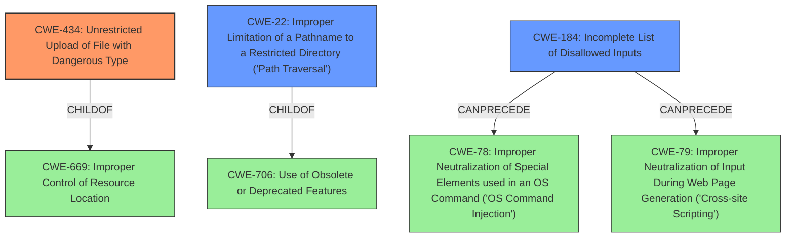

# Enhanced Analysis for CVE-2021-24171

# Summary
| CWE ID  | CWE Name                                                                               | Confidence | CWE Abstraction Level | CWE Vulnerability Mapping Label | CWE-Vulnerability Mapping Notes |
| :-------- | :------------------------------------------------------------------------------------- | :---------- | :---------------------- | :------------------------------ | :---------------------------------- |
| CWE-434   | Unrestricted Upload of File with Dangerous Type                                        | 0.95        | Base                    | Primary                       | Allowed                               |
| CWE-22    | Improper Limitation of a Pathname to a Restricted Directory ('Path Traversal')       | 0.85        | Base                    | Secondary                     | Allowed                               |
| CWE-184   | Incomplete List of Disallowed Inputs                                                 | 0.75        | Base                    | Secondary                     | Allowed                               |

## Evidence and Confidence

*   **Confidence Score:** 0.85
*   **Evidence Strength:** HIGH

## Relationship Analysis
The primary weakness is CWE-434, which is related to the unrestricted upload of dangerous file types. This is often connected to improper or incomplete input validation (CWE-184) and path traversal issues (CWE-22) when filenames or paths are not correctly sanitized. CWE-434 is a child of CWE-669 (Improper Control of Resource Location), which highlights the broader issue of managing where resources are placed. CWE-22 is related to CWE-706 (Use of Obsolete or Deprecated Features) since path traversal relies on the interpretation of path elements. CWE-184, the incomplete denylist, can lead to command injection (CWE-78) or cross-site scripting (CWE-79) if the disallowed inputs are not comprehensive.



## Vulnerability Chain
The vulnerability chain starts with **insufficient input sanitization**. This leads to two distinct but related issues: unrestricted file upload with dangerous types (CWE-434) and path traversal (CWE-22). The **incomplete list of disallowed inputs** (CWE-184) is a contributing factor to the unrestricted file upload, as it allows bypassing the intended file type restrictions.

## Summary of Analysis
This analysis is based on the provided vulnerability description and the CVE reference summary, which clearly indicate the root causes and impacts. The description states that the plugin ran a single sanitization pass to remove blocked extensions, which was bypassable. This directly supports CWE-434, CWE-22 and CWE-184.

The graph relationships confirm that these CWEs are related and can occur together. The selection of Base-level CWEs (CWE-434, CWE-22, and CWE-184) provides the optimal level of specificity for mapping this vulnerability. Other CWEs, such as CWE-79 (Cross-Site Scripting) and CWE-78 (OS Command Injection), were considered but not selected because the vulnerability description doesn't explicitly mention these attack vectors, although they could be potential consequences of the file upload vulnerability.

Relevant CWE Information:

# Enhanced Context (25 CWEs)
The following CWEs were identified as potentially relevant to this vulnerability:

## CWE-434: Unrestricted Upload of File with Dangerous Type
**Abstraction Level**: Base
**Similarity Score**: 0.646
**Source**: sparse

**Description**:
The product allows the upload or transfer of dangerous file types that are automatically processed within its environment.

**Mapping Guidance**:
- Usage: Allowed
- Rationale: This CWE entry is at the Base level of abstraction, which is a preferred level of abstraction for mapping to the root causes of vulnerabilities.

### Justification:

This CWE is a primary candidate because the vulnerability description explicitly mentions the ability to upload a file with a PHP extension, bypassing the intended restrictions. The CVE reference summary also highlights the insufficient sanitization of file names, leading to the ability to upload arbitrary PHP files.

## CWE-22: Improper Limitation of a Pathname to a Restricted Directory ('Path Traversal')
**Abstraction Level**: Base
**Similarity Score**: 0.417
**Source**: sparse

**Description**:
The product uses external input to construct a pathname that is intended to identify a file or directory that is located underneath a restricted parent directory, but the product does not properly neutralize special elements within the pathname that can cause the pathname to resolve to a location that is outside of the restricted directory.

**Mapping Guidance**:
- Usage: Allowed
- Rationale: This CWE entry is at the Base level of abstraction, which is a preferred level of abstraction for mapping to the root causes of vulnerabilities.

### Justification:

The vulnerability description mentions the possibility of performing a double extension attack and uploading files to a different location via path traversal using the `wcuf_current_upload_session_id` parameter. This directly aligns with the characteristics of CWE-22.

## CWE-184: Incomplete List of Disallowed Inputs
**Abstraction Level**: Base
**Similarity Score**: 0.397
**Source**: sparse

**Description**:
The product implements a protection mechanism that relies on a list of inputs (or properties of inputs) that are not allowed by policy or otherwise require other action to neutralize before additional processing takes place, but the list is incomplete.

**Mapping Guidance**:
- Usage: Allowed
- Rationale: This CWE entry is at the Base level of abstraction, which is a preferred level of abstraction for mapping to the root causes of vulnerabilities.

### Justification:

The **rootcause** is **insufficient input sanitization** because the plugin's attempt to remove blocked file extensions was bypassable by embedding a blocked extension within another blocked extension. This indicates an incomplete list of disallowed inputs or an insufficient method for handling them, making CWE-184 a relevant secondary classification.

## Other CWEs Considered and Rejected:

*   **CWE-79 (Improper Neutralization of Input During Web Page Generation ('Cross-site Scripting'))**: While the uploaded files could potentially be used for XSS attacks, the primary vulnerability is the unrestricted file upload, not the XSS itself. Therefore, CWE-79 is not the most appropriate mapping.
*   **CWE-78 (Improper Neutralization of Special Elements used in an OS Command ('OS Command Injection'))**: Similar to XSS, OS Command Injection is a potential consequence of the file upload vulnerability, but not the root cause. The primary weakness is the unrestricted file upload.
*   **CWE-116 (Improper Encoding or Escaping of Output)**: Although encoding issues could arise, the core of the vulnerability is related to the **insufficient sanitization** of file extensions.
*   **CWE-646 (Reliance on File Name or Extension of Externally-Supplied File)**: This is related but less descriptive than CWE-434. The core issue is not just relying on the file name, but allowing dangerous file types to be uploaded and processed.
*   **CWE-23 (Relative Path Traversal)**: While path traversal is involved, it's a secondary issue related to the `wcuf_current_upload_session_id` parameter. The primary issue remains the ability to upload arbitrary files.
*   **CWE-178 (Improper Handling of Case Sensitivity)**: Not directly relevant as the bypass doesn't rely on case sensitivity issues.
*   **CWE-138 (Improper Neutralization of Special Elements)**: Too high-level. CWE-434 and CWE-22 are more specific.
*   **CWE-863 (Incorrect Authorization)**: Not applicable as the vulnerability doesn't primarily involve authorization issues.


## CWE Relationship Analysis

Current CWEs represent these abstraction levels: .


### Vulnerability Chain Analysis

**Chain starting from CWE-646:**
- 646 (Reliance on File Name or Extension of Externally-Supplied File) - ROOT


**Chain starting from CWE-79:**
- 79 (Improper Neutralization of Input During Web Page Generation ('Cross-site Scripting')) - ROOT


### CWE Relationship Diagram

```mermaid
graph TD
    classDef primary fill:#f96,stroke:#333,stroke-width:2px
    classDef secondary fill:#69f,stroke:#333
    classDef tertiary fill:#9e9,stroke:#333
```