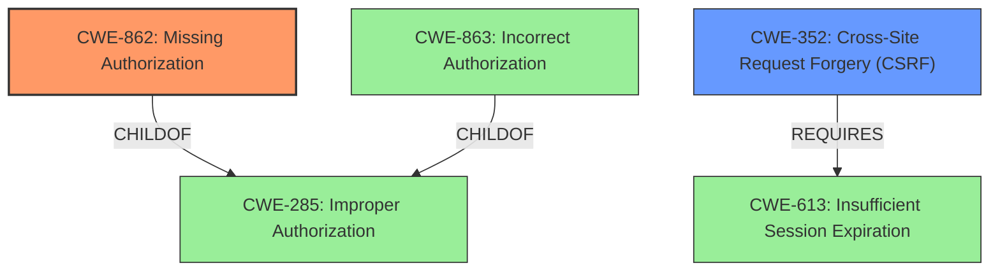

# Enhanced Analysis for CVE-2021-24184

# Summary
| CWE ID | CWE Name | Confidence | CWE Abstraction Level | CWE Vulnerability Mapping Label | CWE-Vulnerability Mapping Notes |
|---|---|---|---|---|---|
| CWE-862 | Missing Authorization | 1 | Class | Allowed-with-Review | Primary CWE |
| CWE-352 | Cross-Site Request Forgery (CSRF) | 0.7 | Compound | Allowed | Secondary Candidate |

## Evidence and Confidence

*   **Confidence Score:** 0.85
*   **Evidence Strength:** HIGH

## Relationship Analysis
The primary relationship that influenced the decision was the ChildOf relationship between CWE-862 (Missing Authorization) and CWE-285 (Improper Authorization). CWE-862 is a more specific case of CWE-285, where authorization is completely missing. The analysis also considered CWE-863 (Incorrect Authorization) but determined that the described scenario fits better with the absence of authorization checks rather than an incorrect implementation. CWE-352 (Cross-Site Request Forgery) was considered as a secondary weakness due to the lack of nonce verification.



## Vulnerability Chain
The vulnerability chain starts with **unprotected AJAX endpoints** (CWE-862), which leads to students being able to modify course information and elevate their privileges. The **missing** authorization checks on the `tutor_add_instructor` AJAX action is the direct root cause. If CSRF protection via nonce verification is also **missing**, then CWE-352 may also be present.

## Summary of Analysis
The analysis is based on the provided vulnerability description and CVE reference content summary. The key evidence is: "**unprotected AJAX endpoints**", "**Missing Capability Checks**," and "**Privilege Escalation**."

The primary selection is CWE-862 (Missing Authorization) because the plugin **lacked proper checks to verify if the user had the necessary permissions**. This aligns directly with the description of CWE-862: "The product does not perform an authorization check when an actor attempts to access a resource or perform an action." This is at the Class level, but the retriever results, and the CWE specifications indicate that no child is a better fit.

CWE-352 (Cross-Site Request Forgery) is a secondary consideration since there was no nonce verification (which protects against CSRF).

Other CWEs considered but not used:

*   CWE-863 (Incorrect Authorization): While related, the vulnerability is due to the complete absence of authorization checks, not an incorrect implementation.
*   CWE-639 (Authorization Bypass Through User-Controlled Key): This CWE is about modifying a key to access another user's data, which is not the primary issue here.
*   CWE-472 (External Control of Assumed-Immutable Web Parameter): This is about modifying parameters that are assumed to be immutable, which is not the core issue here.
*   CWE-471 (Modification of Assumed-Immutable Data (MAID)): Similar to CWE-472, this is not the central problem.

The selected CWEs are at the optimal level of specificity, as CWE-862 directly represents the **missing** authorization and its consequences. CWE-352 is a secondary consideration because of the **lack of nonce verification**.


## CWE Relationship Analysis

Current CWEs represent these abstraction levels: .


### Vulnerability Chain Analysis

**Chain starting from CWE-862:**
- 862 (Missing Authorization) - ROOT


**Chain starting from CWE-285:**
- 285 (Improper Authorization) - ROOT


### CWE Relationship Diagram

```mermaid
graph TD
    classDef primary fill:#f96,stroke:#333,stroke-width:2px
    classDef secondary fill:#69f,stroke:#333
    classDef tertiary fill:#9e9,stroke:#333
```