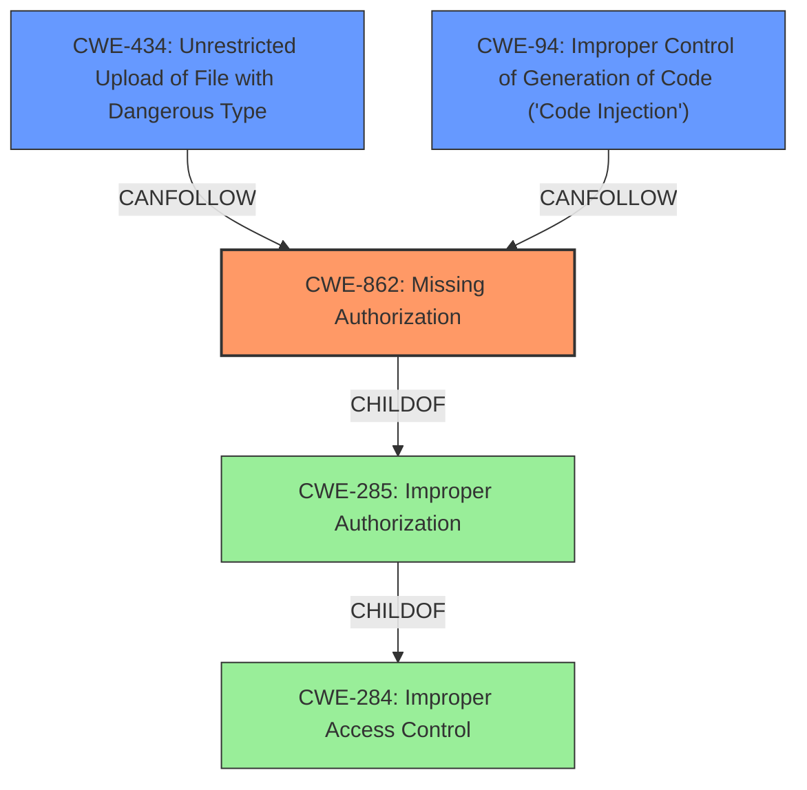

# Analysis Report for CVE-2021-24188

# Vulnerability Analysis Report: CVE-2021-24188

## Description


## Analysis (with Relationship Data)

# Summary
| CWE ID | CWE Name | Confidence | CWE Abstraction Level | CWE Vulnerability Mapping Label | CWE-Vulnerability Mapping Notes |
|---|---|---|---|---|---|
| CWE-862 | Missing Authorization | 0.9 | Class | Primary | Allowed-with-Review |
| CWE-434 | Unrestricted Upload of File with Dangerous Type | 0.7 | Base | Secondary | Allowed |
| CWE-94 | Improper Control of Generation of Code ('Code Injection') | 0.6 | Base | Secondary | Allowed-with-Review |

## Evidence and Confidence

*   **Confidence Score:** 0.8
*   **Evidence Strength:** HIGH

## Relationship Analysis
The primary CWE is CWE-862, indicating a failure to perform authorization checks. This is a child of the more general CWE-285 (Improper Authorization) and CWE-284 (Improper Access Control). CWE-434 and CWE-94 are considered secondary because they could be a result of the missing authorization leading to code execution via plugin installation and activation or unrestricted uploads.



## Vulnerability Chain
The vulnerability chain starts with **missing authorization** (CWE-862), which allows low-privileged users to install arbitrary plugins. The ability to install arbitrary plugins can then lead to the **unrestricted upload of dangerous file types** (CWE-434) or **improper control of generation of code** (CWE-94) if the installed plugins are vulnerable. This can then further lead to more critical vulnerabilities like RCE.

## Summary of Analysis
The initial assessment identified several candidate CWEs, and after a detailed review of the vulnerability description and available information, CWE-862 was chosen as the primary CWE because the **root cause** of the vulnerability is due to the fact that the AJAX action `cp_plugins_do_button_job_later_callback` **does not properly validate user privileges**. This **missing authorization** allows low-privileged users to trigger plugin installation and activation, which leads to further vulnerabilities. The evidence supporting this decision comes from the "CVE Reference Links Content Summary" stating "The AJAX action `cp_plugins_do_button_job_later_callback` in the `settings-start-index.php` file of multiple WP-Buy plugins **does not properly validate user privileges**, allowing low-privileged users to trigger plugin installation and activation." CWE-434 and CWE-94 are possible consequences, but are not the **root cause** so they are categorized as secondary.

Relevant CWE Information:

# Enhanced Context (25 CWEs)

## CWE-472: External Control of Assumed-Immutable Web Parameter
**Abstraction Level**: Base
**Similarity Score**: 0.78
**Source**: dense

**Description**:
The web application does not sufficiently verify inputs that are assumed to be immutable but are actually externally controllable, such as hidden form fields.

**Mapping Guidance**:
- Usage: Allowed
- Rationale: This CWE entry is at the Base level of abstraction, which is a preferred level of abstraction for mapping to the root causes of vulnerabilities.

This CWE was considered, however, it is more about tampering with existing parameters, not about the lack of authorization to perform an action.

## CWE-807: Reliance on Untrusted Inputs in a Security Decision
**Abstraction Level**: Base
**Similarity Score**: 0.77
**Source**: dense

**Description**:
The product uses a protection mechanism that relies on the existence or values of an input, but the input can be modified by an untrusted actor in a way that bypasses the protection mechanism.

**Mapping Guidance**:
- Usage: Allowed
- Rationale: This CWE entry is at the Base level of abstraction, which is a preferred level of abstraction for mapping to the root causes of vulnerabilities.

This CWE was not selected as the vulnerability does not seem to rely on any specific input for a security decision, but rather a **lack of** any authorization check.

## CWE-1220: Insufficient Granularity of Access Control
**Abstraction Level**: Base
**Similarity Score**: 0.76
**Source**: dense

**Description**:
The product implements access controls via a policy or other feature with the intention to disable or restrict accesses (reads and/or writes) to assets in a system from untrusted agents. However, implemented access controls lack required granularity, which renders the control policy too broad because it allows accesses from unauthorized agents to the security-sensitive assets.

**Mapping Guidance**:
- Usage: Allowed
- Rationale: This CWE entry is at the Base level of abstraction, which is a preferred level of abstraction for mapping to the root causes of vulnerabilities.

This CWE was not selected as it focuses on the granularity of existing access controls, not the **absence** of any access control.

## CWE-639: Authorization Bypass Through User-Controlled Key
**Abstraction Level**: Base
**Similarity Score**: 0.76
**Source**: dense

**Description**:
The system's authorization functionality does not prevent one user from gaining access to another user's data or record by modifying the key value identifying the data.

**Mapping Guidance**:
- Usage: Allowed
- Rationale: This CWE entry is at the Base level of abstraction, which is a preferred level of abstraction for mapping to the root causes of vulnerabilities.

This CWE was not selected as the vulnerability is not about modifying keys to gain access to data.

## CWE-74: Improper Neutralization of Special Elements in Output Used by a Downstream Component ('Injection')
**Abstraction Level**: Class
**Similarity Score**: 0.76
**Source**: dense

**Description**:
The product constructs all or part of a command, data structure, or record using externally-influenced input from an upstream component, but it does not neutralize or incorrectly neutralizes special elements that could modify how it is parsed or interpreted when it is sent to a downstream component.

**Mapping Guidance**:
- Usage: Discouraged
- Rationale: CWE-74 is high-level and often misused when lower-level weaknesses are more appropriate.

This CWE was not selected as it focuses on injection vulnerabilities due to improper neutralization, not the **lack of authorization** to perform an action.

## CWE-799: Improper Control of Interaction Frequency
**Abstraction Level**: Class
**Similarity Score**: 0.75
**Source**: dense

**Description**:
The product does not properly limit the number or frequency of interactions that it has with an actor, such as the number of incoming requests.

**Mapping Guidance**:
- Usage: Allowed-with-Review
- Rationale: This CWE entry is a Class and might have Base-level children that would be more appropriate

This CWE was not selected as it focuses on interaction frequency, not authorization.

## CWE-184: Incomplete List of Disallowed Inputs
**Abstraction Level**: Base
**Similarity Score**: 0.75
**Source**: dense

**Description**:
The product implements a protection mechanism that relies on a list of inputs (or properties of inputs) that are not allowed by policy or otherwise require other action to neutralize before additional processing takes place, but the list is incomplete.

**Mapping Guidance**:
- Usage: Allowed
- Rationale: This CWE entry is at the Base level of abstraction, which is a preferred level of abstraction for mapping to the root causes of vulnerabilities.

This CWE was not selected as it focuses on incomplete lists of disallowed inputs, not the **absence of authorization**.

## CWE-425: Direct Request ('Forced Browsing')
**Abstraction Level**: Base
**Similarity Score**: 0.75
**Source**: dense

**Description**:
The web application does not adequately enforce appropriate authorization on all restricted URLs, scripts, or files.

**Mapping Guidance**:
- Usage: Allowed
- Rationale: This CWE entry is at the Base level of abstraction, which is a preferred level of abstraction for mapping to the root causes of vulnerabilities.

While similar to CWE-862, this CWE is more focused on direct requests to resources, while CWE-862 covers a broader scope of **missing authorization**.

## CWE-1289: Improper Validation of Unsafe Equivalence in Input
**Abstraction Level**: Base
**Similarity Score**: 0


## CWE Relationship Analysis

Current CWEs represent these abstraction levels: .


### Vulnerability Chain Analysis

**Chain starting from CWE-862:**
- 862 (Missing Authorization) - ROOT


**Chain starting from CWE-284:**
- 284 (Improper Access Control) - ROOT


### CWE Relationship Diagram

```mermaid
graph TD
    classDef primary fill:#f96,stroke:#333,stroke-width:2px
    classDef secondary fill:#69f,stroke:#333
    classDef tertiary fill:#9e9,stroke:#333
```


*Report generated on 2025-04-02 09:44:52*
