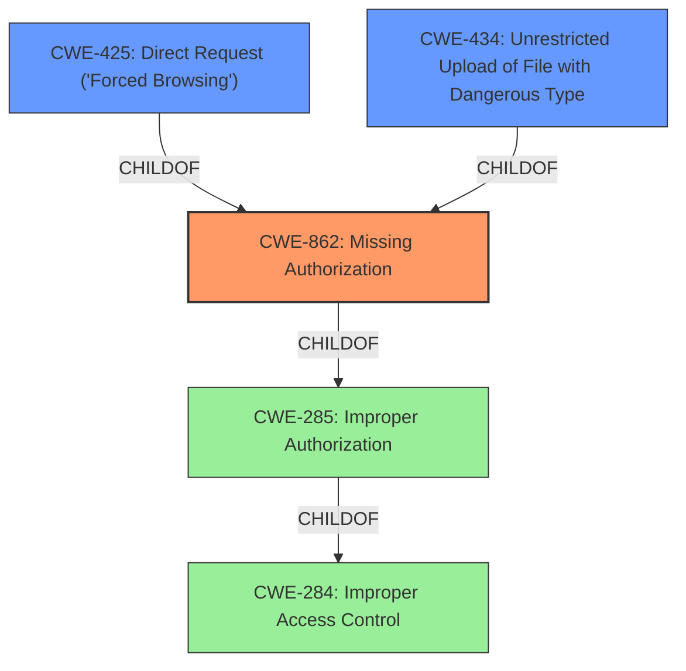

# Analysis for CVE-2021-24190

# Summary
| CWE ID  | CWE Name        | Confidence | CWE Abstraction Level | CWE Vulnerability Mapping Label | CWE-Vulnerability Mapping Notes |
|-----------------|----------------------------------------------------|------------|-------------------------|-----------------------------------|-----------------------------------|
| **CWE-862** | **Missing Authorization**   | 1   | Class    | Primary | Allowed-with-Review  |
| CWE-425 | Direct Request ('Forced Browsing') | 0.8 | Base | Secondary | Allowed |
| CWE-434 | Unrestricted Upload of File with Dangerous Type | 0.6 | Base | Secondary | Allowed |

## Evidence and Confidence

*   **Confidence Score:** 0.9
*   **Evidence Strength:** HIGH

## Relationship Analysis
The primary CWE is CWE-862, indicating a failure to perform authorization checks. CWE-425 and CWE-434 are also relevant as they represent ways in which the missing authorization can be exploited, specifically by directly requesting actions and uploading malicious files. CWE-862 is a child of CWE-285 (Improper Authorization) and CWE-284 (Improper Access Control). The selection of CWE-862 is more specific than its parents, providing a more accurate representation of the vulnerability.

## Vulnerability Chain
The chain of events is as follows:
1.  **Missing Authorization** (CWE-862): The root cause is the lack of authorization checks on the `cp_plugins_do_button_job_later_callback` AJAX action.
2.  **Direct Request** (CWE-425): Low-privileged users can directly request this action.
3.  **Unrestricted Upload of File with Dangerous Type** (CWE-434): Attackers can install arbitrary plugins, including potentially malicious ones, due to the missing authorization.
4.  **Impact:** Installation of malicious plugins leading to potential Remote Code Execution (RCE) and site takeover.

## Summary of Analysis
The initial assessment, supported by the vulnerability description and CVE reference content, points to a **missing authorization** issue. The ability for low-privileged users to install and activate arbitrary plugins stems directly from the **lack of access control** on the AJAX action `cp_plugins_do_button_job_later_callback`. This is supported by the "Root Cause of Vulnerability" section in the CVE Reference Links Content Summary: "The vulnerability stems from a **lack of access control** in the `cp_plugins_do_button_job_later_callback` AJAX action. This action allows low-privileged users to install and activate arbitrary plugins without proper authorization checks." The graph relationships support this, with CWE-862 being a specific type of Improper Authorization (CWE-285).

CWE-862 (Missing Authorization) is more specific than CWE-285 (Improper Authorization) and is thus the more appropriate choice. The vulnerability description clearly states the absence of an authorization check, making CWE-862 a direct fit. While CWE-285 might broadly apply, CWE-862 pinpoints the exact weakness. CWE-425 and CWE-434 are secondary contributing factors where lack of authorization allows direct requests and arbitrary uploads. This makes CWE-862 the primary weakness, with CWE-425 and CWE-434 contributing to the exploitability and potential impact.
The retriever results also support the selection of CWE-862 and CWE-425.

Relevant CWE Information:

# Enhanced Context (25 CWEs)
The following CWEs were identified as potentially relevant to this vulnerability:

## CWE-639: Authorization Bypass Through User-Controlled Key
**Abstraction Level**: Base
**Similarity Score**: 0.77
**Source**: dense

**Description**:
The system's authorization functionality does not prevent one user from gaining access to another user's data or record by modifying the key value identifying the data.

**Mapping Guidance**:
- Usage: Allowed
- Rationale: This CWE entry is at the Base level of abstraction, which is a preferred level of abstraction for mapping to the root causes of vulnerabilities.

## CWE-472: External Control of Assumed-Immutable Web Parameter
**Abstraction Level**: Base
**Similarity Score**: 0.77
**Source**: dense

**Description**:
The web application does not sufficiently verify inputs that are assumed to be immutable but are actually externally controllable, such as hidden form fields.

**Mapping Guidance**:
- Usage: Allowed
- Rationale: This CWE entry is at the Base level of abstraction, which is a preferred level of abstraction for mapping to the root causes of vulnerabilities.

## CWE-807: Reliance on Untrusted Inputs in a Security Decision
**Abstraction Level**: Base
**Similarity Score**: 0.76
**Source**: dense

**Description**:
The product uses a protection mechanism that relies on the existence or values of an input, but the input can be modified by an untrusted actor in a way that bypasses the protection mechanism.

**Mapping Guidance**:
- Usage: Allowed
- Rationale: This CWE entry is at the Base level of abstraction, which is a preferred level of abstraction for mapping to the root causes of vulnerabilities.

## CWE-425: Direct Request ('Forced Browsing')
**Abstraction Level**: Base
**Similarity Score**: 0.76
**Source**: dense

**Description**:
The web application does not adequately enforce appropriate authorization on all restricted URLs, scripts, or files.

**Mapping Guidance**:
- Usage: Allowed
- Rationale: This CWE entry is at the Base level of abstraction, which is a preferred level of abstraction for mapping to the root causes of vulnerabilities.

## CWE-552: Files or Directories Accessible to External Parties
**Abstraction Level**: Base
**Similarity Score**: 0.75
**Source**: dense

**Description**:
The product makes files or directories accessible to unauthorized actors, even though they should not be.

**Mapping Guidance**:
- Usage: Allowed
- Rationale: This CWE entry is at the Base level of abstraction, which is a preferred level of abstraction for mapping to the root causes of vulnerabilities.

## CWE-1220: Insufficient Granularity of Access Control
**Abstraction Level**: Base
**Similarity Score**: 0.75
**Source**: dense

**Description**:
The product implements access controls via a policy or other feature with the intention to disable or restrict accesses (reads and/or writes) to assets in a system from untrusted agents. However, implemented access controls lack required granularity, which renders the control policy too broad because it allows accesses from unauthorized agents to the security-sensitive assets.

**Mapping Guidance**:
- Usage: Allowed
- Rationale: This CWE entry is at the Base level of abstraction, which is a preferred level of abstraction for mapping to the root causes of vulnerabilities.

## CWE-184: Incomplete List of Disallowed Inputs
**Abstraction Level**: Base
**Similarity Score**: 0.75
**Source**: dense

**Description**:
The product implements a protection mechanism that relies on a list of inputs (or properties of inputs) that are not allowed by policy or otherwise require other action to neutralize before additional processing takes place, but the list is incomplete.

**Mapping Guidance**:
- Usage: Allowed
- Rationale: This CWE entry is at the Base level of abstraction, which is a preferred level of abstraction for mapping to the root causes of vulnerabilities.

## CWE-1390: Weak Authentication
**Abstraction Level**: Class
**Similarity Score**: 0.75
**Source**: dense

**Description**:
The product uses an authentication mechanism to restrict access to specific users or identities, but the mechanism does not sufficiently prove that the claimed identity is correct.

**Mapping Guidance**:
- Usage: Allowed-with-Review
- Rationale: This CWE entry is a Class and might have Base-level children that would be more appropriate

## CWE-41: Improper Resolution of Path Equivalence
**Abstraction Level**: Base
**Similarity Score**: 0.75
**Source**: dense

**Description**:
The product is vulnerable to file system contents disclosure through path equivalence. Path equivalence involves the