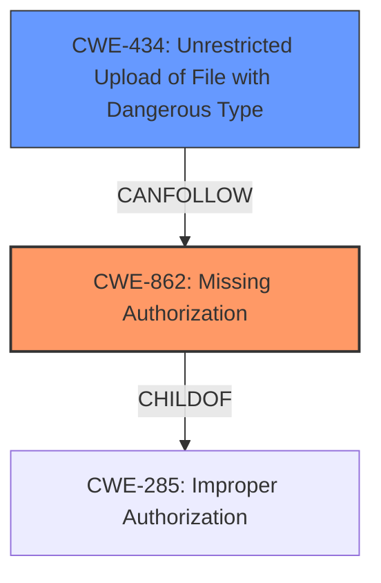

# Raw Analyzer Response for CVE-2021-24193

# Summary
| CWE ID | CWE Name | Confidence | CWE Abstraction Level | CWE Vulnerability Mapping Label | CWE-Vulnerability Mapping Notes |
|---|---|---|---|---|---|
| CWE-862 | Missing Authorization | 0.9 | Class | Primary | Allowed-with-Review |
| CWE-434 | Unrestricted Upload of File with Dangerous Type | 0.7 | Base | Secondary | Allowed |

## Evidence and Confidence

*   **Confidence Score:** 0.8
*   **Evidence Strength:** HIGH

## Relationship Analysis
The primary CWE is CWE-862, indicating a **missing authorization** check. It's a child of CWE-285 (Improper Authorization), but CWE-862 is more specific. CWE-434, Unrestricted Upload of File with Dangerous Type, represents the ability to upload arbitrary files. This can lead to installing vulnerable plugins, which is an impact of the **missing authorization**. These two CWEs together represent the root cause and a potential avenue for exploitation.

## Vulnerability Chain
The vulnerability chain starts with **missing authorization** (CWE-862) for the AJAX action `cp_plugins_do_button_job_later_callback`. This allows low-privileged users to install arbitrary plugins, possibly leading to the upload of a dangerous file type (CWE-434). The final impact is the potential for RCE.

## Summary of Analysis
Initially, the primary CWE match was CWE-NVD-Other from the similar CVE descriptions. However, upon closer inspection of the vulnerability description and the "CVE Reference Links Content Summary", it is clear that the root cause is related to **improper access control** leading to the ability to install arbitrary plugins.

The key evidence is: "The AJAX action `cp_plugins_do_button_job_later_callback` in multiple WP-Buy plugins **lacks proper access control**, allowing low-privileged users to install and activate arbitrary plugins."

This directly points to CWE-862 **Missing Authorization** as the primary weakness, since the code does not perform the necessary checks to ensure that the user has the privileges to perform the action. CWE-862 is a more specific child of CWE-285, which makes it a better match. The "Retriever Results" also lists CWE-862 as a candidate.

CWE-434, Unrestricted Upload of File with Dangerous Type, is considered as a secondary CWE because the vulnerability allows installing arbitrary plugins, which could include plugins containing dangerous file types.

The selected CWEs are at the optimal level of specificity. CWE-862 is a Class-level CWE, but it accurately captures the **missing authorization** aspect. CWE-434 is a Base-level CWE, representing the dangerous file upload scenario.

Relevant CWE Information:

# Enhanced Context (25 CWEs)

## CWE-552: Files or Directories Accessible to External Parties
**Abstraction Level**: Base
**Similarity Score**: 0.78
**Source**: dense

**Description**:
The product makes files or directories accessible to unauthorized actors, even though they should not be.

**Mapping Guidance**:
- Usage: Allowed
- Rationale: This CWE entry is at the Base level of abstraction, which is a preferred level of abstraction for mapping to the root causes of vulnerabilities.

## CWE-434: Unrestricted Upload of File with Dangerous Type
**Abstraction Level**: Base
**Similarity Score**: 0.78
**Source**: dense

**Description**:
The product allows the upload or transfer of dangerous file types that are automatically processed within its environment.

**Mapping Guidance**:
- Usage: Allowed
- Rationale: This CWE entry is at the Base level of abstraction, which is a preferred level of abstraction for mapping to the root causes of vulnerabilities.

## CWE-184: Incomplete List of Disallowed Inputs
**Abstraction Level**: Base
**Similarity Score**: 0.77
**Source**: dense

**Description**:
The product implements a protection mechanism that relies on a list of inputs (or properties of inputs) that are not allowed by policy or otherwise require other action to neutralize before additional processing takes place, but the list is incomplete.

**Mapping Guidance**:
- Usage: Allowed
- Rationale: This CWE entry is at the Base level of abstraction, which is a preferred level of abstraction for mapping to the root causes of vulnerabilities.

## CWE-425: Direct Request ('Forced Browsing')
**Abstraction Level**: Base
**Similarity Score**: 0.77
**Source**: dense

**Description**:
The web application does not adequately enforce appropriate authorization on all restricted URLs, scripts, or files.

**Mapping Guidance**:
- Usage: Allowed
- Rationale: This CWE entry is at the Base level of abstraction, which is a preferred level of abstraction for mapping to the root causes of vulnerabilities.

## CWE-472: External Control of Assumed-Immutable Web Parameter
**Abstraction Level**: Base
**Similarity Score**: 0.77
**Source**: dense

**Description**:
The web application does not sufficiently verify inputs that are assumed to be immutable but are actually externally controllable, such as hidden form fields.

**Mapping Guidance**:
- Usage: Allowed
- Rationale: This CWE entry is at the Base level of abstraction, which is a preferred level of abstraction for mapping to the root causes of vulnerabilities.

## CWE-639: Authorization Bypass Through User-Controlled Key
**Abstraction Level**: Base
**Similarity Score**: 0.77
**Source**: dense

**Description**:
The system's authorization functionality does not prevent one user from gaining access to another user's data or record by modifying the key value identifying the data.

**Mapping Guidance**:
- Usage: Allowed
- Rationale: This CWE entry is at the Base level of abstraction, which is a preferred level of abstraction for mapping to the root causes of vulnerabilities.

## CWE-41: Improper Resolution of Path Equivalence
**Abstraction Level**: Base
**Similarity Score**: 0.76
**Source**: dense

**Description**:
The product is vulnerable to file system contents disclosure through path equivalence. Path equivalence involves the use of special characters in file and directory names. The associated manipulations are intended to generate multiple names for the same object.

## CWE-1289: Improper Validation of Unsafe Equivalence in Input
**Abstraction Level**: Base
**Similarity Score**: 0.76
**Source**: dense

**Description**:
The product receives an input value that is used as a resource identifier or other type of reference, but it does not validate or incorrectly validates that the input is equivalent to a potentially-unsafe value.

## CWE-807: Reliance on Untrusted Inputs in a Security Decision
**Abstraction Level**: Base
**Similarity Score**: 0.76
**Source**: dense

**Description**:
The product uses a protection mechanism that relies on the existence or values of an input, but the input can be modified by an untrusted actor in a way that bypasses the protection mechanism.

## CWE-73: External Control of File Name or Path
**Abstraction Level**: Base
**Similarity Score**: 0.76
**Source**: dense

**Description**:
The product allows user input to control or influence paths or file names that are used in filesystem operations.

## CWE-285: Improper Authorization
**Abstraction Level**: Class
**Similarity Score**: 5658.62
**Source**: sparse

**Description**:
The product does not perform or incorrectly performs an authorization check when an actor attempts to access a resource or perform an action.

## CWE-863: Incorrect Authorization
**Abstraction Level**: Class
**Similarity Score**: 5620.65
**Source**: sparse

**Description**:
The product performs an authorization check when an actor attempts to access a resource or perform an action, but it does not correctly perform the check.

## CWE-425: Direct Request ('Forced Browsing')
**Abstraction Level**: Base
**Similarity Score**: 5601.65
**Source**: sparse

**Description**:
The web application does not adequately enforce appropriate authorization on all restricted URLs, scripts, or files.

## CWE-639: Authorization Bypass Through User-Controlled Key
**Abstraction Level**: Base
**Similarity Score**: 5419.89
**Source**: sparse

**Description**:
The system's authorization functionality does not prevent one user from gaining access to another user's data or record by modifying the key value identifying the data.

## CWE-306: Missing Authentication for Critical Function
**Abstraction Level**: Base
**Similarity Score**: 5310.59
**