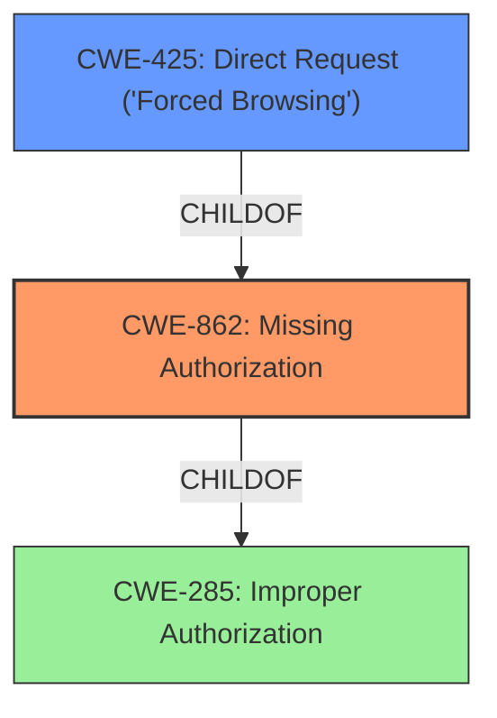

# Raw Analyzer Response for CVE-2021-24195

# Summary
| CWE ID | CWE Name | Confidence | CWE Abstraction Level | CWE Vulnerability Mapping Label | CWE-Vulnerability Mapping Notes |
|---|---|---|---|---|---|
| CWE-862 | Missing Authorization | 1 | Class | Allowed-with-Review | Primary CWE |
| CWE-425 | Direct Request ('Forced Browsing') | 0.8 | Base | Allowed | Secondary Candidate |

## Evidence and Confidence

*   **Confidence Score:** 0.9
*   **Evidence Strength:** HIGH

## Relationship Analysis
The primary relationship that influenced the decision was the ChildOf relationship between CWE-862 and CWE-285 (Improper Authorization). Since the description clearly indicates a **missing** authorization check, CWE-862 is a more specific and appropriate choice than its parent, CWE-285, which is too general. CWE-425 is a child of CWE-862 and represents a specific type of missing authorization related to web applications, reinforcing its relevance. The relationship between CWE-425 and other weaknesses like CWE-471 (Modification of Assumed-Immutable Data) and CWE-98 (Improper Control of Filename for Include/Require Statement in PHP Program) suggests potential attack chains that could stem from this missing authorization.

## Vulnerability Chain
The vulnerability chain starts with the **missing authorization** check, allowing low-privileged users to directly request and trigger functions intended for higher-level users. This leads to the installation of arbitrary plugins (including potentially vulnerable ones), which can then lead to RCE or other severe consequences.

Missing Authorization (CWE-862) -> Arbitrary Plugin Installation -> Potential RCE

## Summary of Analysis
The analysis is primarily based on the vulnerability description and the CVE Reference Links Content Summary. The key phrase "Low privileged users can use the AJAX action cp_plugins_do_button_job_later_callback...to install any plugin...which helps attackers install vulnerable plugins..." clearly indicates a **broken access control** issue where low-privileged users are able to perform actions they should not be authorized to do.

The CVE Reference Links Content Summary further supports this, stating "**Broken Access Control:** Low-privileged users can trigger a function intended for higher-level users, bypassing intended access restrictions."

CWE-862 (Missing Authorization) aligns perfectly with this description. It describes a scenario where the product does not perform an authorization check when an actor attempts to access a resource or perform an action. This allows the low-privileged users to bypass the intended access restrictions and install/activate plugins.

CWE-425 (Direct Request ('Forced Browsing')) was also considered, as the vulnerability involves low-privileged users directly accessing functionality (installing plugins) via an AJAX action. This matches the description of CWE-425, which is that the web application does not adequately enforce appropriate authorization on all restricted URLs, scripts, or files.

However, the more fundamental issue is the **lack of an authorization check** before allowing the plugin installation. The direct request is simply the mechanism by which this **missing authorization** is exploited.

Therefore, CWE-862 is selected as the primary CWE, with CWE-425 as a secondary candidate. CWE-862 is at the Class level, and while it would be ideal to find a more specific Base or Variant, none of the children of CWE-862 seem to fit as well as CWE-425.

Relevant CWE Information:

# Enhanced Context (25 CWEs)
The following CWEs were identified as potentially relevant to this vulnerability:

## CWE-74: Improper Neutralization of Special Elements in Output Used by a Downstream Component ('Injection')
**Abstraction Level**: Class
**Similarity Score**: 0.77
**Source**: dense

**Description**:
The product constructs all or part of a command, data structure, or record using externally-influenced input from an upstream component, but it does not neutralize or incorrectly neutralizes special elements that could modify how it is parsed or interpreted when it is sent to a downstream component.

**Mapping Guidance**:
- Usage: Discouraged
- Rationale: CWE-74 is high-level and often misused when lower-level weaknesses are more appropriate.

## CWE-639: Authorization Bypass Through User-Controlled Key
**Abstraction Level**: Base
**Similarity Score**: 0.76
**Source**: dense

**Description**:
The system's authorization functionality does not prevent one user from gaining access to another user's data or record by modifying the key value identifying the data.

**Mapping Guidance**:
- Usage: Allowed
- Rationale: This CWE entry is at the Base level of abstraction, which is a preferred level of abstraction for mapping to the root causes of vulnerabilities.

## CWE-472: External Control of Assumed-Immutable Web Parameter
**Abstraction Level**: Base
**Similarity Score**: 0.76
**Source**: dense

**Description**:
The web application does not sufficiently verify inputs that are assumed to be immutable but are actually externally controllable, such as hidden form fields.

**Mapping Guidance**:
- Usage: Allowed
- Rationale: This CWE entry is at the Base level of abstraction, which is a preferred level of abstraction for mapping to the root causes of vulnerabilities.

## CWE-425: Direct Request ('Forced Browsing')
**Abstraction Level**: Base
**Similarity Score**: 0.75
**Source**: dense

**Description**:
The web application does not adequately enforce appropriate authorization on all restricted URLs, scripts, or files.

**Mapping Guidance**:
- Usage: Allowed
- Rationale: This CWE entry is at the Base level of abstraction, which is a preferred level of abstraction for mapping to the root causes of vulnerabilities.

## CWE-807: Reliance on Untrusted Inputs in a Security Decision
**Abstraction Level**: Base
**Similarity Score**: 0.75
**Source**: dense

**Description**:
The product uses a protection mechanism that relies on the existence or values of an input, but the input can be modified by an untrusted actor in a way that bypasses the protection mechanism.

**Mapping Guidance**:
- Usage: Allowed
- Rationale: This CWE entry is at the Base level of abstraction, which is a preferred level of abstraction for mapping to the root causes of vulnerabilities.

## CWE-184: Incomplete List of Disallowed Inputs
**Abstraction Level**: Base
**Similarity Score**: 0.75
**Source**: dense

**Description**:
The product implements a protection mechanism that relies on a list of inputs (or properties of inputs) that are not allowed by policy or otherwise require other action to neutralize before additional processing takes place, but the list is incomplete.

**Mapping Guidance**:
- Usage: Allowed
- Rationale: This CWE entry is at the Base level of abstraction, which is a preferred level of abstraction for mapping to the root causes of vulnerabilities.

## CWE-1289: Improper Validation of Unsafe Equivalence in Input
**Abstraction Level**: Base
**Similarity Score**: 0.74
**Source**: dense

**Description**:
The product receives an input value that is used as a resource identifier or other type of reference, but it does not validate or incorrectly validates that the input is equivalent to a potentially-unsafe value.

**Mapping Guidance**:
- Usage: Allowed
- Rationale: This CWE entry is at the Base level of abstraction, which is a preferred level of abstraction for mapping to the root causes of vulnerabilities.

## CWE-41: Improper Resolution of Path Equivalence
**Abstraction Level**: Base
**Similarity Score**: 0.74
**Source**: dense

**Description**:
The product is vulnerable to file system contents disclosure through path equivalence. Path equivalence involves the use of special characters in file and directory names. The associated manipulations are intended to generate multiple names for the same object.

**Mapping Guidance**:
- Usage: Allowed
- Rationale: This CWE entry is at the Base level of abstraction, which is a preferred level of abstraction for mapping to the root causes of vulnerabilities.

## CWE-274: Improper Handling of Insufficient Privileges
**Abstraction Level**: Base
**Similarity Score**: 0.74
**Source**: dense

**Description**:
The product does not handle or incorrectly handles when it has insufficient privileges to perform an operation, leading to resultant weaknesses.

**Mapping Guidance**:
- Usage: Discouraged
- Rationale: This CWE entry could be deprecated in a future version of CWE.

## CWE-23: Relative Path Traversal
**Abstraction Level**: Base
**Similarity Score**: 0.74
**Source**: dense

**