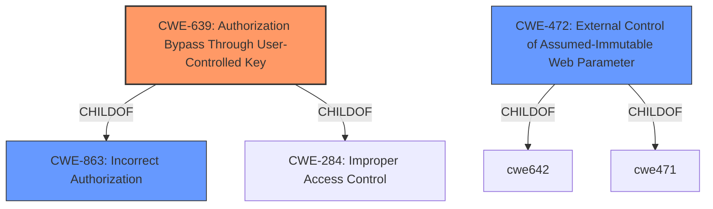

# Analysis Report for CVE-2021-24197

# Vulnerability Analysis Report: CVE-2021-24197

## Description


## Analysis (with Relationship Data)

# Summary
| CWE ID | CWE Name | Confidence | CWE Abstraction Level | CWE Vulnerability Mapping Label | CWE-Vulnerability Mapping Notes |
|---|---|---|---|---|---|
| CWE-639 | Authorization Bypass Through User-Controlled Key | 0.9 | Base | Allowed | Primary CWE |
| CWE-472 | External Control of Assumed-Immutable Web Parameter | 0.7 | Base | Allowed | Secondary Candidate |
| CWE-863 | Incorrect Authorization | 0.6 | Class | Allowed-with-Review | Secondary Candidate |

## Evidence and Confidence

*   **Confidence Score:** 0.8
*   **Evidence Strength:** HIGH

## Relationship Analysis
The primary CWE selected is CWE-639, which is a child of CWE-863 (Incorrect Authorization) and CWE-284 (Improper Access Control). This indicates a hierarchical relationship where CWE-639 is a more specific case of a general authorization problem. CWE-472 (External Control of Assumed-Immutable Web Parameter) is also considered because the vulnerability involves tampering with parameters.



## Vulnerability Chain
The vulnerability chain starts with the **improper access control**, leading to a low-privilege authenticated user being able to tamper with parameters and gain access to other users' data. The chain can be described as:
1.  **Improper Access Control**: The root cause where the plugin **fails to properly validate and enforce user permissions.**
2.  **Parameter Manipulation**: Attackers can manipulate `formdata[wdt_ID]` to access other user's data.
3.  **Data Breach**: Attackers can access and manage the data of all users in the same table.

## Summary of Analysis
The analysis is based on the vulnerability description and the provided CVE Reference Links Content Summary. The key phrase "Improper Access Control" and the ability to tamper with the `formdata[wdt_ID]` parameter strongly suggest CWE-639. The evidence from the "CVE Reference Links Content Summary" states, "The vulnerability stems from an **Improper Access Control** issue within the wpDataTables WordPress plugin. Specifically, the plugin **does not adequately restrict access** to table data based on user permissions."

CWE-639 is chosen because it specifically addresses the scenario where a user can modify a key value (the `formdata[wdt_ID]` parameter) to access another user's data. This is a direct match to the vulnerability description.

CWE-472 is considered because it highlights the risk of relying on externally controlled parameters that are assumed to be immutable. While relevant, it's a broader category and CWE-639 more precisely captures the authorization bypass aspect.

CWE-863 is a more general class of weakness of which CWE-639 is a child.

The selected CWEs are at the optimal level of specificity. CWE-639 is a Base level CWE and directly reflects the vulnerability. The other CWEs are either higher level or less specific.

Relevant CWE Information:

# Enhanced Context (25 CWEs)
The following CWEs were identified as potentially relevant to this vulnerability:

## CWE-472: External Control of Assumed-Immutable Web Parameter
**Abstraction Level**: Base
**Similarity Score**: 0.76
**Source**: dense

**Description**:
The web application does not sufficiently verify inputs that are assumed to be immutable but are actually externally controllable, such as hidden form fields.

**Mapping Guidance**:
- Usage: Allowed
- Rationale: This CWE entry is at the Base level of abstraction, which is a preferred level of abstraction for mapping to the root causes of vulnerabilities.

## CWE-639: Authorization Bypass Through User-Controlled Key
**Abstraction Level**: Base
**Similarity Score**: 0.75
**Source**: dense

**Description**:
The system's authorization functionality does not prevent one user from gaining access to another user's data or record by modifying the key value identifying the data.

**Mapping Guidance**:
- Usage: Allowed
- Rationale: This CWE entry is at the Base level of abstraction, which is a preferred level of abstraction for mapping to the root causes of vulnerabilities.

## CWE-863: Incorrect Authorization
**Abstraction Level**: Class
**Similarity Score**: 6528.42
**Source**: sparse

**Description**:
The product performs an authorization check when an actor attempts to access a resource or perform an action, but it does not correctly perform the check.

**Mapping Guidance**:
- Usage: Allowed-with-Review
- Rationale: This CWE entry is a Class and might have Base-level children that would be more appropriate

## CWE-285: Improper Authorization
**Abstraction Level**: Class
**Similarity Score**: 6459.35
**Source**: sparse

**Description**:
The product does not perform or incorrectly performs an authorization check when an actor attempts to access a resource or perform an action.

**Mapping Guidance**:
- Usage: Discouraged
- Rationale: CWE-285 is high-level and lower-level CWEs can frequently be used instead. It is a level-1 Class (i.e., a child of a Pillar).

## CWE-425: Direct Request ('Forced Browsing')
**Abstraction Level**: Base
**Similarity Score**: 6209.93
**Source**: sparse

**Description**:
The web application does not adequately enforce appropriate authorization on all restricted URLs, scripts, or files.

**Mapping Guidance**:
- Usage: Allowed
- Rationale: This CWE entry is at the Base level of abstraction, which is a preferred level of abstraction for mapping to the root causes of vulnerabilities.

### Technical Explanation for CWE-639:
The vulnerability allows a low-privilege user to gain access to another user's data by modifying the `formdata[wdt_ID]` parameter. This aligns with CWE-639, which describes a scenario where the system's authorization functionality **does not prevent one user from gaining access to another user's data or record by modifying the key value identifying the data.** The security implication is a data breach, where an attacker can access and manage sensitive information belonging to other users.

### Technical Explanation for CWE-472:
The `formdata[wdt_ID]` parameter is assumed to be immutable but is, in fact, externally controllable. This aligns with CWE-472, which describes a situation where "The web application does not sufficiently verify inputs that are assumed to be immutable but are actually externally controllable, such as hidden form fields." The security implication is that an attacker can modify this parameter to gain unauthorized access.

### Technical Explanation for CWE-863:
CWE-863 describes a scenario where authorization checks are performed, but they are done incorrectly. In this case, the application attempts to authorize users, but the implementation has a flaw, allowing the bypass.

### Alternative CWEs Considered but Not Used:
- CWE-285: Improper Authorization - While this is a general authorization issue, it is too high-level and less descriptive than CWE-639.
- CWE-425: Direct Request ('Forced Browsing') - This CWE focuses on inadequate enforcement of authorization on URLs, which is not the primary issue here.
- CWE-306: Missing Authentication for Critical Function - This is not applicable because the user is authenticated, but the authorization is **incorrect**.


## CWE Relationship Analysis

Current CWEs represent these abstraction levels: .


### Vulnerability Chain Analysis

**Chain starting from CWE-306:**
- 306 (Missing Authentication for Critical Function) - ROOT


**Chain starting from CWE-284:**
- 284 (Improper Access Control) - ROOT


### CWE Relationship Diagram

```mermaid
graph TD
    classDef primary fill:#f96,stroke:#333,stroke-width:2px
    classDef secondary fill:#69f,stroke:#333
    classDef tertiary fill:#9e9,stroke:#333
```


*Report generated on 2025-04-02 14:04:12*
